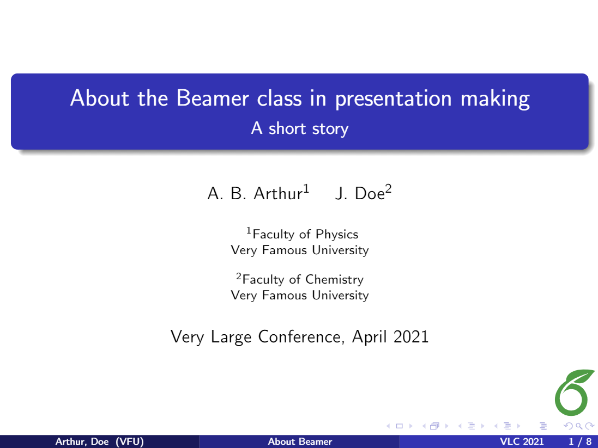
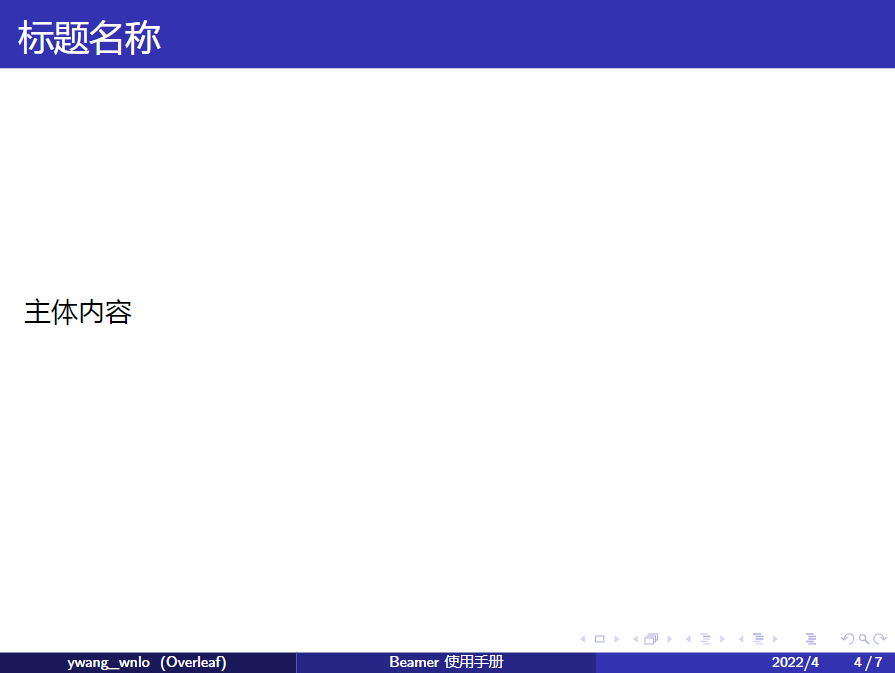
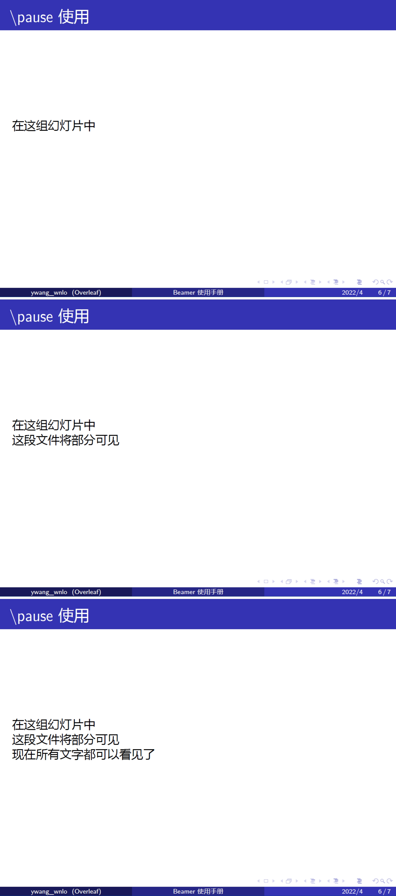
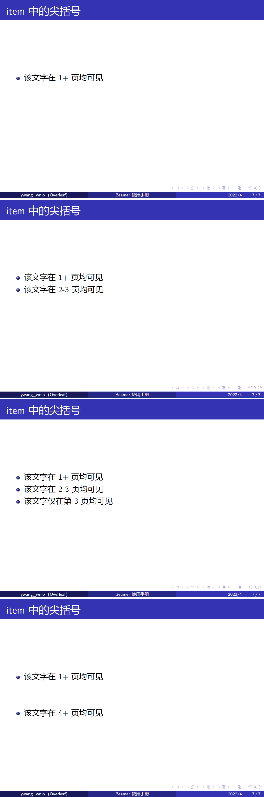

# LaTeX 制作 PPT


## Beamer 模板

PPT 推荐用 Beamer 模板来做，Beamer 是一个用于制作幻灯片的 LaTeX 文档类，可以用来制作演讲稿、学术报告、课件等

以下仅记录个人常用的一些功能，具体可以参考 [Overleaf 上相关介绍](https://www.overleaf.com/learn/latex/Beamer) 来使用



## 特性

### `frame` 与 `slide`

Beamer 中通常会用一对 `\begin{frame}`、`\end{frame}` 来制作一页幻灯片（slide），例如

```tex
\begin{frame}
	\frametitle{标题名称}
	主体内容
\end{frame}
```



然而其实 frame 并不等同于 slide，其实 frame 对应的是一组 slides

#### `\pause`

添加 `\pause` 会将 `\pause` 语句前面内容单独在新的一页 slide 上显示，实现了类似 PPT 动画中的点击页面出现下一段文字的效果，下面给出代码和生成的 PDF 帮助理解

```tex
\begin{frame}
	\frametitle{\textbackslash pause 使用}

	在这组幻灯片中 \pause
	
	这段文件将部分可见 \pause
	
	现在所有文字都可以看见了
\end{frame}
```



#### `itemize` 中的尖括号 \<strat-end\>

```tex
\begin{frame}
\frametitle{item 中的尖括号}

\begin{itemize}
	\item<1-> 该文字在 1+ 页均可见
	\item<2-3> 该文字在 2-3 页均可见
	\item<3> 该文字仅在第 3 页均可见
	\item<4-> 该文字在 4+ 页均可见
\end{itemize}
\end{frame}
```



## 参考资料

- [【Overleaf】Beamer](https://www.overleaf.com/learn/latex/Beamer)


---

> 作者: [Zeus](https://github.com/ywang-wnlo)  
> URL: https://ywang-wnlo.github.io/posts/499c5a19/  

