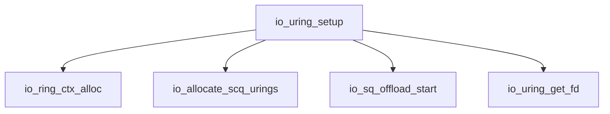
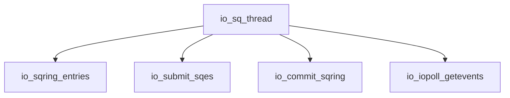
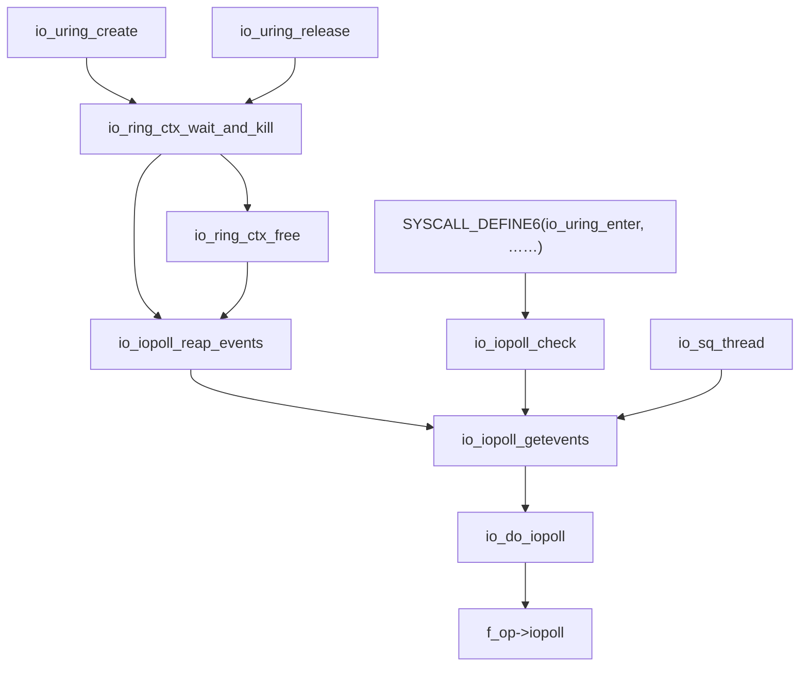

# io_uring 内核源码分析


当前内容基于 Linux Kernel [v5.4.121](https://git.kernel.org/pub/scm/linux/kernel/git/stable/linux.git/tag/?h=v5.4.121)

## 1. `io_uring`

[之前](/posts/c142853f/#系统调用) 介绍过 io_uring 只增加了三个 Linux 系统调用分别是 `io_uring_setup`，`io_uring_enter` 和 `io_uring_register`

他们的入口都在 Linux 内核源码的 `fs/io_uring.c` 文件中，下面将逐个分析

## 2. 系统调用 `io_uring_setup`

`io_uring_setup` 的作用在 [用户库源码分析](/posts/d7259d1d/#io-uring-queue-init) 中有过介绍，主要是初始化初始化 `io_uring` 结构体

### 2.1. `io_uring_setup`

```c
/*
 * Sets up an aio uring context, and returns the fd. Applications asks for a
 * ring size, we return the actual sq/cq ring sizes (among other things) in the
 * params structure passed in.
 */
static long io_uring_setup(u32 entries, struct io_uring_params __user *params)
{
	struct io_uring_params p;
	long ret;
	int i;

	// 用户态拷贝到内核态
	if (copy_from_user(&p, params, sizeof(p)))
		return -EFAULT;
	// 确认保留区域没有被赋值
	for (i = 0; i < ARRAY_SIZE(p.resv); i++) {
		if (p.resv[i])
			return -EINVAL;
	}

	// 检查 flags 参数
	if (p.flags & ~(IORING_SETUP_IOPOLL | IORING_SETUP_SQPOLL |
			IORING_SETUP_SQ_AFF))
		return -EINVAL;

	// 分配内存空间，创建 workqueue，创建 fd 等
	ret = io_uring_create(entries, &p);
	if (ret < 0)
		return ret;

	// 内核态拷贝回用户态
	if (copy_to_user(params, &p, sizeof(p)))
		return -EFAULT;

	return ret;
}

SYSCALL_DEFINE2(io_uring_setup, u32, entries,
		struct io_uring_params __user *, params)
{
	return io_uring_setup(entries, params);
}
```

可以看到 `io_uring_setup` 的核心函数是 `io_uring_create`

### 2.2. `io_uring_create`

```c
static int io_uring_create(unsigned entries, struct io_uring_params *p)
{
	struct user_struct *user = NULL;
	struct io_ring_ctx *ctx;
	bool account_mem;
	int ret;

	if (!entries || entries > IORING_MAX_ENTRIES)
		return -EINVAL;

	/*
	 * Use twice as many entries for the CQ ring. It's possible for the
	 * application to drive a higher depth than the size of the SQ ring,
	 * since the sqes are only used at submission time. This allows for
	 * some flexibility in overcommitting a bit.
	 */
	p->sq_entries = roundup_pow_of_two(entries);
	p->cq_entries = 2 * p->sq_entries;

	user = get_uid(current_user());
	// 允许对共享内存段进行锁定
	account_mem = !capable(CAP_IPC_LOCK);

	if (account_mem) {
		// 不能对共享内存段进行锁定，就需要增加当前可以锁定的内存
		ret = io_account_mem(user,
				ring_pages(p->sq_entries, p->cq_entries));
		if (ret) {
			free_uid(user);
			return ret;
		}
	}

	ctx = io_ring_ctx_alloc(p);
	if (!ctx) {
		if (account_mem)
			io_unaccount_mem(user, ring_pages(p->sq_entries,
								p->cq_entries));
		free_uid(user);
		return -ENOMEM;
	}
	ctx->compat = in_compat_syscall();
	ctx->account_mem = account_mem;
	ctx->user = user;

	ctx->creds = get_current_cred();
	if (!ctx->creds) {
		ret = -ENOMEM;
		goto err;
	}

	// 申请 io_rings SQEs
	ret = io_allocate_scq_urings(ctx, p);
	if (ret)
		goto err;

	// 初始化 workqueue，[初始化内核线程用于进行 IO poll]
	ret = io_sq_offload_start(ctx, p);
	if (ret)
		goto err;

	memset(&p->sq_off, 0, sizeof(p->sq_off));
	p->sq_off.head = offsetof(struct io_rings, sq.head);
	p->sq_off.tail = offsetof(struct io_rings, sq.tail);
	p->sq_off.ring_mask = offsetof(struct io_rings, sq_ring_mask);
	p->sq_off.ring_entries = offsetof(struct io_rings, sq_ring_entries);
	p->sq_off.flags = offsetof(struct io_rings, sq_flags);
	p->sq_off.dropped = offsetof(struct io_rings, sq_dropped);
	p->sq_off.array = (char *)ctx->sq_array - (char *)ctx->rings;

	memset(&p->cq_off, 0, sizeof(p->cq_off));
	p->cq_off.head = offsetof(struct io_rings, cq.head);
	p->cq_off.tail = offsetof(struct io_rings, cq.tail);
	p->cq_off.ring_mask = offsetof(struct io_rings, cq_ring_mask);
	p->cq_off.ring_entries = offsetof(struct io_rings, cq_ring_entries);
	p->cq_off.overflow = offsetof(struct io_rings, cq_overflow);
	p->cq_off.cqes = offsetof(struct io_rings, cqes);

	/*
	 * Install ring fd as the very last thing, so we don't risk someone
	 * having closed it before we finish setup
	 */
	// 创建 fd 便于用户态访问 ctx
	ret = io_uring_get_fd(ctx);
	if (ret < 0)
		goto err;

	p->features = IORING_FEAT_SINGLE_MMAP;
	return ret;
err:
	io_ring_ctx_wait_and_kill(ctx);
	return ret;
}
```



1. `io_ring_ctx_alloc` 主要用来申请空间，初始化列表头、互斥锁、自旋锁等结构

2. `io_allocate_scq_urings` 来初始化整个 `struct io_rings *rings`，包括 `SQ`、`CQ` 头尾指针的初始化，以及 `SQE`、`CQE` 的初始化

   - 不同的是 `SQ`、`CQ` 头尾指针以及 `CQE` 都在 `struct io_rings *rings` 结构体中
   - 而 `SQE` 则是在 `struct io_ring_ctx *ctx` 结构体中

3. `io_sq_offload_start` 会根据用户通过 `io_uring_setup` 传递的 `flags` 来配置 `io_uring` 的运行方式，后续详细展开

4. `io_uring_get_fd` 将 `struct io_ring_ctx *ctx` 暴露给用户态访问

### 2.3. `io_sq_offload_start`

```c
static int io_sq_offload_start(struct io_ring_ctx *ctx,
			       struct io_uring_params *p)
{
	int ret;

	mmgrab(current->mm);
	ctx->sqo_mm = current->mm;

	if (ctx->flags & IORING_SETUP_SQPOLL) {
		// IORING_SETUP_SQPOLL 将会创建一个内核线程来 poll SQ
		ret = -EPERM;
		if (!capable(CAP_SYS_ADMIN))
			goto err;

		ctx->sq_thread_idle = msecs_to_jiffies(p->sq_thread_idle);
		if (!ctx->sq_thread_idle)
			ctx->sq_thread_idle = HZ;

		if (p->flags & IORING_SETUP_SQ_AFF) {
			int cpu = p->sq_thread_cpu;

			ret = -EINVAL;
			if (cpu >= nr_cpu_ids)
				goto err;
			if (!cpu_online(cpu))
				goto err;

			ctx->sqo_thread = kthread_create_on_cpu(io_sq_thread,
							ctx, cpu,
							"io_uring-sq");
		} else {
			ctx->sqo_thread = kthread_create(io_sq_thread, ctx,
							"io_uring-sq");
		}
		if (IS_ERR(ctx->sqo_thread)) {
			ret = PTR_ERR(ctx->sqo_thread);
			ctx->sqo_thread = NULL;
			goto err;
		}
		wake_up_process(ctx->sqo_thread);
	} else if (p->flags & IORING_SETUP_SQ_AFF) {
		/* Can't have SQ_AFF without SQPOLL */
		ret = -EINVAL;
		goto err;
	}

	/* Do QD, or 2 * CPUS, whatever is smallest */
	ctx->sqo_wq[0] = alloc_workqueue("io_ring-wq",
			WQ_UNBOUND | WQ_FREEZABLE,
			min(ctx->sq_entries - 1, 2 * num_online_cpus()));
	if (!ctx->sqo_wq[0]) {
		ret = -ENOMEM;
		goto err;
	}

	/*
	 * This is for buffered writes, where we want to limit the parallelism
	 * due to file locking in file systems. As "normal" buffered writes
	 * should parellelize on writeout quite nicely, limit us to having 2
	 * pending. This avoids massive contention on the inode when doing
	 * buffered async writes.
	 */
	// 对 buffer 写的 workqueue 深度进行限制，减少锁争用开销?
	ctx->sqo_wq[1] = alloc_workqueue("io_ring-write-wq",
						WQ_UNBOUND | WQ_FREEZABLE, 2);
	if (!ctx->sqo_wq[1]) {
		ret = -ENOMEM;
		goto err;
	}

	return 0;
err:
	io_finish_async(ctx);
	mmdrop(ctx->sqo_mm);
	ctx->sqo_mm = NULL;
	return ret;
}
```

当 `flags` 中配置了 `IORING_SETUP_SQPOLL` 时，将启动一个单独的内核线程 `io_sq_thread`，而当 `IORING_SETUP_SQ_AFF` 字段也配置时，将根据 `sq_thread_cpu` 字段，在指定的 CPU 上启用内核线程 `io_sq_thread`

同时该函数还会创建两个工作队列 `ctx->sqo_wq[2]` 分别名为 `io_ring-wq` 和 `io_ring-write-wq`

- `io_ring-wq` 主要处理读 IO，以及 direct 写 IO
- `io_ring-write-wq` 主要是处理 buffer 写 IO

## 3. 系统调用 `io_uring_enter`

```c
SYSCALL_DEFINE6(io_uring_enter, unsigned int, fd, u32, to_submit,
		u32, min_complete, u32, flags, const sigset_t __user *, sig,
		size_t, sigsz)
{
	struct io_ring_ctx *ctx;
	long ret = -EBADF;
	int submitted = 0;
	struct fd f;

	if (flags & ~(IORING_ENTER_GETEVENTS | IORING_ENTER_SQ_WAKEUP))
		return -EINVAL;

	f = fdget(fd);
	if (!f.file)
		return -EBADF;

	ret = -EOPNOTSUPP;
	if (f.file->f_op != &io_uring_fops)
		goto out_fput;

	ret = -ENXIO;
	ctx = f.file->private_data;
	if (!percpu_ref_tryget(&ctx->refs))
		goto out_fput;

	/*
	 * For SQ polling, the thread will do all submissions and completions.
	 * Just return the requested submit count, and wake the thread if
	 * we were asked to.
	 */
	ret = 0;
	if (ctx->flags & IORING_SETUP_SQPOLL) {
		// 唤醒内核中的 sq_thread
		if (flags & IORING_ENTER_SQ_WAKEUP)
			wake_up(&ctx->sqo_wait);
		submitted = to_submit;
	} else if (to_submit) {
		// 主动提交请求
		to_submit = min(to_submit, ctx->sq_entries);

		mutex_lock(&ctx->uring_lock);
		submitted = io_ring_submit(ctx, to_submit);
		mutex_unlock(&ctx->uring_lock);

		if (submitted != to_submit)
			goto out;
	}
	if (flags & IORING_ENTER_GETEVENTS) {
		// 等待指定数量的请求完成
		unsigned nr_events = 0;

		min_complete = min(min_complete, ctx->cq_entries);

		if (ctx->flags & IORING_SETUP_IOPOLL) {
			ret = io_iopoll_check(ctx, &nr_events, min_complete);
		} else {
			ret = io_cqring_wait(ctx, min_complete, sig, sigsz);
		}
	}

out:
	percpu_ref_put(&ctx->refs);
out_fput:
	fdput(f);
	return submitted ? submitted : ret;
}
```

`io_uring_enter` 是 `io_uring` 的核心系统调用之一，根据 `flags` 的配置以及 `io_uring` 的模式不同，其功能也不同

1. 开启 `IORING_SETUP_SQPOLL` 时，可以通过配置 `flags` 的 `IORING_ENTER_SQ_WAKEUP` 位来唤醒内核中的代理线程 `io_sq_thread`
2. 未开启 `IORING_SETUP_SQPOLL` 时，可以通过配置 `to_submit` 用来主动提交指定数量的请求
3. 未开启 `IORING_SETUP_SQPOLL` 时，还可以通过配置 `flags` 的 `IORING_ENTER_SQ_WAKEUP` 位以及 `min_complete` 用来等待指定数量的请求完成

## 4. 系统调用 `io_uring_register`

```c
SYSCALL_DEFINE4(io_uring_register, unsigned int, fd, unsigned int, opcode,
		void __user *, arg, unsigned int, nr_args)
{
	struct io_ring_ctx *ctx;
	long ret = -EBADF;
	struct fd f;

	f = fdget(fd);
	if (!f.file)
		return -EBADF;

	ret = -EOPNOTSUPP;
	if (f.file->f_op != &io_uring_fops)
		goto out_fput;

	ctx = f.file->private_data;

	mutex_lock(&ctx->uring_lock);
	// 核心函数
	ret = __io_uring_register(ctx, opcode, arg, nr_args);
	mutex_unlock(&ctx->uring_lock);
out_fput:
	fdput(f);
	return ret;
}

static int __io_uring_register(struct io_ring_ctx *ctx, unsigned opcode,
			       void __user *arg, unsigned nr_args)
	__releases(ctx->uring_lock)
	__acquires(ctx->uring_lock)
{
	int ret;

	/*
	 * We're inside the ring mutex, if the ref is already dying, then
	 * someone else killed the ctx or is already going through
	 * io_uring_register().
	 */
	if (percpu_ref_is_dying(&ctx->refs))
		return -ENXIO;

	percpu_ref_kill(&ctx->refs);

	/*
	 * Drop uring mutex before waiting for references to exit. If another
	 * thread is currently inside io_uring_enter() it might need to grab
	 * the uring_lock to make progress. If we hold it here across the drain
	 * wait, then we can deadlock. It's safe to drop the mutex here, since
	 * no new references will come in after we've killed the percpu ref.
	 */
	mutex_unlock(&ctx->uring_lock);
	wait_for_completion(&ctx->ctx_done);
	mutex_lock(&ctx->uring_lock);

	// 根据 opcode 注册/释放相应的缓冲区资源
	switch (opcode) {
	case IORING_REGISTER_BUFFERS:
		ret = io_sqe_buffer_register(ctx, arg, nr_args);
		break;
	case IORING_UNREGISTER_BUFFERS:
		ret = -EINVAL;
		if (arg || nr_args)
			break;
		ret = io_sqe_buffer_unregister(ctx);
		break;
	case IORING_REGISTER_FILES:
		ret = io_sqe_files_register(ctx, arg, nr_args);
		break;
	case IORING_UNREGISTER_FILES:
		ret = -EINVAL;
		if (arg || nr_args)
			break;
		ret = io_sqe_files_unregister(ctx);
		break;
	case IORING_REGISTER_EVENTFD:
		ret = -EINVAL;
		if (nr_args != 1)
			break;
		ret = io_eventfd_register(ctx, arg);
		break;
	case IORING_UNREGISTER_EVENTFD:
		ret = -EINVAL;
		if (arg || nr_args)
			break;
		ret = io_eventfd_unregister(ctx);
		break;
	default:
		ret = -EINVAL;
		break;
	}

	/* bring the ctx back to life */
	reinit_completion(&ctx->ctx_done);
	percpu_ref_reinit(&ctx->refs);
	return ret;
}
```

`io_uring_register` 主要用于注册/释放各种不同类型的缓冲区资源

通过提前注册这些缓冲区可以减轻后续每个 IO 的申请资源开销，属于一种高级功能，在这里不做过多展开

## 5. 内核线程 `io_sq_thread`

```c
static int io_sq_thread(void *data)
{
	struct io_ring_ctx *ctx = data;
	struct mm_struct *cur_mm = NULL;
	const struct cred *old_cred;
	mm_segment_t old_fs;
	DEFINE_WAIT(wait);
	unsigned inflight;
	unsigned long timeout;

	// 通知主线程，sqo 线程已经启动
	complete(&ctx->sqo_thread_started);

	old_fs = get_fs();
	set_fs(USER_DS);
	old_cred = override_creds(ctx->creds);

	// 线程的主循环
	timeout = inflight = 0;
	while (!kthread_should_park()) {
		bool mm_fault = false;
		unsigned int to_submit;

		// 如果 inflight 不为 0，说明有请求正在处理中
		if (inflight) {
			unsigned nr_events = 0;

			if (ctx->flags & IORING_SETUP_IOPOLL) {
				/*
				 * inflight is the count of the maximum possible
				 * entries we submitted, but it can be smaller
				 * if we dropped some of them. If we don't have
				 * poll entries available, then we know that we
				 * have nothing left to poll for. Reset the
				 * inflight count to zero in that case.
				 */
				mutex_lock(&ctx->uring_lock);
				// iopoll 模式下，sqo 还需要负责执行 poll
				if (!list_empty(&ctx->poll_list))
					io_iopoll_getevents(ctx, &nr_events, 0);
				else
					inflight = 0;
				mutex_unlock(&ctx->uring_lock);
			} else {
				/*
				 * Normal IO, just pretend everything completed.
				 * We don't have to poll completions for that.
				 */
				// 非 iopoll 模式下，直接将 inflight 设置为 0
				nr_events = inflight;
			}

			inflight -= nr_events;
			if (!inflight)
				timeout = jiffies + ctx->sq_thread_idle;
		}

		// 获取 sq ring 中的 sqe 数量
		to_submit = io_sqring_entries(ctx);
		if (!to_submit) {
			/*
			 * Drop cur_mm before scheduling, we can't hold it for
			 * long periods (or over schedule()). Do this before
			 * adding ourselves to the waitqueue, as the unuse/drop
			 * may sleep.
			 */
			if (cur_mm) {
				unuse_mm(cur_mm);
				mmput(cur_mm);
				cur_mm = NULL;
			}

			/*
			 * We're polling. If we're within the defined idle
			 * period, then let us spin without work before going
			 * to sleep.
			 */
			// 有未完成的请求，或者还在 idle 时间内，就继续循环，暂缓请求的下发
			if (inflight || !time_after(jiffies, timeout)) {
				cond_resched();
				continue;
			}

			prepare_to_wait(&ctx->sqo_wait, &wait,
						TASK_INTERRUPTIBLE);

			/* Tell userspace we may need a wakeup call */
			ctx->rings->sq_flags |= IORING_SQ_NEED_WAKEUP;
			/* make sure to read SQ tail after writing flags */
			smp_mb();

			to_submit = io_sqring_entries(ctx);
			if (!to_submit) {
				if (kthread_should_park()) {
					finish_wait(&ctx->sqo_wait, &wait);
					break;
				}
				if (signal_pending(current))
					flush_signals(current);
				schedule();
				finish_wait(&ctx->sqo_wait, &wait);

				ctx->rings->sq_flags &= ~IORING_SQ_NEED_WAKEUP;
				continue;
			}
			finish_wait(&ctx->sqo_wait, &wait);

			ctx->rings->sq_flags &= ~IORING_SQ_NEED_WAKEUP;
		}

		/* Unless all new commands are FIXED regions, grab mm */
		if (!cur_mm) {
			mm_fault = !mmget_not_zero(ctx->sqo_mm);
			if (!mm_fault) {
				use_mm(ctx->sqo_mm);
				cur_mm = ctx->sqo_mm;
			}
		}

		to_submit = min(to_submit, ctx->sq_entries);
		// 提交请求
		inflight += io_submit_sqes(ctx, to_submit, cur_mm != NULL,
					   mm_fault);

		/* Commit SQ ring head once we've consumed all SQEs */
		// 更新 sq ring 的 head
		io_commit_sqring(ctx);
	}

	set_fs(old_fs);
	if (cur_mm) {
		unuse_mm(cur_mm);
		mmput(cur_mm);
	}
	revert_creds(old_cred);

	kthread_parkme();

	return 0;
}
```



`sq_thread` 的功能比较简单，就是一个代理线程，主要是负责将用户写入 `sq` 中的请求下发到设备驱动

此外在开启了 IOPOLL 模式时，`sq_thread` 同时负责轮询设备驱动确认 IO 是否完成

## 6. `IOPOLL` 模式

### 6.1. 启用

当 `io_uring_setup` 初始化时 `flags` 配置了 `IORING_SETUP_IOPOLL` 字段后将开启 `IOPOLL` 模式

### 6.2. 限制

开启此选项必须保证后续只用 `O_DIRECT` 打开文件并且文件系统的 `file_operations` 中注册了 `iopoll` 函数，否则 IO 将下发失败

### 6.3. 调用栈

开启后内核将调用注册的 `iopoll` 函数来主动轮询设备驱动确认 IO 是否完成

对 `f_op->iopoll` 函数调用关系进行了分析



主要有三条调用路线（所有调用逻辑都会判断是否在初始化时配置了 `IORING_SETUP_IOPOLL`）：

  1. `io_uring` 销毁时需要调用
  2. 系统调用 `io_uring_enter` 将会触发，用于轮询 IO 完成情况，直到到达指定的 `wait_nr` 数量 IO 完成后才会退出轮询
  3. 当初始化时同时配置了 `IORING_SETUP_SQPOLL` 时，`io_sq_thread` 内核线程触发，当存在未完成的 IO 时调用，用于更新 IO 完成情况（ `io_do_iopoll` 的参数 `min = 0`，即每次调用无论是否有新完成的 IO 都会退出轮询，不会阻塞线程）

