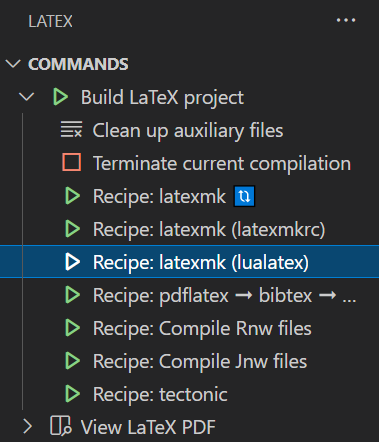

# LaTeX 环境配置


## 网页环境

### Overleaf

[Overleaf](https://www.overleaf.com) 是一个在线的 LaTeX 编辑环境，可以避免在本地安装和配置的过程，同时还能和他人共享编辑

官网的 [教程文档](https://www.overleaf.com/learn) 给了丰富的图文教程，这里不再赘述

推荐优先查看 [创建文档](https://www.overleaf.com/learn/how-to/Creating_a_document_in_Overleaf) 和 [共享项目](https://www.overleaf.com/learn/how-to/Sharing_a_project)

## 本地环境

### TeX Live

TeX Live 可以利用镜像安装节省下载时间

- 从 [清华镜像站](https://mirrors.tuna.tsinghua.edu.cn/CTAN/systems/texlive/Images/) 直接下载
- 或者利用 [种子文件](http://www.tug.org/texlive/acquire-iso.html#torrent) BT 下载镜像

可以在安装 TeX Live 时同时勾选上安装 TeXworks 前端，然后就可以使用 TeXworks 作为 IDE 来使用了

### TeXstudio

TeXstudio 也是一个很好的 LaTeX 编辑软件，可以直接去 [官网](https://www.texstudio.org/) 下载安装，并且有中文界面

### VSCode

个人更喜欢 VSCode，通过安装扩展并进行相应的配置即可较好的支持 LaTeX，同时还有格式化和自动补全等功能，非常方便

#### 安装 LaTeX Workshop 扩展

直接在 [VSCode 的扩展商店](https://marketplace.visualstudio.com/items?itemName=James-Yu.latex-workshop) 中搜索 `LaTeX Workshop` 安装即可

#### 编译链配置

1. 默认配置

    TeX Live 安装时会同时安装 `latexmk`, LaTeX Workshop 会默认使用 `latexmk` 来编译 `.tex`，无需手动再配置

2. 手动配置(可选)

    手动配置 LaTeX Workshop，在 VSCode 的配置文件 `settings.json` 中直接手动添加如下代码:

    主要参考插件的 [官方 recipes 配置](https://github.com/James-Yu/LaTeX-Workshop/wiki/Compile#latex-recipes) 修改

    ```json
    // 配置编译链，可以根据需要做修改
    "latex-workshop.latex.recipes": [
        {
            "name": "xelatex 🔃",
            "tools": [
                "xelatex"
            ]
        },
        {
            "name": "pdflatex 🔃",
            "tools": [
                "pdflatex"
            ]
        },
        {
            "name": "latexmk 🔃",
            "tools": [
                "latexmk"
            ]
        },
        {
            "name": "xelatex ➞ bibtex ➞ xelatex`×2",
            "tools": [
                "xelatex",
                "bibtex",
                "xelatex",
                "xelatex"
            ]
        },
        {
            "name": "pdflatex ➞ bibtex ➞ pdflatex`×2",
            "tools": [
                "pdflatex",
                "bibtex",
                "pdflatex",
                "pdflatex"
            ]
        }
    ],
    // 具体的编译命令配置
    "latex-workshop.latex.tools": [
        {
            "name": "latexmk",
            "command": "latexmk",
            "args": [
                "-synctex=1",
                "-interaction=nonstopmode",
                "-file-line-error",
                "-pdf",
                "-outdir=%OUTDIR%",
                "%DOC%"
            ]
        },
        {
            "name": "xelatex",
            "command": "xelatex",
            "args": [
                "-synctex=1",
                "-interaction=nonstopmode",
                "-file-line-error",
                "%DOC%"
            ]
        },
        {
            "name": "pdflatex",
            "command": "pdflatex",
            "args": [
                "-synctex=1",
                "-interaction=nonstopmode",
                "-file-line-error",
                "%DOC%"
            ]
        },
        {
            "name": "bibtex",
            "command": "bibtex",
            "args": [
                "%DOCFILE%"
            ]
        }
    ],
    ```

#### 正向同步

正向同步指的是编译完成后，在 `.tex` 文件内通过快捷键，快速定位到光标位置在 `.tex` 的对应位置，方便查看 PDF 文件

推荐打开文件修改后，编译完成后自动正向同步。该功能通过 `latex-workshop.synctex.afterBuild.enabled` 来控制

```json
"latex-workshop.synctex.afterBuild.enabled": true,
```

#### 反向同步

反向同步指的是编译完成后，在 PDF 文件内通过快捷键，快速定位点击部分在 `.tex` 的位置，方便修改 `.tex` 源码

主要参考插件的 [官方 synctex 配置](https://github.com/James-Yu/LaTeX-Workshop/wiki/View#synctex) 修改

1. VSCode 内部 PDF 浏览器

    如果直接使用 VSCode 来浏览 PDF，不需要额外设置，可以根据需要修改 `latex-workshop.view.pdf.internal.synctex.keybinding` 来修改反向同步的快捷键即可，默认 Ctrl 加鼠标左键

    ```json
    // 默认 Ctrl 加鼠标左键
    "latex-workshop.view.pdf.internal.synctex.keybinding": "ctrl-click",
    ```

2. 外部 PDF 浏览器

    [SumatraPDF](https://www.sumatrapdfreader.org/free-pdf-reader) 是一款流行的小巧方便的免费 PDF 浏览软件。VSCode 支持使用外部的 PDF 浏览器来查看编译后的 PDF 文件，以及反向搜索功能。主要需要如下配置：

    ```json
    // 配置为使用外部 PDF 浏览软件来浏览 PDF
    "latex-workshop.view.pdf.viewer": "external",
    // 配置外部 PDF 浏览软件的命令行以及参数
    "latex-workshop.view.pdf.external.viewer.command": "D:/Program/SumatraPDF/SumatraPDF-3.2-64.exe", // 自行修改路径
    "latex-workshop.view.pdf.external.viewer.args": [
        "%PDF%"
    ],
    ```

    在 SumatraPDF 的设置-选项中设置反向搜索命令行 `C:\Users\<user>\AppData\Local\Programs\Microsoft VS Code\Code.exe -g "%f:%l"`，Code 的路径应该为完整的绝对路径

#### 其他可选配置

```json
// 关闭自动编译
"latex-workshop.latex.autoBuild.run": "never",
// 默认选择上次编译链
"latex-workshop.latex.recipe.default": "lastUsed"
// 右键菜单
"latex-workshop.showContextMenu": true,
// 关闭编译出错的弹窗
"latex-workshop.message.error.show": false,
"latex-workshop.message.warning.show": false,
```

## 中文支持

该节主要参考 [Overleaf Chinese](https://cn.overleaf.com/learn/latex/Chinese) 文档

**推荐使用 XeLaTeX 和 LuaLaTeX 来编译含有中文字符的 `.tex` 文件**

### XeLaTeX 和 LuaLaTeX

1. 直接使用 `ctexart` 文档类即可支持中文
2. 或者使用 `ctex` 包来支持中文

参考代码如下：

```tex
\documentclass{ctexart}

\begin{document}

\tableofcontents

\begin{abstract}
这是简介及摘要。
\end{abstract}

\section{前言}

\section{关于数学部分}
数学、中英文皆可以混排。You can intersperse math, Chinese and English (Latin script) without adding extra environments.

這是繁體中文。

\end{document}
```

或者

```tex
\documentclass{xxx}
\usepackage{ctex}
```

### XeLaTeX

XeLaTeX 还可以使用 `xeCJK` 包来支持中文

参考代码如下：

```tex
\documentclass{article}
\usepackage{xeCJK}
\begin{document}

\section{前言}

\section{关于数学部分}
数学、中英文皆可以混排。You can intersperse math, Chinese and English (Latin script) without adding extra environments.

這是繁體中文。
\end{document}
```

### pdfLaTeX

pdfLaTeX 对中文支持不是很好，只用 pdaLaTeX 的话需要引入 `CJKutf8` 包，并且用 `\begin{CJK*}{UTF8}{gbsn}` 和 `\end{CJK*}` 包住所有的中文。

- `gbsn` 和 `gkai` 是简体的字体
- `bsmi` 和 `bkai` 是繁体的字体

参考代码如下：

```tex
\documentclass{article}
\usepackage{CJKutf8}

\begin{document}

\begin{CJK*}{UTF8}{gbsn}

\section{前言}

\section{关于数学部分}
数学、中英文皆可以混排。You can intersperse math, Chinese and English (Latin script) without adding extra environments.

\end{CJK*}

\bigskip  %% Just some white space

You can also insert Latin text in your document

\bigskip  %% Just some white space

\begin{CJK*}{UTF8}{bsmi}
這是繁體中文。
\end{CJK*}

\end{document}
```

### 编译

1. 首先 `.tex` 文件名以及路径尽量不要含有空格以及中文字符
2. 在使用 `latexmk` 和 VSCode 的 LaTeX Workshop 时，推荐使用第三个编译链 `Recipe: latexmk (lualatex)`

    

## 参考资料

- [【Overleaf】教程文档](https://www.overleaf.com/learn)
- [【Overleaf】创建文档](https://www.overleaf.com/learn/how-to/Creating_a_document_in_Overleaf)
- [【Overleaf】共享项目](https://www.overleaf.com/learn/how-to/Sharing_a_project)
- [【LaTeX Workshop】依赖](https://github.com/James-Yu/LaTeX-Workshop/wiki/Install#requirements)
- [【LaTeX Workshop】recipes 配置](https://github.com/James-Yu/LaTeX-Workshop/wiki/Compile#latex-recipes)
- [【LaTeX Workshop】synctex 配置](https://github.com/James-Yu/LaTeX-Workshop/wiki/View#synctex)
- [【知乎】使用 VSCode 编写 LaTeX](https://zhuanlan.zhihu.com/p/38178015)
- [【知乎】Visual Studio Code 配置 LaTeX](https://zhuanlan.zhihu.com/p/166523064)
- [【Overleaf】Chinese](https://cn.overleaf.com/learn/latex/Chinese)


---

> 作者: [Zeus](https://github.com/ywang-wnlo)  
> URL: https://ywang-wnlo.github.io/posts/4f94956/  

