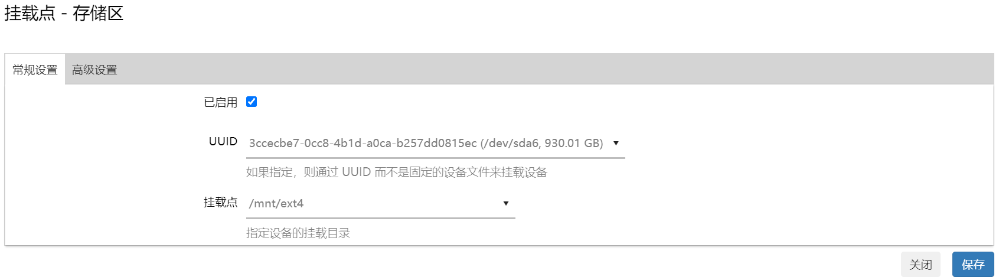
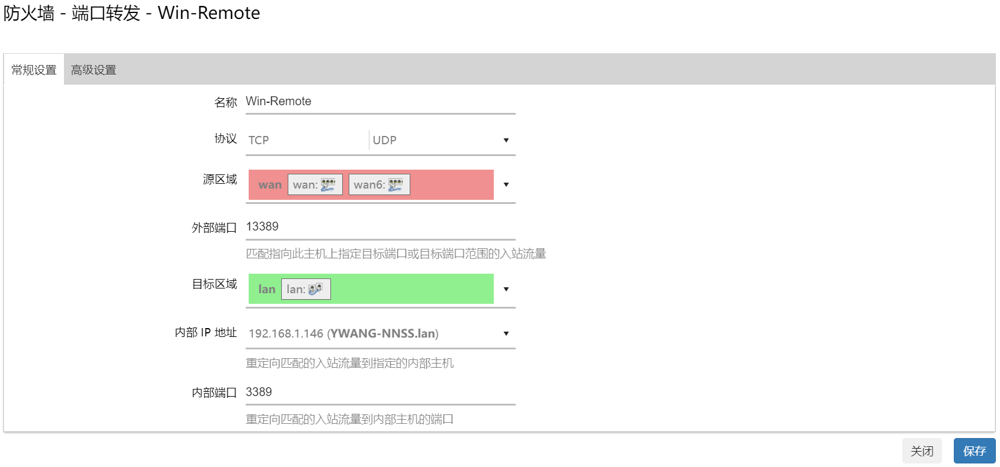
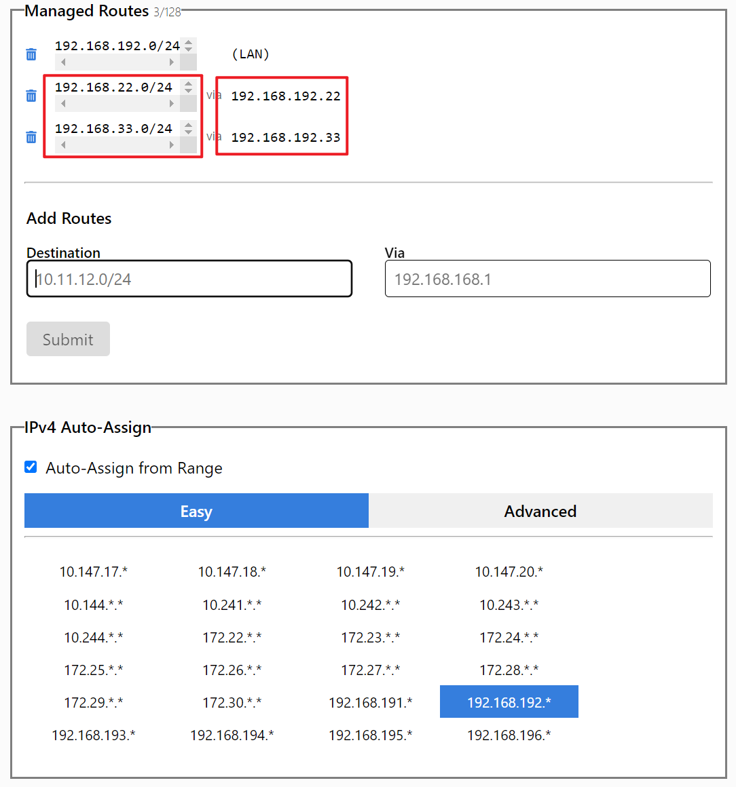
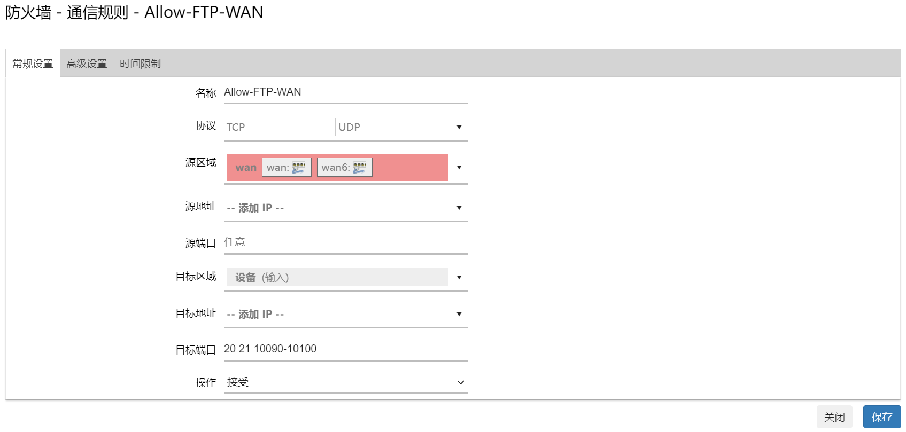
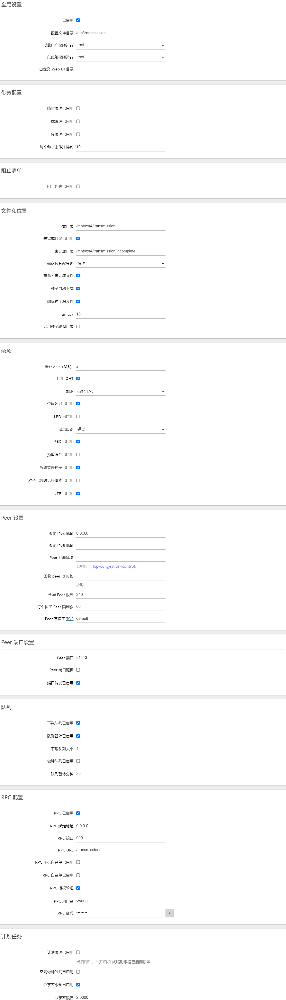

# OpenWrt 配置使用


## Web 界面

一般 OpenWrt 安装好之后会已经默启用了 Web 管理界面（LuCI），默认地址是 `192.168.1.1`，默认账号是 `root`，无密码，直接点击登录即可进入

### 汉化

默认界面是英文的，可以在 [系统-软件](http://192.168.1.1/cgi-bin/luci/admin/system/opkg) 中搜索中文包安装进行汉化

- 点击 `UPDATE LIST...` 耐心等待软件包的更新
- 然后在 `Filter:` 下的输入框中输入 `luci-i18n-base-zh-cn`，在筛选出来的结果中点击 `INSTALL...`，安装勾上 `Overwrite files from other package(s)`，然后点击 `INSTALL`，耐心等待安装完成之后刷新网页（Ctrl+F5）可以看见大部分界面已经汉化了
- 同理安装 `luci-i18n-opkg-zh-cn` 包用于 [系统-软件](http://192.168.1.1/cgi-bin/luci/admin/system/opkg) 界面的汉化
- 同理安装 `luci-i18n-firewall-zh-cn` 包用于 [网络-防火墙](http://192.168.1.1/cgi-bin/luci/admin/network/firewall) 界面的汉化

```bash
opkg update
opkg install luci-i18n-base-zh-cn luci-i18n-opkg-zh-cn luci-i18n-firewall-zh-cn
```

### root 密码

进入管理界面后进入 [系统-管理-密码](http://192.168.1.1/cgi-bin/luci/admin/system/admin/password) 界面修改路由器密码，同时也是系统的 root 账号的密码

### ssh

然后在 [系统-管理-ssh](http://192.168.1.1/cgi-bin/luci/admin/system/admin/dropbear) 可以配置 ssh 登录，参考配置如下

- 接口：不指定 → 内网以及外网都可以 ssh 登录
- 端口：22 → ssh 默认端口，不做修改
- 密码验证：不勾选 → 推荐使用 ssh 登录
- 允许 root 用户凭密码登录：不勾选 → 推荐使用 ssh 登录
- 网关端口：根据需要勾选

按照上面配置完成后将只能通过 ssh 密钥进行登录，所以还得在 [系统-管理-ssh密钥](http://192.168.1.1/cgi-bin/luci/admin/system/admin/sshkeys) 添加设备的公钥

### 升级 LuCI

ssh 登入路由器后执行以下命令：

```bash
# 更新软件源
opkg update
# luci-compat 包有时可以帮助解决一些兼容性问题，推荐一同安装
opkg install luci luci-base luci-compat
```

### 美化

原始的 `bootstrap` 主题个人不太喜欢，在空间足够的情况下我个人额外安装了 `material`，主题的切换在 [系统-系统-语言和界面](http://192.168.1.1/cgi-bin/luci/admin/system/system) 中

```bash
opkg update
opkg install luci-theme-material
```

## USB

很多路由器有 USB 端口，通过插入 U 盘或者接入磁盘、SSD 等设备可以拓展存储空间，这样就可以安装更多的插件，或者搭建一个简单的 FTP、SMB 服务器用于共享数据

### 安装 USB 驱动

依次执行以下命令进行驱动基本包的安装

```bash
opkg update
opkg install kmod-usb-core
# insmod usbcore
opkg install kmod-usb-storage
```

如果设备是 USB 2.0

```bash
opkg install kmod-usb2
# insmod ehci-hcd
```

如果设备是 USB 3.0

```bash
opkg install kmod-usb3
# insmod xhci-hcd
```

通常移动硬盘或者移动 SSD 还需要安装 UAS/UASP 支持

```bash
opkg install kmod-usb-storage-uas
```

然后热插拔存储设备，通常就能在 `/dev` 目录下看见 `sda` 设备了

### 自动挂载

- 安装块设备工具包

  ```bash
  opkg install block-mount
  ```

- 分区

  个人已经提前将存储设备划分了两个分区，一个分区较小(sda1)用于后续的 [Extroot](#extroot)，剩余的空间(sda2)全用于存储个人数据

- 创建文件系统

  推荐移动磁盘用 ext4 文件系统，而移动 SSD 推荐使用 f2fs 文件系统

  分区和创建文件系统可以参考 [官网的指导](https://openwrt.org/docs/guide-user/storage/usb-drives#create_a_partition_on_the_usb_disk)

  例如：

  ```bash
  # ext4
  opkg install e2fsprogs
  opkg install kmod-fs-ext4
  mkfs.ext4 /dev/sda1

  # f2fs
  opkg install f2fs-tools
  opkg install kmod-fs-f2fs
  mkfs.f2fs /dev/sda1
  ```

- 配置挂载

  配置挂载可以通过直接在网页端的 [系统-挂载点](http://192.168.1.1/cgi-bin/luci/admin/system/mounts) 进行手动配置，比较直观，如图所示：

  

  - 已启用：勾选
  - UUID：推荐使用 UUID 来进行挂载
  - 挂载点：也就是挂载的位置，通常在 `/mnt` 目录下新建一个文件夹

### Extroot

有时候安装太多包会导致本地空间不足，此时可以通过将包安装在 USB 设备上，也可以通过 Extroot 的方式将 USB 设备的空间直接配置成 `overlay` 分区，后者更为推荐

1. 修改 `fstab`，将原本挂载的 `overlay` 设备挂载到新的目录 `/rwm`

    ```bash
    DEVICE="$(sed -n -e "/\s\/overlay\s.*$/s///p" /etc/mtab)"
    uci -q delete fstab.rwm
    uci set fstab.rwm="mount"
    uci set fstab.rwm.device="${DEVICE}"
    uci set fstab.rwm.target="/rwm"
    uci commit fstab
    ```

2. 修改 `fstab`，配置 USB 设备挂载成 `overlay` 分区

    其中部分部分操作在 [上节](#自动挂载) 已经执行过，可以略去

    ```bash
    # 查看分区信息
    # block info

    # 确定分区并制作文件系统
    DEVICE="/dev/sda1"
    # mkfs.ext4 ${DEVICE}

    eval $(block info ${DEVICE} | grep -o -e "UUID=\S*")
    uci -q delete fstab.overlay
    uci set fstab.overlay="mount"
    uci set fstab.overlay.uuid="${UUID}"
    uci set fstab.overlay.target="/overlay"
    uci commit fstab
    ```

3. 将原本 `overlay` 分区数据复制到 USB 设备上，重启设备

    ```bash
    mkdir -p /tmp/cproot
    mount --bind /overlay /tmp/cproot
    mkdir -p /mnt/tmp
    mount ${DEVICE} /mnt/tmp
    tar -C /tmp/cproot -cvf - . | tar -C /mnt/tmp -xf -
    umount /tmp/cproot /mnt/tmp
    reboot
    ```

## 锐捷认证

很多学校校园网通常采用锐捷认证，并且限制了用户账号的登陆数量，但是我们可以通过在路由器上进行锐捷认证来接入校园网，之后连接路由器的所有设备都会直接接入校园网而不需要认证了

### MentoHUST

**首选，自动重连比 Minieap 靠谱得多！！！**

[MentoHUST](http://byhh.hust.edu.cn/cgi-bin/bbsnewtcon?board=NetResource&file=M.1230774282.A) 是华中科技大学的 [HustMoon](http://byhh.hust.edu.cn/cgi-bin/bbsqry?userid=HustMoon) 最初在校内 BBS 白云黄鹤上发布的一款可以在 Linux 系统上进行锐捷认证的软件。不过 [原始项目](https://code.google.com/archive/p/mentohust/) 已经归档，不在开发，GitHub 上有加入 v4 支持的 [新项目](https://github.com/hyrathb/mentohust)

而在 OpenWrt 可以通过 GitHub 上的两个项目手动编译 `.ipk` 文件，然后 `opkg install xxx.ipk` 进行安装即可

- 通过 [MentoHUST-OpenWrt-ipk](https://github.com/KyleRicardo/MentoHUST-OpenWrt-ipk) OpenWrt 项目可以生成  `mentohust` 的二进制文件
- ~~通过 [OpenWrt/LEDE LuCI for MentoHUST](https://github.com/BoringCat/luci-app-mentohust) 项目可以生成 MentoHUST 的 LuCI 控制界面~~（命令行已经足够）

手动编译 `ipk` 文件的过程可以参考 [这里](/posts/96a1807/)

### ~~MiniEAP~~

~~[MiniEAP](https://github.com/updateing/minieap) 是一个实现了标准 EAP-MD5-Challenge 算法的 EAP 客户端，支持通过插件来修改标准数据包以通过特殊服务端的认证。同时含有支持锐捷 v3 (v4) 算法的插件，可以用来进行锐捷认证~~

~~而在 OpenWrt 可以通过 GitHub 上的两个项目手动编译 `.ipk` 文件，然后 `opkg install xxx.ipk` 进行安装即可~~

- ~~通过 [minieap-openwrt](https://github.com/BoringCat/minieap-openwrt) 项目可以生成 `minieap` 的二进制文件~~
- ~~(可选) 通过 [OpenWrt/LEDE LuCI for minieap](https://github.com/BoringCat/luci-app-minieap) 项目可以生成 MiniEAP 的 LuCI 控制界面~~

~~补充：如果想要掉线自动重新认证，在配置文件中不要配置 `no-auto-reauth`，参考该 [minieap@issue#43](https://github.com/updateing/minieap/issues/43)~~

## 防火墙

防火墙规则的详细配置可以参考 [官方的介绍](https://openwrt.org/docs/guide-user/firewall/firewall_configuration#rules) 以及部分 [例子](https://openwrt.org/zh-cn/doc/uci/firewall#%E4%B8%BE%E4%BE%8B)

### 开放端口

以开放 80 端口，用于外网直接访问 Web 界面为例：

1. 首先要在 [网络-防火墙-通信规则](http://192.168.1.1/cgi-bin/luci/admin/network/firewall/rules) 点击新增，进行如下配置

    

    - 名称：可以随意设置
    - 协议：根据需要进行选择即可
    - 源区域：选择 WAN 表示是从外网进行访问
    - 源地址以及源端口：主要用于限制来访的设备，可以根据需要进行配置
    - 目标区域：选择 `设备` 代表这是一个入站的规则
    - 目标地址：因为是访问设备，此时不需要配置
    - 目标端口：Web 的默认端口是 80
    - 操作：开放端口，当然是选择接受

2. 然后在 [状态-防火墙](http://192.168.1.1/cgi-bin/luci/admin/status/iptables) 根据需要对 IPv4、IPv6 防火墙进行重启即可

如果这时外网还是不能访问 LuCI 的 Web 界面，可以尝试路由器重启，确认路由器的 IP 是否能够 ping 通，以及确认 80 端口有没有被运营商封禁

### 端口转发

以将 Windows 的远程连接的端口 3389 为例：

1. 首先要在 [网络-防火墙-端口转发](http://192.168.1.1/cgi-bin/luci/admin/network/firewall/forwards) 点击新增，进行如下配置

    

    - 名称：可以随意设置
    - 协议：根据需要进行选择即可
    - 源区域：选择 WAN 表示是从外网进行访问
    - 外部端口：这里配置成 13389
    - 目标区域：选择 `LAN`
    - 内部 IP 地址：配置成内网需要远程连接的主机
    - 内部端口：远程连接的默认端口是 3389

2. 然后在 [状态-防火墙](http://192.168.1.1/cgi-bin/luci/admin/status/iptables) 根据需要对 IPv4、IPv6 防火墙进行重启即可

后续就可以通过访问路由器 `WAN_IP:13389` 来远程连接内网的 Windows 主机了

## IPv6

在校园网环境下发现 WAN 口默认能自动获取到 IPv6 地址（但是 /128 的地址），并且在路由器上测试也能正常访问 IPv6 网站，但是局域网内的设备不能正常访问 IPv6 网站，于是选择 NAT6 的方式来解决

参考 [官网的 NAT6 文档](https://openwrt.org/docs/guide-user/network/ipv6/ipv6.nat6)，需要在路由器内依次进行如下配置：

注：基于 OpenWrt 22.03.2 版本配置，版本不同配置可能有所不同！

1. 安装 kmod-ipt-nat6 包

    ```bash
    # Install packages
    opkg update
    opkg install kmod-ipt-nat6
    ```

2. 配置 IPv6 ULA 前缀，使得内网设备默认使用 IPv6

    ```bash
    # Using IPv6 by default
    NET_ULA="$(uci get network.globals.ula_prefix)"
    uci set network.globals.ula_prefix="d${NET_ULA:1}"
    # 默认 network.lan.ip6assign 配置可能有误，需要根据 ula_prefix 重新配置
    IP6_ASSIGN="$(echo ${NET_ULA} | grep -E '(\d+)$' -o)"
    uci set network.lan.ip6assign="${IP6_ASSIGN}"
    uci commit network
    /etc/init.d/network restart
    ```

3. 配置 WAN6 以及 LAN 端口

    ```bash
    uci set dhcp.wan6.ra='relay'
    uci set dhcp.wan6.dhcpv6='relay'
    uci delete dhcp.wan6.ndp
    uci set dhcp.wan6.master='1'

    uci set dhcp.lan.ra_default='1'
    uci set dhcp.lan.ra='server'
    uci set dhcp.lan.dhcpv6='server'
    uci delete dhcp.lan.ndp
    uci set dhcp.lan.ra_management='1'

    uci commit dhcp
    /etc/init.d/odhcpd restart
    ```

4. 配置防火墙

    ```bash
    # Configure firewall
    uci set firewall.@zone[1].masq6="1"
    uci commit firewall
    /etc/init.d/firewall restart
    ```

5. 添加 ipv6 默认网关

    ```bash
    cd /etc/hotplug.d/iface
    touch 90-nat66
    echo "#!/bin/sh" >> 90-nat66
    echo "[ \"\$ACTION\" = ifup ] || exit 0" >> 90-nat66
    echo "route -A inet6 add default gw \`(ip -6 route | grep default | awk '{print \$5,\$6,\$7}')\`" >> 90-nat66
    ```

    也可以直接 `vim /etc/hotplug.d/iface/90-nat66` 填入：

    ```bast
    #!/bin/sh
    [ "$ACTION" = ifup ] || exit 0
    route -A inet6 add default gw `(ip -6 route | grep default | awk '{print $5,$6,$7}')`
    ```

    该步骤主要是让 OpenWRT 每次重启后自动添加 ipv6 默认网关，如果要立即生效可以手动执行

6. 重启路由器

## ZeroTier

为了异地内网互访，ZeroTier 可以算是一个“神器”了，虽然不如 frp 稳定，但是胜在免费，无需公网 VPS


1. 首先安装 zerotier 包

    ```bash
    opkg update
    opkg install zerotier
    ```

2. 直接修改配置文件

    ```bash
    vim /etc/config/zerotier
    ```

    默认文件类似下面这样

    ```txt
    config zerotier sample_config
        option enabled 0

        # persistent configuration folder (for ZT controller mode)
        #option config_path '/etc/zerotier'

        #option port '9993'

        # Generate secret on first start
        option secret ''

        # Join a public network called Earth
        list join '8056c2e21c000001'
        #list join '<other_network>'
    ```

    修改其中的 `enabled` 为 1，开启服务，并且 `list join` 后的网络 ID 改为自己申请的网络 ID 即可

    也可以新建一个配置，填上自己的网络 ID，如下

    ```bash
    uci set zerotier.openwrt_network=zerotier
    uci add_list zerotier.openwrt_network.join='xxxxxxxxxxxxxxxx'
    uci set zerotier.openwrt_network.enabled='1'
    uci commit zerotier
    ```

3. 重启路由器

    ```bash
    reboot
    ```

4. 配置防火墙

    开启外网 udp 到 9993 端口的访问权限

    ```bash
    uci add firewall rule
    uci set firewall.@rule[-1].name='Allow-ZeroTier-Inbound'
    uci set firewall.@rule[-1].src='*'
    uci set firewall.@rule[-1].target='ACCEPT'
    uci set firewall.@rule[-1].proto='udp'
    uci set firewall.@rule[-1].dest_port='9993'
    uci commit firewall
    /etc/init.d/firewall restart
    ```

5. 配置 ZeroTier 的路由

    在 [网络-接口](http://192.168.1.1/cgi-bin/luci/admin/network/network) 界面新建一个接口，ztXXXXXXXX 根据实际情况替换，后续类似不再重复

    ```txt
    名称：ZeroTier
    协议：不配置协议
    设备：ztXXXXXXXX
    ```

    命令行也可以

    ```bash
    uci set network.ZeroTier=interface
    uci set network.ZeroTier.proto='none'
    uci set network.ZeroTier.device='ztXXXXXXXX'
    uci commit network
    /etc/init.d/network restart
    ```

    然后在 [网络-防火墙](http://192.168.1.1/cgi-bin/luci/admin/network/firewall) 界面新建一个防火墙区域

    ```txt
    名称: zerotier
    入站数据：接受
    出站数据：接受
    转发：拒绝
    IP 动态伪装: [√]
    MSS 钳制: [ ]
    涵盖的网络: [√] ZeroTier
    允许转发到目标区域：[√] lan
                    [√] wan wan6
    允许来自源区域的转发：[√] lan
    ```

    命令行也可以，仅供参考

    ```bash
    uci add firewall zone
    uci set firewall.@zone[-1].name='zerotier'
    uci set firewall.@zone[-1].input='ACCEPT'
    uci set firewall.@zone[-1].output='ACCEPT'
    uci set firewall.@zone[-1].forward='ACCEPT'
    uci set firewall.@zone[-1].masq='1'
    uci add_list firewall.@zone[-1].network='ZeroTier'
    uci add firewall forwarding
    uci set firewall.@forwarding[-1].src='zerotier'
    uci set firewall.@forwarding[-1].dest='lan'
    uci add firewall forwarding
    uci set firewall.@forwarding[-1].src='zerotier'
    uci set firewall.@forwarding[-1].dest='wan'
    uci add firewall forwarding
    uci set firewall.@forwarding[-1].src='lan'
    uci set firewall.@forwarding[-1].dest='zerotier'
    uci commit firewall
    /etc/init.d/firewall restart
    ```
    
    至此路由器本身的配置就完了，然后需要去 [zerotier 官网](https://my.zerotier.com/network) 配置一下路由

    

    例如我的局域网段选的 `192.168.192.*`，两个路由器实际的内网的 LAN 口配置依次为 `192.168.22.0/24` 和 `192.168.33.0/24` 对应左边的红框，路由器自身的 ZeroTier 的虚拟 IP 为 `192.168.192.22` 和 `192.168.192.33` 则对应着右边红框，这里不详细展开，可以参考 [这篇博文](https://stray.love/jiao-cheng/zerotier-zhong-jie-jiao-cheng)

## FTP

配置好 USB 后，就可以配置 FTP 来共享 USB 设备

1. 首先安装 vsftpd 包

    ```bash
    opkg install vsftpd
    ```

2. 修改配置文件 `/etc/vsftpd.conf`，这里给出个人的配置，可以参考

    ```ini
    background=YES
    listen=YES
    anonymous_enable=NO
    local_enable=YES
    write_enable=YES
    local_umask=022
    check_shell=NO
    #dirmessage_enable=YES
    #ftpd_banner=Welcome to MINI FTP service.
    session_support=NO
    #syslog_enable=YES
    #userlist_enable=YES
    #userlist_deny=NO
    #userlist_file=/etc/vsftpd/vsftpd.users
    #xferlog_enable=YES
    #xferlog_file=/var/log/vsftpd.log
    #xferlog_std_format=YES
    ###
    ### TLS/SSL options
    ### example key generation: openssl req -x509 -nodes -days 365 -newkey rsa:2048 -keyout /etc/vsftpd/vsftpd_privkey.pem -out /etc
    #ssl_enable=YES
    #allow_anon_ssl=NO
    #force_local_data_ssl=NO
    #force_local_logins_ssl=NO
    #ssl_tlsv1=YES
    #ssl_sslv2=NO
    #ssl_sslv3=NO
    #rsa_cert_file=/etc/vsftpd/vsftpd_cert.pem
    #rsa_private_key_file=/etc/vsftpd/vsftpd_privkey.pem
    # 共享的目录位置
    local_root=/mnt/ext4
    pasv_enable=YES
    pasv_min_port=10090
    pasv_max_port=10100
    ```

3. 然后参考之前的 [开放端口](#开放端口)，打开 20、21、10090-10100 端口就可以在外网访问 FTP 服务器了

    

4. 之后重启 `vsftpd` 服务即可使用

    ```bash
    /etc/init.d/vsftpd restart
    ```

P.S. 连接 ftp 服务器的账号密码就是路由器的 root 账号密码

## SMB

使用 Samba 来共享的设备可以在 Windows 的文件资源管理器中挂载，使用起来和本地磁盘一样（在局域网内）

1. 安装 samba4-server 以及 LuCI 管理界面

    ```bash
    opkg install samba4-server
    opkg install luci-app-samba4 luci-i18n-samba4-zh-cn
    ```

2. 在网页端的 [服务-网络共享](http://192.168.1.1/cgi-bin/luci/admin/services/samba4) 中进行配置，个人配置如下，可以参考

    

3. 之后重启 `samba4` 服务即可使用

    ```bash
    /etc/init.d/samba4 restart
    ```

P.S. 连接 Samba 服务器的账号密码也是路由器的 root 账号密码

## BT 下载

transmission 是一个轻量级跨平台的 BT 下载客户端

1. 安装 transmission

    ```bash
    opkg install transmission-daemon
    opkg install transmission-cli
    opkg install transmission-web   # web 界面，可选
    opkg install transmission-remote
    opkg install luci-app-transmission luci-i18n-transmission-zh-cn
    ```

2. 直接修改 `/etc/config/transmission`，或者在网页端的 [服务-Transmission](http://192.168.1.1/cgi-bin/luci/admin/services/transmission) 进行配置，下面给出个人配置，可以参考

    

    ```ini
    config transmission
        option config_overwrite '1'
        option mem_percentage '50'
        option nice '10'
        option alt_speed_enabled 'false'
        option alt_speed_time_enabled 'false'
        option bind_address_ipv4 '0.0.0.0'
        option bind_address_ipv6 '::'
        option blocklist_enabled 'false'
        option cache_size_mb '2'
        option dht_enabled 'true'
        option download_queue_enabled 'true'
        option download_queue_size '4'
        option encryption '1'
        option idle_seeding_limit_enabled 'false'
        option lazy_bitfield_enabled 'true'
        option lpd_enabled 'false'
        option message_level '1'
        option peer_limit_global '240'
        option peer_limit_per_torrent '60'
        option peer_port '51413'
        option peer_port_random_on_start 'false'
        option peer_socket_tos 'default'
        option pex_enabled 'true'
        option port_forwarding_enabled 'true'
        option preallocation '1'
        option queue_stalled_enabled 'true'
        option queue_stalled_minutes '30'
        option ratio_limit '2.0000'
        option rename_partial_files 'true'
        option rpc_bind_address '0.0.0.0'
        option rpc_enabled 'true'
        option rpc_host_whitelist_enabled 'false'
        option rpc_port '9091'
        option rpc_url '/transmission/'
        option rpc_whitelist_enabled 'false'
        option scrape_paused_torrents_enabled 'true'
        option script_torrent_done_enabled 'false'
        option seed_queue_enabled 'false'
        option speed_limit_down_enabled 'false'
        option speed_limit_up_enabled 'false'
        option start_added_torrents 'true'
        option umask '18'
        option utp_enabled 'true'
        option scrape_paused_torrents 'true'
        option watch_dir_enabled 'false'
        option enabled '1'
        option user 'root'
        option group 'root'
        option upload_slots_per_torrent '10'
        option download_dir '/mnt/ext4/transmission'
        option incomplete_dir_enabled 'true'
        option incomplete_dir '/mnt/ext4/transmission/incomplete'
        option trash_original_torrent_files 'true'
        option rpc_authentication_required 'true'
        option rpc_username 'rpc_username'
        option rpc_password 'rpc_password'
        option ratio_limit_enabled 'true'
        option config_dir '/etc/transmission'
    ```

3. 之后重启 `transmission` 服务即可使用

    ```bash
    /etc/init.d/transmission restart
    ```

连接的账号密码为自行配置的 `RPC` 连接的账号密码

默认的 [Web 界面](http://192.168.1.1:9091/transmission/web/) 比较简陋，并且不能配置 tracker，个人推荐使用 [transgui](https://github.com/transmission-remote-gui/transgui) 来 `RPC` 连接使用

如果需要远程访问，则需要将 `rpc_port` 配置的端口开放，具体流程参考 [上文](#开放端口)

## 参考资料

- [【OpenWrt】LuCI](https://openwrt.org/docs/guide-user/luci/luci.essentials)
- [【CSDN】luci.cbi 报错](https://blog.csdn.net/weixin_43274097/article/details/107197717)
- [【GitHub】应用设置界面错误](https://github.com/kuoruan/luci-app-v2ray/issues/42)
- [【OpenWrt】安装 USB 驱动](https://openwrt.org/docs/guide-user/storage/usb-installing)
- [【OpenWrt】使用 USB 设备](https://openwrt.org/docs/guide-user/storage/usb-drives)
- [【OpenWrt】Extroot 配置](https://openwrt.org/docs/guide-user/additional-software/extroot_configuration)
- [【GitHub】MentoHUST 加入 v4 支持](https://github.com/hyrathb/mentohust)
- [【GitHub】MentoHUST-OpenWrt-ipk](https://github.com/KyleRicardo/MentoHUST-OpenWrt-ipk)
- [【GitHub】OpenWrt/LEDE LuCI for MentoHUST](https://github.com/BoringCat/luci-app-mentohust)
- [【GitHub】MiniEAP](https://github.com/updateing/minieap)
- [【GitHub】minieap-openwrt](https://github.com/BoringCat/minieap-openwrt)
- [【GitHub】OpenWrt/LEDE LuCI for minieap](https://github.com/BoringCat/luci-app-minieap)
- [【GitHub】no-auto-reauth 配置项的逻辑判断有问题](https://github.com/updateing/minieap/issues/43)
- [【OpenWrt】firewall rules](https://openwrt.org/docs/guide-user/firewall/firewall_configuration#rules)
- [【OpenWrt】防火墙配置举例](https://openwrt.org/zh-cn/doc/uci/firewall#%E4%B8%BE%E4%BE%8B)
- [【OpenWrt】IPv6 NAT6 配置](https://openwrt.org/docs/guide-user/network/ipv6/ipv6.nat6)
- [【OpenWrt】默认使用 IPv6](https://openwrt.org/docs/guide-user/network/ipv6/ipv6_extras#using_ipv6_by_default)
- [【OpenWrt】默认 IPv6 路由](https://openwrt.org/docs/guide-user/network/ipv6/ipv6_extras#announcing_default_ipv6_route)
- [【Bilibili】【老湿基】IPv6 竟然也可以开 NAT｜OpenWRT IPv6 NAT 手把手教学](https://www.bilibili.com/video/BV1Ny4y1x7Pa)
- [【Zhihu】如何开启 NAT6](https://zhuanlan.zhihu.com/p/346606856)
- [【GitHub】ZeroTier setup on OpenWRT](https://github.com/mwarning/zerotier-openwrt/wiki)
- [【个人博客】ZeroTier 中阶教程](https://stray.love/jiao-cheng/zerotier-zhong-jie-jiao-cheng)
- [【OpenWrt】FTP](https://openwrt.org/docs/guide-user/services/nas/ftp.overview)
- [【OpenWrt】Samba](https://openwrt.org/docs/guide-user/services/nas/samba)
- [【OpenWrt】transmission](https://openwrt.org/docs/guide-user/services/downloading_and_filesharing/transmission)


---

> 作者: [Zeus](https://github.com/ywang-wnlo)  
> URL: https://ywang-wnlo.github.io/posts/51140c4a/  

