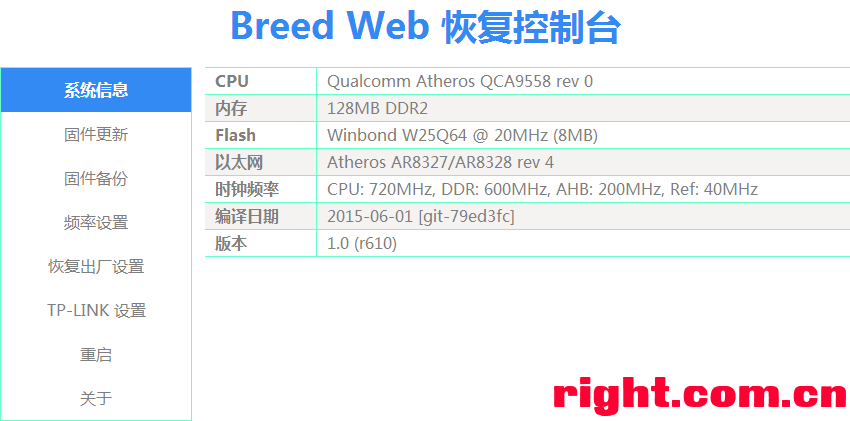

# Breed 介绍、刷入和使用

## 介绍

Breed 是国内个人 [hackpascal](https://github.com/hackpascal) 开发的闭源 Bootloader，也被称为“不死鸟”

因为有些官方升级固件自带 bootloader，如果从官方固件升级，会导致现有 bootloader 被覆盖。而当 Breed 更新固件时，它会自动删除固件附带的引导加载程序，因此可以防止 Breed 被覆盖

Breed 拥有以下特性：

- 实时刷机进度，进度条能准确反映刷机进度
- Web 页面快速响应
- 最大固件备份速度，依 Flash 而定，一般能达到 1MB/s
- 免按复位键进入 Web 刷机模式
- Telnet 功能，免 TTL 进入 Breed 命令控制台
- 复位键定义测试功能
- 固件启动失败自动进入 Web 刷机模式
- 可自定义位置和大小的环境变量块

由于是闭源，无法进行二次开发，所有支持的设备均由 hackpascal 一人完成。在 2020-10-09 后已经停止版本更新，但 [官网](https://breed.hackpascal.net/) 目前仍然开放所有的 Breed 下载

### 文件说明

下表为 Breed 的文件对应的设备介绍，发布在 [恩山论坛](https://www.right.com.cn/forum/thread-161906-1-1.html) 上，在此处做一个备份

| 文件名                                            | 说明                                                                                                                                    |
| ------------------------------------------------- | --------------------------------------------------------------------------------------------------------------------------------------- |
| BreedEnter.exe                                    | Breed 启动中断工具，实现免按复位键进入 Web 刷机模式                                                                                     |
| md5sum.txt                                        | 当前版本所有 Breed 文件的 MD5 值，用于校验文件的完整性                                                                                  |
| breed-mt7620-reset1.bin                           | MT7620A / MT7620N 全通用，波特率 57600，复位键 GPIO#1                                                                                   |
| breed-mt7620-reset2.bin                           | MT7620A / MT7620N 全通用，波特率 57600，复位键 GPIO#2                                                                                   |
| breed-mt7620-reset11.bin                          | MT7620A / MT7620N 全通用，波特率 57600，复位键 GPIO#11                                                                                  |
| breed-mt7620-reset12.bin                          | MT7620A / MT7620N 全通用，波特率 57600，复位键 GPIO#12                                                                                  |
| breed-mt7620-reset13.bin                          | MT7620A / MT7620N 全通用，波特率 57600，复位键 GPIO#13                                                                                  |
| breed-mt7620-reset26.bin                          | MT7620A / MT7620N 全通用，波特率 57600，复位键 GPIO#26                                                                                  |
| breed-mt7620-reset30.bin                          | MT7620A / MT7620N 全通用，波特率 57600，复位键 GPIO#30                                                                                  |
| breed-mt7620-rt-n14u.bin                          | MT7620A / MT7620N 全通用，波特率 57600，复位键 GPIO#1，WPS 键 GPIO#2                                                                    |
| breed-mt7620-whr-1166dhp.bin                      | MT7620A / MT7620N 全通用，波特率 57600，复位键 GPIO#52，AOSS 键 GPIO#53                                                                 |
| breed-mt7620-lenovo-y1.bin                        | 联想 Y1 (newifi mini) 专用，波特率 115200，复位键 GPIO#11                                                                               |
| breed-mt7620-lenovo-y1s.bin                       | 联想 Y1S (newifi) 专用，千兆口可用，波特率 115200，复位键 GPIO#11                                                                       |
| breed-mt7620-zte-q7.bin                           | 中兴 ZTE Q7 专用，波特率 57600，复位键 GPIO#26                                                                                          |
| breed-mt7620-youku-yk1.bin                        | 优酷路由宝专用，波特率 57600，复位键 GPIO#1                                                                                             |
| breed-mt7620-xiaomi-mini.bin                      | 小米 Mini 专用，波特率 115200，复位键 GPIO#30                                                                                           |
| breed-mt7620-fir302m.bin                          | 斐讯 FIR300M/302M 专用，波特率 57600，复位键 GPIO#2                                                                                     |
| breed-mt7620-phicomm-psg1208.bin                  | 斐讯 PSG1208 (K1)/ PSG1218 (K2) 专用，波特率 57600，复位键 GPIO#1                                                                       |
| breed-mt7620-hiwifi-hc5761.bin                    | 极路由 极壹S (HC5661)/极贰 (HC5761) 专用，波特率 115200，复位键 GPIO#12                                                                 |
| breed-mt7620-hiwifi-hc5861.bin                    | 极路由 极叁 (HC5861) 专用，千兆LAN可用，波特率 115200，复位键 GPIO#12                                                                   |
| breed-mt7620-oye-0001.bin                         | 哦耶 Oye-0001 专用，波特率 115200，复位键 GPIO#1                                                                                        |
| breed-mt7620-airmobi-iplay2.bin                   | AirMobi iPlay2 专用，波特率 57600，复位键 GPIO#26                                                                                       |
| breed-mt7621-newifi-d1.bin                        | 联想 Newifi D1 专用，DDR3 内存适用，默认 256MB DDR AC 时序参数，波特率 115200，复位键 GPIO#15，WPS 键 GPIO#18                           |
| breed-mt7621-newifi-d2.bin                        | 联想 Newifi D2 专用，DDR3 内存适用，默认 512MB DDR AC 时序参数，波特率 115200，复位键 GPIO#3，WPS 键 GPIO#7                             |
| breed-mt7621-xunlei-timeplug.bin                  | 迅雷时光机 (时光云) 专用，DDR3 内存适用，默认 256MB DDR AC 时序参数，波特率 115200，复位键 GPIO#4                                       |
| breed-mt7621-youku-l2.bin                         | 优酷路由宝 YK-L2 专用，DDR3 内存适用，默认 256MB DDR AC 时序参数，波特率 115200，复位键 GPIO#18，WPS 键 GPIO#17                         |
| breed-mt7621-phicomm-k2p.bin                      | 斐讯 K2P 专用，DDR3 内存适用，默认 512MB DDR AC 时序参数，波特率 57600，复位键 GPIO#3                                                   |
| breed-mt7621-pbr-m1.bin                           | PandoraBox PBR-M1 专用，DDR3 内存适用，默认 512MB DDR AC 时序参数，波特率 115200，复位键 GPIO#18                                        |
| breed-mt7621-totolink-a3004ns.bin                 | TOTOLINK A3004NS 专用，DDR3 内存适用，默认 256MB DDR AC 时序参数，波特率 57600，复位键 GPIO#4，WPS 键 GPIO#3                            |
| breed-mt7621-xiaomi-r3g.bin                       | 小米路由器 3G 专用，NAND 启动，DDR3 内存适用，默认 256MB DDR AC 时序参数，波特率 115200，复位键 GPIO#18                                 |
| breed-mt7621-creativebox-v1.bin                   | CreativeBox v1 专用，DDR3 内存适用，默认 512MB DDR AC 时序参数，波特率 115200，复位键 GPIO#18                                           |
| breed-mt7621-hiwifi-hc5962.bin                    | 极路由4/HC5962/B70 专用，NAND 启动，DDR3 内存适用，默认 256MB DDR AC 时序参数，波特率 115200，复位键 GPIO#18                            |
| breed-mt7621-r6220.bin                            | Netgear R6220 专用，NAND 启动，DDR2 内存适用，固定 128MB DDR AC 时序参数，波特率 57600，复位键 GPIO#14，WPS 键 GPIO#7，RFKILL 键 GPIO#8 |
| breed-mt7621-wndr3700v5.bin                       | Netgear WNDR3700 v5 专用，DDR2 内存适用，固定 128MB DDR AC 时序参数，波特率 57600，复位键 GPIO#14，WPS 键 GPIO#7，RFKILL 键 GPIO#8      |
| breed-mt7621-gehua-ghl-r-001.bin                  | 歌华 GHL-R-001 专用，DDR3 内存适用，默认 512MB DDR AC 时序参数，波特率 57600，复位键 GPIO#18                                            |
| breed-mt7621-jd-cloud-1.bin                       | 京东云路由宝 RE-SP-01B 专用，DDR3 内存适用，默认 512MB DDR AC 时序参数，波特率 115200，复位键 GPIO#18                                   |
| breed-mt7628-hiwifi-hc5661a.bin                   | 极路由 极壹S (HC5661A) 专用，波特率 115200，复位键 GPIO#38                                                                              |
| breed-mt7628-oye-0006.bin                         | 哦耶 OYE-0006 专用，波特率 115200，复位键 GPIO#38                                                                                       |
| breed-mt7688-reset38.bin                          | MT7628AN/KN 全通用，波特率 57600，复位键 GPIO#38                                                                                        |
| breed-mt7688-wrtnode2r.bin                        | MT7628AN/KN 全通用，波特率 115200，复位键 GPIO#5                                                                                        |
| breed-rt3050-buffalo-wcr-hp-gn.bin (不再更新)     | Buffalo WCR-HP-GN 专用，SPI 启动，波特率 57600，复位键 GPIO#10，WPS 键 GPIO#0                                                           |
| breed-rt3050-di-524m-b1.bin (不再更新)            | D-LINK DI-624M B1 专用，SPI 启动，波特率 57600，复位键 GPIO#10                                                                          |
| breed-rt305x-nor-reset0.bin (不再更新)            | RT305X 通用，NOR 启动，波特率 57600，复位键 GPIO#0                                                                                      |
| breed-rt305x-nor-reset10.bin (不再更新)           | RT305X 通用，NOR 启动，波特率 57600，复位键 GPIO#10                                                                                     |
| breed-rt3052-dir-605-b1.bin (不再更新)            | D-LINK DIR-605 B1 专用，NOR 启动，波特率 57600，复位键 GPIO#10，WPS 键 GPIO#0                                                           |
| breed-rt3052-hg255d.bin (不再更新)                | 华为 HG255D 专用，NOR 启动，波特率 115200，复位键 GPIO#4，WPS 键 GPIO#10                                                                |
| breed-rt5350-airmobi-iplay.bin (不再更新)         | AirMobi iPlay 专用，波特率 57600，复位键 GPIO#12                                                                                        |
| breed-rt5350-hame-a5.bin (不再更新)               | 华美 A5 专用，波特率 57600，复位键 GPIO#0                                                                                               |
| breed-rt5350-zm-10.bin (不再更新)                 | 中沃 ZM-10 专用，波特率 57600，复位键 GPIO#10                                                                                           |
| breed-ar7161-dir-825-b1.bin (不再更新)            | D-LINK DIR-825 B1 专用，波特率 115200，复位键 GPIO#3，WPS 键 GPIO#8                                                                     |
| breed-ar724x.bin (不再更新)                       | AR724X 通用，百兆有线，波特率 115200，复位键 GPIO#11，QSS 键 GPIO#12                                                                    |
| breed-ar724x-reset11.bin (不再更新)               | AR724X 通用，百兆有线，波特率 115200，复位键 GPIO#11                                                                                    |
| breed-ar724x-reset12.bin (不再更新)               | AR724X 通用，百兆有线，波特率 115200，复位键 GPIO#12                                                                                    |
| breed-ar7240-wnr1000v2.bin (不再更新)             | Netgear WNR1000 v2 专用，百兆有线，波特率 115200                                                                                        |
| breed-ar7242-wr2543nd.bin (不再更新)              | TP-LINK WR2543ND 专用，波特率 115200，复位键 GPIO#11，QSS 键 GPIO#12                                                                    |
| breed-ar7242-aruba-ap93.bin (不再更新)            | Aruba-AP93 专用，千兆有线，波特率 115200，复位键 GPIO#11，WPS 键 GPIO#12                                                                |
| breed-ar913x.bin (不再更新)                       | AR913X 通用，百兆有线，波特率 115200，复位键 GPIO#7，WPS 键 GPIO#3                                                                      |
| breed-ar9132-wr1043ndv1.bin (不再更新)            | TP-LINK WR1043ND v1 专用，波特率 115200，复位键 GPIO#7，WPS 键 GPIO#3                                                                   |
| breed-ar9331.bin (不再更新)                       | AR9331 通用，波特率 115200，复位键 GPIO#11                                                                                              |
| breed-ar9331-mr12u.bin (不再更新)                 | TP-LINK MR12U 专用，波特率 115200，复位键 GPIO#11                                                                                       |
| breed-ar9331-pisen.bin (不再更新)                 | 品胜云路由 (云座易充 WMM003N/无线音乐路由 WPR001N) 专用，波特率 115200，复位键 GPIO#12                                                  |
| breed-ar9331-wr710n.bin (不再更新)                | TP-LINK WR710N/WR720N v3 专用，波特率 115200，复位键 GPIO#11                                                                            |
| breed-ar9331-hiwifi-hc6361.bin (不再更新)         | 极路由 极壹 (HC6361) 专用，仅支持 TP 类固件，波特率 115200，复位键 GPIO#11                                                              |
| breed-ar9341.bin (不再更新)                       | AR9341 通用，波特率 115200，复位键 GPIO#17                                                                                              |
| breed-ar9341-wnr2000v4.bin (不再更新)             | Netgear WNR2000 v4 专用，波特率 115200，复位键 GPIO#4                                                                                   |
| breed-ar9341-pisen-wmp002n.bin (不再更新)         | 品胜云追剧 WMP002N 专用，波特率 115200，复位键 GPIO#17                                                                                  |
| breed-ar9341-wr800n.bin (不再更新)                | TP-LINK WR800N 专用，波特率 115200，复位键 GPIO#18                                                                                      |
| breed-ar9342-wr1041nv2.bin (不再更新)             | TP-LINK WR1042N v2 专用，波特率 115200，复位键 GPIO#14                                                                                  |
| breed-ar9342-huawei-ws322.bin (不再更新)          | 华为 WS322 专用，波特率 115200，复位键 GPIO#0，WPS 键 GPIO#16                                                                           |
| breed-ar9344.bin (不再更新)                       | AR9344 百兆版，通用，波特率 115200，复位键 GPIO#16                                                                                      |
| breed-ar9344-ar8327n.bin (不再更新)               | AR9344 + AR8327N 千兆版，通用，波特率 115200，复位键 GPIO#16                                                                            |
| breed-ar9344-wdr3320v2.bin (不再更新)             | TP-LINK WDR3320  v2 专用，波特率 115200，复位键 GPIO#16                                                                                 |
| breed-ar9344-wr941nv6.bin (不再更新)              | TP-LINK WR941N v6 专用，波特率 115200，复位键 GPIO#12                                                                                   |
| breed-ar9344-mw4530r.bin (不再更新)               | 水星 MW4530R 专用，波特率 115200，复位键 GPIO#17，QSS 键 GPIO#16                                                                        |
| breed-ar9344-wndr4300-spi.bin (不再更新)          | Netgear WNDR4300/WNDR3700 v4 专用，SPI 启动，波特率 115200，复位键 GPIO#21，QSS 键 GPIO#12                                              |
| breed-ar9344-wndr4300-spi-recovery.bin (不再更新) | Netgear WNDR4300/WNDR3700 v4 专用，SPI 启动，仅用于恢复目的，波特率 115200，复位键 GPIO#21，QSS 键 GPIO#12                              |
| breed-ar9344-belair20e11.bin (不再更新)           | BelAir20E-11 专用，波特率 115200，复位键 GPIO#17，WPS 键 GPIO#12                                                                        |
| breed-ar9344-sgr-w500-n85b-v2.bin                 | 国人通信 GRENTECH SGR-W500-N85b v2 专用，波特率 115200，支持 RTL8211E，复位键 GPIO#3                                                    |
| breed-qca953x.bin                                 | QCA9531/QCA9533，通用，波特率 115200，复位键 GPIO#12                                                                                    |
| breed-qca953x-letv-lba-047-ch.bin                 | 乐视路由专用，波特率 115200，复位键 GPIO#17                                                                                             |
| breed-qca9558-wr941nv7.bin                        | TP-LINK WR941N v7 专用，波特率 115200，复位键 GPIO#17                                                                                   |
| breed-qca9558-ar8236.bin                          | QCA9558 + AR8236 百兆版，通用，波特率 115200，复位键 GPIO#16                                                                            |
| breed-qca9558-ar8327n.bin                         | QCA9558 + AR8327N 千兆版，通用，波特率 115200，复位键 GPIO#16                                                                           |
| breed-qca9558-wr2041nv2.bin                       | TP-LINK WR2041N v2 专用，波特率 115200，复位键 GPIO#17                                                                                  |
| breed-qca9558-wr1043ndv2.bin                      | TP-LINK WR1043ND v2 专用，波特率 115200，复位键 GPIO#16                                                                                 |
| breed-qca9558-dw33d.bin                           | 大麦 DW33D 专用，波特率 115200，复位键 GPIO#17                                                                                          |
| breed-qca956x-uart_rx18_tx20-reset1.bin           | QCA956X 通用，百兆/千兆自适应，波特率 115200，UART RX GPIO#18，TX GPIO#20，复位键 GPIO#1                                                |
| breed-qca956x-uart_rx18_tx20-reset2.bin           | QCA956X 通用，百兆/千兆自适应，波特率 115200，UART RX GPIO#18，TX GPIO#20，复位键 GPIO#2                                                |
| breed-qca956x-uart_rx18_tx22-reset1.bin           | QCA956X 通用，百兆/千兆自适应，波特率 115200，UART RX GPIO#18，TX GPIO#22，复位键 GPIO#1                                                |
| breed-qca956x-uart_rx18_tx22-reset2.bin           | QCA956X 通用，百兆/千兆自适应，波特率 115200，UART RX GPIO#18，TX GPIO#22，复位键 GPIO#2                                                |
| breed-qca956x-uart_rx19_tx20-reset1.bin           | QCA956X 通用，百兆/千兆自适应，波特率 115200，UART RX GPIO#19，TX GPIO#20，复位键 GPIO#1                                                |
| breed-qca956x-uart_rx19_tx20-reset2.bin           | QCA956X 通用，百兆/千兆自适应，波特率 115200，UART RX GPIO#19，TX GPIO#20，复位键 GPIO#2                                                |
| breed-qca956x-uart_rx19_tx20-reset1.bin           | QCA956X 通用，百兆/千兆自适应，波特率 115200，UART RX GPIO#19，TX GPIO#22，复位键 GPIO#1                                                |
| breed-qca956x-uart_rx19_tx22-reset2.bin           | QCA956X 通用，百兆/千兆自适应，波特率 115200，UART RX GPIO#19，TX GPIO#22，复位键 GPIO#2                                                |
| breed-qca956x-uart_rx20_tx22-reset1.bin           | QCA956X 通用，百兆/千兆自适应，波特率 115200，UART RX GPIO#20，TX GPIO#22，复位键 GPIO#1                                                |
| breed-qca956x-uart_rx20_tx22-reset2.bin           | QCA956X 通用，百兆/千兆自适应，波特率 115200，UART RX GPIO#20，TX GPIO#22，复位键 GPIO#2                                                |
| breed-qca956x-reset2.bin                          | QCA956X 百兆版，通用，波特率 115200，复位键 GPIO#2                                                                                      |
| breed-qca9561-wdr6500v2.bin (不再更新)            | TP-LINK WDR6500 v2 专用，波特率 115200，复位键 GPIO#1                                                                                   |
| breed-qca9563-wndr4500v3.bin                      | Netgear WNDR4500 v3 专用，波特率 115200，复位键 GPIO#2，WPS 键 GPIO#1                                                                   |
| breed-qca9563-phicomm-k2t.bin                     | 斐讯 K2T 专用，波特率 115200，复位键 GPIO#2                                                                                             |
| breed-qca9563-rosinson-wr818.bin                  | ROSINSON WR818 专用，波特率 115200，复位键 GPIO#2                                                                                       |
| breed-qca9563-jhr-848q.bin                        | JHR-848Q 专用，波特率 115200，复位键 GPIO#2                                                                                             |
| breed-qca9563-dir-859-a.bin                       | D-Link DIR-859 A1/A2 专用，波特率 115200，复位键 GPIO#2                                                                                 |
| breed-tp9343.bin                                  | TP9343，通用，波特率 115200，复位键 GPIO#1，WPS 键 GPIO#1                                                                               |

注：专用版能够点亮所有 LED

以下是可以支持自定义复位键 GPIO 的特别版

| 文件名                                | 说明                                                                                                |
| ------------------------------------- | --------------------------------------------------------------------------------------------------- |
| breed-ar7161-blank.bin (不再更新)     | AR7161 专用，支持 AR8035 IP1001 MV88E1116 BCM5481 千兆 PHY                                          |
| breed-ar913x-blank.bin (不再更新)     | AR913X 专用，仅支持 88E6060 百兆交换机                                                              |
| breed-ar724x-blank.bin (不再更新)     | AR724X 专用，支持内置百兆交换机和 AR8021 千兆 PHY                                                   |
| breed-ar9331-blank.bin (不再更新)     | AR9331 专用，仅支持内置百兆交换机                                                                   |
| breed-ar934x-blank.bin (不再更新)     | AR934X 专用，支持内置百兆交换机和  AR8327(N) 千兆交换机、AR8035 RTL8211E 千兆 PHY、RTL8201 百兆 PHY |
| breed-mt7620-blank.bin                | MT7620 专用，仅支持内置百兆交换机                                                                   |
| breed-mt76x8-blank.bin                | MT7628/MT7688 专用，仅支持内置百兆交换机                                                            |
| breed-rt305x-nor-blank.bin (不再更新) | RT305X 专用，从 NOR 闪存启动，仅支持内置百兆交换机                                                  |
| breed-rt305x-spi-blank.bin (不再更新) | RT305X 专用，从 SPI 闪存启动，仅支持内置百兆交换机                                                  |
| breed-rt5350-blank.bin (不再更新)     | RT5350 专用，仅支持内置百兆交换机                                                                   |

## 刷入 Breed

Breed 的刷入和固件刷入流程基本一致：

1. 获取原厂固件的 SSH 登录权限（可能是通过原厂固件漏洞等方式）
2. 在原厂固件上利用 `cat /proc/mtd` 获取 ROM 分区的布局
3. [可选] 备份原有的所有 ROM 分区数据，主要目的是为了恢复原厂固件
4. 利用 `mtd` 等命令直接对 Bootloader 所在的 ROM 区域进行写入镜像
5. 重启设备

刷入 Breed 后，耐心等待设备重启，通常可以通过 192.168.1.1 这个地址来进入 Breed 的 Web 管理界面

## 通过 Breed 刷机

通过 Breed 刷机就很方便了，直接在 [固件更新](http://192.168.1.1/upgrade.html) 界面，勾选固件，并上传对应的固件，并勾选正确的闪存布局后，点击上传，等待设备重启即可

## 其他功能

除去 Web 界面刷机，Breed 还支持一些其他的功能，包括固件备份、超频等，更多的使用方式推荐参考网上的其他资料

## 参考资料

- [【恩山论坛】Breed](https://www.right.com.cn/forum/thread-161906-1-1.html)
- [【恩山论坛】U-Boot 刷机](https://www.right.com.cn/forum/thread-154561-1-1.html)
- [【恩山论坛】小米路由器 MINI 刷 Breed 及 Pandavan 教程](https://www.right.com.cn/forum/thread-690605-1-1.html)
- [【恩山论坛】小米路由器 3G 刷 Breed 及老毛子 Padavan 固件教程](https://www.right.com.cn/forum/thread-257423-1-1.html)

