# page cache 回写机制


当前内容基于 Linux Kernel [v5.4.121](https://git.kernel.org/pub/scm/linux/kernel/git/stable/linux.git/tag/?h=v5.4.121)

## writeback 回写

在 [page cache 简介](/posts/9ba60726/) 有过介绍

buffer IO 通过 page cache 进行缓存，减少对底层存储设备的直接读写，同时能够提高整体性能

写入到 page cache 的数据不会立刻写入后端设备，而是标记为“脏”，并被加入到脏页链表，后续由内核中的回写进程周期性的将脏页写回到底层存储设备

下面主要分析 page cache 回写机制的策略和实现

## 相关结构体

### 底层设备信息

在 `include/linux/backing-dev-defs.h` 中定义了 `backing_dev_info` 结构体，主要用与记录底层的设备信息

```c
struct backing_dev_info {
	u64 id;
	struct rb_node rb_node; /* keyed by ->id */
	struct list_head bdi_list;
	unsigned long ra_pages;	/* max readahead in PAGE_SIZE units */
	unsigned long io_pages;	/* max allowed IO size */
	congested_fn *congested_fn; /* Function pointer if device is md/dm */
	void *congested_data;	/* Pointer to aux data for congested func */

	// 通常为 "block"
	const char *name;

	struct kref refcnt;	/* Reference counter for the structure */
	unsigned int capabilities; /* Device capabilities */
	unsigned int min_ratio;
	unsigned int max_ratio, max_prop_frac;

	/*
	 * Sum of avg_write_bw of wbs with dirty inodes.  > 0 if there are
	 * any dirty wbs, which is depended upon by bdi_has_dirty().
	 */
	atomic_long_t tot_write_bandwidth;

	struct bdi_writeback wb;  /* the root writeback info for this bdi */
	struct list_head wb_list; /* list of all wbs */
#ifdef CONFIG_CGROUP_WRITEBACK
	struct radix_tree_root cgwb_tree; /* radix tree of active cgroup wbs */
	struct rb_root cgwb_congested_tree; /* their congested states */
	struct mutex cgwb_release_mutex;  /* protect shutdown of wb structs */
	struct rw_semaphore wb_switch_rwsem; /* no cgwb switch while syncing */
#else
	struct bdi_writeback_congested *wb_congested;
#endif
	wait_queue_head_t wb_waitq;

	// bdi_class 设备
	struct device *dev;
	// 主设备号:次设备号
	char dev_name[64];
	// 实际的底层设备
	struct device *owner;

	struct timer_list laptop_mode_wb_timer;

#ifdef CONFIG_DEBUG_FS
	struct dentry *debug_dir;
#endif
};
```

#### 初始化

该结构体只会由 `mm/backing-dev.c` 中的 `bdi_alloc_node` 函数来申请内存空间并调用 `bdi_init` 初始化

#### 部分字段说明

1. `name` 字段

    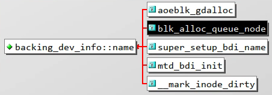

    在 `block/blk-core.c` 中 `blk_alloc_queue_node` 会调用 `bdi_alloc_node` 来初始化该结构体，其中 `name` 字段赋值为 `"block"`

2. `dev` 字段

    在 `mm/backing-dev.c` 的 `bdi_register_va` 会调用 `device_create` 创建一个 `bdi_class` 类型的设备，并赋值给 `dev` 字段

3. `dev_name` 字段

    在 `mm/backing-dev.c` 的 `bdi_register_va` 还会对 `dev_name` 进行赋值

    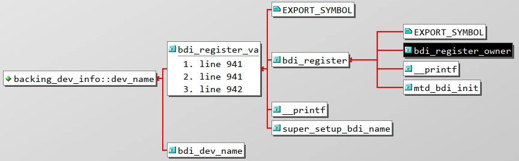

    根据调用栈溯源可以发现，`mm/backing-dev.c` 的 `bdi_register_owner` 将 `fmt` 和 `args` 传递到 `bdi_register_va`，最终会将主设备号和次设备号拼接组合后进行赋值

4. `owner` 字段

    在 `mm/backing-dev.c` 的 `bdi_register_owner` 还会对 `owner` 进行赋值

    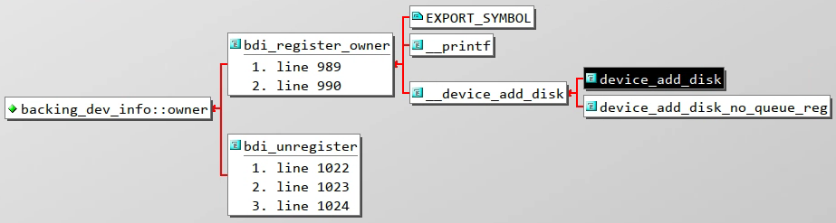

    实际赋值的为 `disk` 对应的 `dev`，通过 `disk_to_dev` 宏转换得到

### 设备回写管理

在 `include/linux/backing-dev-defs.h` 中定义了 `bdi_writeback` 结构体，用于管理一个块设备的回写，同时支持 `cgroup` 进行限制

```c
/*
 * Each wb (bdi_writeback) can perform writeback operations, is measured
 * and throttled, independently.  Without cgroup writeback, each bdi
 * (bdi_writeback) is served by its embedded bdi->wb.
 *
 * On the default hierarchy, blkcg implicitly enables memcg.  This allows
 * using memcg's page ownership for attributing writeback IOs, and every
 * memcg - blkcg combination can be served by its own wb by assigning a
 * dedicated wb to each memcg, which enables isolation across different
 * cgroups and propagation of IO back pressure down from the IO layer upto
 * the tasks which are generating the dirty pages to be written back.
 *
 * A cgroup wb is indexed on its bdi by the ID of the associated memcg,
 * refcounted with the number of inodes attached to it, and pins the memcg
 * and the corresponding blkcg.  As the corresponding blkcg for a memcg may
 * change as blkcg is disabled and enabled higher up in the hierarchy, a wb
 * is tested for blkcg after lookup and removed from index on mismatch so
 * that a new wb for the combination can be created.
 */
struct bdi_writeback {
	struct backing_dev_info *bdi;	/* our parent bdi */

	unsigned long state;		/* Always use atomic bitops on this */
	unsigned long last_old_flush;	/* last old data flush */

	struct list_head b_dirty;	/* dirty inodes */
	struct list_head b_io;		/* parked for writeback */
	struct list_head b_more_io;	/* parked for more writeback */
	struct list_head b_dirty_time;	/* time stamps are dirty */
	spinlock_t list_lock;		/* protects the b_* lists */

	struct percpu_counter stat[NR_WB_STAT_ITEMS];

	struct bdi_writeback_congested *congested;

	unsigned long bw_time_stamp;	/* last time write bw is updated */
	unsigned long dirtied_stamp;
	unsigned long written_stamp;	/* pages written at bw_time_stamp */
	unsigned long write_bandwidth;	/* the estimated write bandwidth */
	unsigned long avg_write_bandwidth; /* further smoothed write bw, > 0 */

	/*
	 * The base dirty throttle rate, re-calculated on every 200ms.
	 * All the bdi tasks' dirty rate will be curbed under it.
	 * @dirty_ratelimit tracks the estimated @balanced_dirty_ratelimit
	 * in small steps and is much more smooth/stable than the latter.
	 */
	unsigned long dirty_ratelimit;
	unsigned long balanced_dirty_ratelimit;

	struct fprop_local_percpu completions;
	int dirty_exceeded;
	enum wb_reason start_all_reason;

	spinlock_t work_lock;		/* protects work_list & dwork scheduling */
	struct list_head work_list;
	struct delayed_work dwork;	/* work item used for writeback */

	unsigned long dirty_sleep;	/* last wait */

	struct list_head bdi_node;	/* anchored at bdi->wb_list */

#ifdef CONFIG_CGROUP_WRITEBACK
	struct percpu_ref refcnt;	/* used only for !root wb's */
	struct fprop_local_percpu memcg_completions;
	struct cgroup_subsys_state *memcg_css; /* the associated memcg */
	struct cgroup_subsys_state *blkcg_css; /* and blkcg */
	struct list_head memcg_node;	/* anchored at memcg->cgwb_list */
	struct list_head blkcg_node;	/* anchored at blkcg->cgwb_list */

	union {
		struct work_struct release_work;
		struct rcu_head rcu;
	};
#endif
};
```

#### 初始化

该结构体由 `mm/backing-dev.c` 中的 `wb_init` 函数初始化

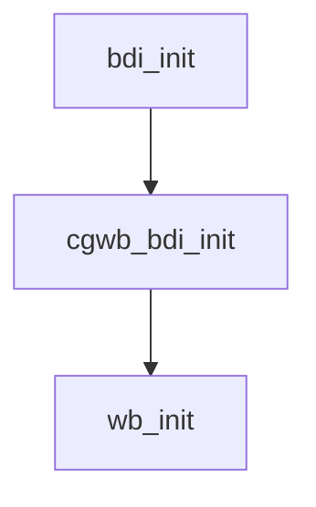

#### 部分字段说明

1. `b_dirty` 字段

    暂存所有的脏 inode 的链表

2. `b_io` 字段

    暂存即将回写的 inode 的链表

3. `b_more_io` 字段

    暂存由于一次回写数量限制原因导致的等待下次回写的 inode 链表

4. `b_dirty_time` 字段

    暂存仅仅是时间戳更新而被至脏的 inode 的链表

5. `list_lock` 字段

    为了保护上述 4 个 `b_*` 列表的自旋锁

6. `dwork` 字段

    用于 page cache 回写机制的 `work` 关键结构体

7. `work_list` 字段

    暂存所有需要回写的任务的链表

8. `work_lock` 字段

    为了保护 `work_list` 以及 `dwork` 调度的自旋锁

### 回写任务

在 `fs/fs-writeback.c` 中定义了 `wb_writeback_work` 结构体，用于描述一次回写任务的相关参数

```c
/*
 * Passed into wb_writeback(), essentially a subset of writeback_control
 */
struct wb_writeback_work {
	// 本次回写的页数限制
	long nr_pages;
	// 回写的文件系统的超级块
	struct super_block *sb;
	// 回写的模式
	enum writeback_sync_modes sync_mode;
	// tag-and-write 机制标记
	unsigned int tagged_writepages:1;
	// 定期回写标记
	unsigned int for_kupdate:1;
	// 继续上次循环回写标记
	unsigned int range_cyclic:1;
	// 阈值回写标记
	unsigned int for_background:1;
	// sync 系统调用标记
	unsigned int for_sync:1;	/* sync(2) WB_SYNC_ALL writeback */
	unsigned int auto_free:1;	/* free on completion */
	enum wb_reason reason;		/* why was writeback initiated? */

	struct list_head list;		/* pending work list */
	struct wb_completion *done;	/* set if the caller waits */
};
```

后续通过 `include/linux/writeback.h` 中的 `writeback_control` 结构体封装，传递给底层的 `writepages` 函数

```c
/*
 * A control structure which tells the writeback code what to do.  These are
 * always on the stack, and hence need no locking.  They are always initialised
 * in a manner such that unspecified fields are set to zero.
 */
struct writeback_control {
	long nr_to_write;		/* Write this many pages, and decrement
					   this for each page written */
	long pages_skipped;		/* Pages which were not written */

	/*
	 * For a_ops->writepages(): if start or end are non-zero then this is
	 * a hint that the filesystem need only write out the pages inside that
	 * byterange.  The byte at `end' is included in the writeout request.
	 */
	loff_t range_start;
	loff_t range_end;

	enum writeback_sync_modes sync_mode;

	unsigned for_kupdate:1;		/* A kupdate writeback */
	unsigned for_background:1;	/* A background writeback */
	unsigned tagged_writepages:1;	/* tag-and-write to avoid livelock */
	unsigned for_reclaim:1;		/* Invoked from the page allocator */
	unsigned range_cyclic:1;	/* range_start is cyclic */
	unsigned for_sync:1;		/* sync(2) WB_SYNC_ALL writeback */

	/*
	 * When writeback IOs are bounced through async layers, only the
	 * initial synchronous phase should be accounted towards inode
	 * cgroup ownership arbitration to avoid confusion.  Later stages
	 * can set the following flag to disable the accounting.
	 */
	unsigned no_cgroup_owner:1;

	unsigned punt_to_cgroup:1;	/* cgrp punting, see __REQ_CGROUP_PUNT */

#ifdef CONFIG_CGROUP_WRITEBACK
	struct bdi_writeback *wb;	/* wb this writeback is issued under */
	struct inode *inode;		/* inode being written out */

	/* foreign inode detection, see wbc_detach_inode() */
	int wb_id;			/* current wb id */
	int wb_lcand_id;		/* last foreign candidate wb id */
	int wb_tcand_id;		/* this foreign candidate wb id */
	size_t wb_bytes;		/* bytes written by current wb */
	size_t wb_lcand_bytes;		/* bytes written by last candidate */
	size_t wb_tcand_bytes;		/* bytes written by this candidate */
#endif
};
```

#### 部分字段说明

1. `sync_mode` 字段

    `WB_SYNC_NONE`：绝大部分回写任务的配置，不会等待回写真正落盘，下发写命令后就返回

    `WB_SYNC_ALL`：`sync` 系统调用时配置，必须等待回调函数执行完成，写的数据真正落盘之后才会返回

2. `tagged_writepages` 字段

    值为 1 表示开启 `tag-and-write` 机制用于避免活锁。该机制详情参考 [后续小节](#tag-and-write)

3. `for_kupdate` 字段

    值为 1 表示当前任务是定期回写任务，用于回写已经至脏超过指定时间（内核中当前配置为 30s）的脏页。定期回写详情参考 [后续小节](#定期回写)

4. `range_cyclic` 字段

    值为 1 表示当前任务的回写范围为整个 `inode`，并且从上次完成的位置作为起始位置进行循环回写。值为 0 则根据 `struct writeback_control wbc` 的 `range_start` 以及 `range_end` 作为回写的范围。`range_cyclic` 的详情参考 [后续小节](#range_cyclic)

5. `for_background` 字段

    值为 1 表示当前任务是阈值回写任务，当脏页比例超过阈值后才会触发。阈值回写详情参考 [后续小节](#阈值回写)

6. `for_sync` 字段

    值为 1 表示当前任务是阈值回写任务 `sync` 系统调用手动触发的回写任务。`sync` 系统调用详情参考 [后续小节](#sync)

## 回写线程

前面说过 `bdi_writeback` 结构体中 `struct delayed_work dwork` 就是关键的负责 page cache 回写工作的结构体

### 初始化

`wb_init` 函数会对 `wb->dwork` 赋值，注册实际的工作函数 `wb_workfn`

由于这是个 `delayed_work`，注册的工作函数不会立即执行，需要后续利用 `mod_delayed_work` 来修改 `delayed_work` 内置的定时器时间来唤醒

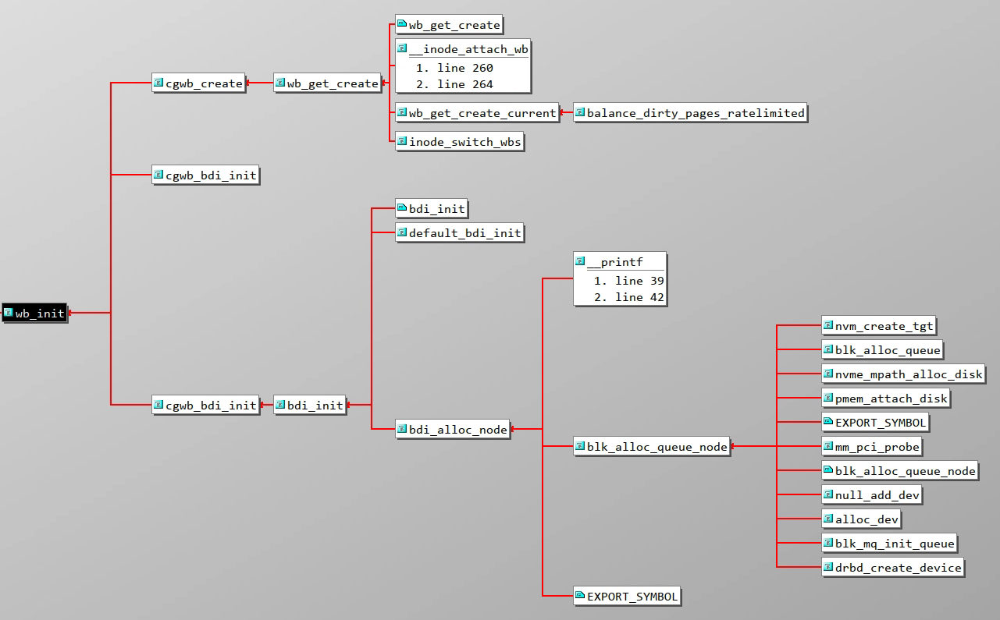

(P.S. 图片中函数开头为 `cg` 代表和 `cgroup` 相关，同一层级多个同名函数和宏定义的编译控制有关)

根据函数调用图，大致分析可知，当设备申请 `queue` 时会初始化 `backing_dev_info` 结构体和 `bdi_writeback` 结构体，以及初始化回写线程

### 立即唤醒

虽然 `dwork` 是个 `delayed_work`，但是我们可以在调用 `mod_delayed_work` 将延时设置为 0，来立即唤醒回写线程

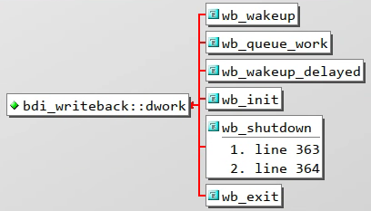

#### `wb_wakeup`

`wb_wakeup` 就是修改延时为 0，直接唤醒回写线程

```c
// fs/fs-writeback.c
static void wb_wakeup(struct bdi_writeback *wb)
{
	spin_lock_bh(&wb->work_lock);
	if (test_bit(WB_registered, &wb->state))
		mod_delayed_work(bdi_wq, &wb->dwork, 0);
	spin_unlock_bh(&wb->work_lock);
}
```

#### `wb_queue_work`

`wb_queue_work` 将一个回写任务插入到队列尾部，然后修改延时为 0，立即唤醒回写线程

```c
// fs/fs-writeback.c
static void wb_queue_work(struct bdi_writeback *wb,
			  struct wb_writeback_work *work)
{
	trace_writeback_queue(wb, work);

	if (work->done)
		atomic_inc(&work->done->cnt);

	spin_lock_bh(&wb->work_lock);

	if (test_bit(WB_registered, &wb->state)) {
		list_add_tail(&work->list, &wb->work_list);
		mod_delayed_work(bdi_wq, &wb->dwork, 0);
	} else
		finish_writeback_work(wb, work);

	spin_unlock_bh(&wb->work_lock);
}
```

### 定时唤醒

定时唤醒主要是由 `wb_wakeup_delayed` 来实现的，而时间间隔在 `mm/page-writeback.c` 进行了定义

```c
// mm/page-writeback.c
/*
 * The interval between `kupdate'-style writebacks
 */
unsigned int dirty_writeback_interval = 5 * 100; /* centiseconds */

EXPORT_SYMBOL_GPL(dirty_writeback_interval);
```

```c
// mm/backing-dev.c
/*
 * This function is used when the first inode for this wb is marked dirty. It
 * wakes-up the corresponding bdi thread which should then take care of the
 * periodic background write-out of dirty inodes. Since the write-out would
 * starts only 'dirty_writeback_interval' centisecs from now anyway, we just
 * set up a timer which wakes the bdi thread up later.
 *
 * Note, we wouldn't bother setting up the timer, but this function is on the
 * fast-path (used by '__mark_inode_dirty()'), so we save few context switches
 * by delaying the wake-up.
 *
 * We have to be careful not to postpone flush work if it is scheduled for
 * earlier. Thus we use queue_delayed_work().
 */
void wb_wakeup_delayed(struct bdi_writeback *wb)
{
	unsigned long timeout;

	timeout = msecs_to_jiffies(dirty_writeback_interval * 10);
	spin_lock_bh(&wb->work_lock);
	if (test_bit(WB_registered, &wb->state))
		queue_delayed_work(bdi_wq, &wb->dwork, timeout);
	spin_unlock_bh(&wb->work_lock);
}
```

`wb_wakeup_delayed` 使用 5s 作为时间间隔，当调用 `wb_wakeup_delayed` 后，回写线程会在 5s 后被唤醒

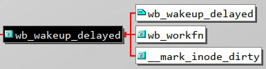

定时唤醒只会在两种情形下被调用：

- `__mark_inode_dirty`：当给一个 `inode` 标记为脏时，如果脏的不仅仅是时间戳，而且当前的 `b_dirty` 链表是空的，也就是说第一次将脏页挂在 `b_dirty` 链表时，开启定时唤醒
- `wb_workfn`：当回写线程处理完 `work_list` 上的所有任务后，如果仍有脏 `inode` 在 `b_{dirty|io|more_io}` 上时，开启定时唤醒

简单的讲，就是只要存在脏 `inode` 在 `b_{dirty|io|more_io}` 上时，内核的回写线程每 5s 内肯定会被唤醒一次

### 释放销毁

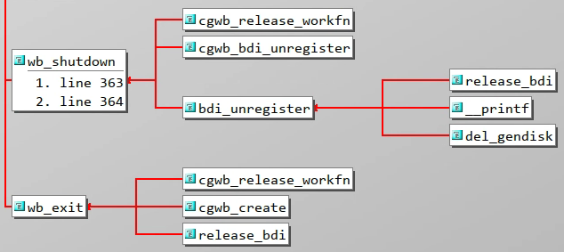

当需要对整个 `backing_dev_info` 结构释放时，也会立即唤醒内核回写线程，并且会下刷现有的所有工作

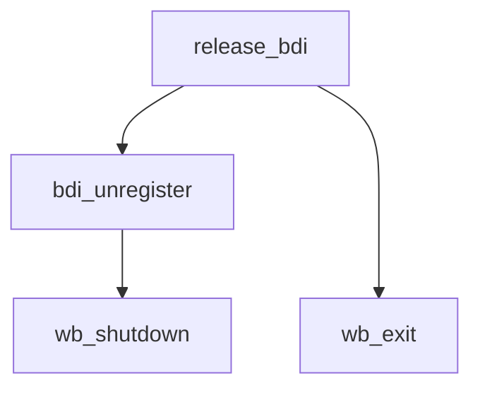

## 细节分析

### `tag-and-write`

该机制会在 `write_pages` 时先快速对下刷范围内的脏页进行标记，后续只对标记过的脏页进行下刷

首先回写任务的参数会通过 `fs/fs-writeback.c` 的 `writeback_sb_inodes` 函数传递给 `struct writeback_control wbc`

后续在 `mm/page-writeback.c` 中 `write_cache_pages` 就会根据 `wbc` 的 `tagged_writepages` 字段进行判断，配置不同的 `tag`，以及是否需要快速遍历脏页并标记

```c
/**
 * write_cache_pages - walk the list of dirty pages of the given address space and write all of them.
 * @mapping: address space structure to write
 * @wbc: subtract the number of written pages from *@wbc->nr_to_write
 * @writepage: function called for each page
 * @data: data passed to writepage function
 *
 * If a page is already under I/O, write_cache_pages() skips it, even
 * if it's dirty.  This is desirable behaviour for memory-cleaning writeback,
 * but it is INCORRECT for data-integrity system calls such as fsync().  fsync()
 * and msync() need to guarantee that all the data which was dirty at the time
 * the call was made get new I/O started against them.  If wbc->sync_mode is
 * WB_SYNC_ALL then we were called for data integrity and we must wait for
 * existing IO to complete.
 *
 * To avoid livelocks (when other process dirties new pages), we first tag
 * pages which should be written back with TOWRITE tag and only then start
 * writing them. For data-integrity sync we have to be careful so that we do
 * not miss some pages (e.g., because some other process has cleared TOWRITE
 * tag we set). The rule we follow is that TOWRITE tag can be cleared only
 * by the process clearing the DIRTY tag (and submitting the page for IO).
 *
 * To avoid deadlocks between range_cyclic writeback and callers that hold
 * pages in PageWriteback to aggregate IO until write_cache_pages() returns,
 * we do not loop back to the start of the file. Doing so causes a page
 * lock/page writeback access order inversion - we should only ever lock
 * multiple pages in ascending page->index order, and looping back to the start
 * of the file violates that rule and causes deadlocks.
 *
 * Return: %0 on success, negative error code otherwise
 */
int write_cache_pages(struct address_space *mapping,
		      struct writeback_control *wbc, writepage_t writepage,
		      void *data)
{
	int ret = 0;
	int done = 0;
	int error;
	struct pagevec pvec;
	int nr_pages;
	pgoff_t uninitialized_var(writeback_index);
	pgoff_t index;
	pgoff_t end;		/* Inclusive */
	pgoff_t done_index;
	int range_whole = 0;
	xa_mark_t tag;

	pagevec_init(&pvec);
	if (wbc->range_cyclic) {
		writeback_index = mapping->writeback_index; /* prev offset */
		index = writeback_index;
		end = -1;
	} else {
		index = wbc->range_start >> PAGE_SHIFT;
		end = wbc->range_end >> PAGE_SHIFT;
		if (wbc->range_start == 0 && wbc->range_end == LLONG_MAX)
			range_whole = 1;
	}
	if (wbc->sync_mode == WB_SYNC_ALL || wbc->tagged_writepages)
		tag = PAGECACHE_TAG_TOWRITE;
	else
		tag = PAGECACHE_TAG_DIRTY;
	if (wbc->sync_mode == WB_SYNC_ALL || wbc->tagged_writepages)
		tag_pages_for_writeback(mapping, index, end);
	done_index = index;
	while (!done && (index <= end)) {
		int i;

		nr_pages = pagevec_lookup_range_tag(&pvec, mapping, &index, end,
				tag);
		if (nr_pages == 0)
			break;

		for (i = 0; i < nr_pages; i++) {
			struct page *page = pvec.pages[i];

			done_index = page->index;

			lock_page(page);

			/*
			 * Page truncated or invalidated. We can freely skip it
			 * then, even for data integrity operations: the page
			 * has disappeared concurrently, so there could be no
			 * real expectation of this data interity operation
			 * even if there is now a new, dirty page at the same
			 * pagecache address.
			 */
			if (unlikely(page->mapping != mapping)) {
continue_unlock:
				unlock_page(page);
				continue;
			}

			if (!PageDirty(page)) {
				/* someone wrote it for us */
				goto continue_unlock;
			}

			if (PageWriteback(page)) {
				if (wbc->sync_mode != WB_SYNC_NONE)
					wait_on_page_writeback(page);
				else
					goto continue_unlock;
			}

			BUG_ON(PageWriteback(page));
			if (!clear_page_dirty_for_io(page))
				goto continue_unlock;

			trace_wbc_writepage(wbc, inode_to_bdi(mapping->host));
			error = (*writepage)(page, wbc, data);
			if (unlikely(error)) {
				/*
				 * Handle errors according to the type of
				 * writeback. There's no need to continue for
				 * background writeback. Just push done_index
				 * past this page so media errors won't choke
				 * writeout for the entire file. For integrity
				 * writeback, we must process the entire dirty
				 * set regardless of errors because the fs may
				 * still have state to clear for each page. In
				 * that case we continue processing and return
				 * the first error.
				 */
				if (error == AOP_WRITEPAGE_ACTIVATE) {
					unlock_page(page);
					error = 0;
				} else if (wbc->sync_mode != WB_SYNC_ALL) {
					ret = error;
					done_index = page->index + 1;
					done = 1;
					break;
				}
				if (!ret)
					ret = error;
			}

			/*
			 * We stop writing back only if we are not doing
			 * integrity sync. In case of integrity sync we have to
			 * keep going until we have written all the pages
			 * we tagged for writeback prior to entering this loop.
			 */
			if (--wbc->nr_to_write <= 0 &&
			    wbc->sync_mode == WB_SYNC_NONE) {
				done = 1;
				break;
			}
		}
		pagevec_release(&pvec);
		cond_resched();
	}

	/*
	 * If we hit the last page and there is more work to be done: wrap
	 * back the index back to the start of the file for the next
	 * time we are called.
	 */
	if (wbc->range_cyclic && !done)
		done_index = 0;
	if (wbc->range_cyclic || (range_whole && wbc->nr_to_write > 0))
		mapping->writeback_index = done_index;

	return ret;
}
EXPORT_SYMBOL(write_cache_pages);
```

在 `fs/fs-writeback.c` 中 `writeback_chunk_size` 里面的注释也对这个流程进行了描述

```c
static long writeback_chunk_size(struct bdi_writeback *wb,
				 struct wb_writeback_work *work)
{
	long pages;

	/*
	 * WB_SYNC_ALL mode does livelock avoidance by syncing dirty
	 * inodes/pages in one big loop. Setting wbc.nr_to_write=LONG_MAX
	 * here avoids calling into writeback_inodes_wb() more than once.
	 *
	 * The intended call sequence for WB_SYNC_ALL writeback is:
	 *
	 *      wb_writeback()
	 *          writeback_sb_inodes()       <== called only once
	 *              write_cache_pages()     <== called once for each inode
	 *                   (quickly) tag currently dirty pages
	 *                   (maybe slowly) sync all tagged pages
	 */
	if (work->sync_mode == WB_SYNC_ALL || work->tagged_writepages)
		pages = LONG_MAX;
	else {
		pages = min(wb->avg_write_bandwidth / 2,
			    global_wb_domain.dirty_limit / DIRTY_SCOPE);
		pages = min(pages, work->nr_pages);
		pages = round_down(pages + MIN_WRITEBACK_PAGES,
				   MIN_WRITEBACK_PAGES);
	}

	return pages;
}
```

### `range_cyclic`

`range_cyclic` 早在内核的 v2.6.18-rc1 版本就已经实现，可以参考 [111ebb6](https://github.com/torvalds/linux/commit/111ebb6e6f7bd7de6d722c5848e95621f43700d9) 的提交信息辅助理解

```commit
[PATCH] writeback: fix range handling
When a writeback_control's `start' and `end' fields are used to
indicate a one-byte-range starting at file offset zero, the required
values of .start=0,.end=0 mean that the ->writepages() implementation
has no way of telling that it is being asked to perform a range
request.  Because we're currently overloading (start == 0 && end == 0)
to mean "this is not a write-a-range request".

To make all this sane, the patch changes range of writeback_control.

So caller does: If it is calling ->writepages() to write pages, it
sets range (range_start/end or range_cyclic) always.

And if range_cyclic is true, ->writepages() thinks the range is
cyclic, otherwise it just uses range_start and range_end.

This patch does,

    - Add LLONG_MAX, LLONG_MIN, ULLONG_MAX to include/linux/kernel.h
      -1 is usually ok for range_end (type is long long). But, if someone did,

		range_end += val;		range_end is "val - 1"
		u64val = range_end >> bits;	u64val is "~(0ULL)"

      or something, they are wrong. So, this adds LLONG_MAX to avoid nasty
      things, and uses LLONG_MAX for range_end.

    - All callers of ->writepages() sets range_start/end or range_cyclic.

    - Fix updates of ->writeback_index. It seems already bit strange.
      If it starts at 0 and ended by check of nr_to_write, this last
      index may reduce chance to scan end of file.  So, this updates
      ->writeback_index only if range_cyclic is true or whole-file is
      scanned.

Signed-off-by: OGAWA Hirofumi <hirofumi@mail.parknet.co.jp>
Cc: Nathan Scott <nathans@sgi.com>
Cc: Anton Altaparmakov <aia21@cantab.net>
Cc: Steven French <sfrench@us.ibm.com>
Cc: "Vladimir V. Saveliev" <vs@namesys.com>
Signed-off-by: Andrew Morton <akpm@osdl.org>
Signed-off-by: Linus Torvalds <torvalds@osdl.org>
```

`range_cyclic` 和 `range_start/end` 互斥

- 当开启 `range_cyclic` 将无视 `range_start/end` 的值
- 否则底层 `writepages` 函数则使用 `range_start/end` 作为写的范围

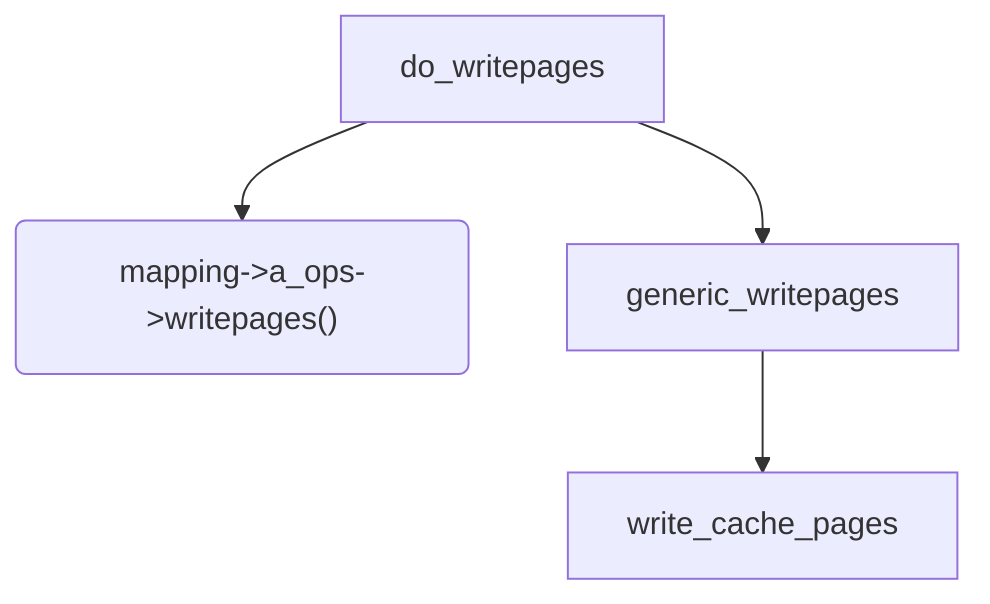

结合实际代码，在 `mm/page-writeback.c` 的 `write_cache_pages` 函数中有以下片段

```c
	if (wbc->range_cyclic) {
		writeback_index = mapping->writeback_index; /* prev offset */
		index = writeback_index;
		end = -1;
	} else {
		index = wbc->range_start >> PAGE_SHIFT;
		end = wbc->range_end >> PAGE_SHIFT;
		if (wbc->range_start == 0 && wbc->range_end == LLONG_MAX)
			range_whole = 1;
	}

	// 此处省略部分代码

	/*
	 * If we hit the last page and there is more work to be done: wrap
	 * back the index back to the start of the file for the next
	 * time we are called.
	 */
	if (wbc->range_cyclic && !done)
		done_index = 0;
	if (wbc->range_cyclic || (range_whole && wbc->nr_to_write > 0))
		mapping->writeback_index = done_index;
```

`range_cyclic` 开启后会使用 `mapping->writeback_index` 作为本次回写的起始地址，并会在完成本次回写流程（回写页数限制或者到达文件末尾）后更新 `mapping->writeback_index`

### 定期回写

定期回写的任务声明在 `fs/fs-writeback.c` 的 `wb_check_old_data_flush` 函数中，而这个函数则是被 `wb_workfn` 调用

```c
static long wb_check_old_data_flush(struct bdi_writeback *wb)
{
	unsigned long expired;
	long nr_pages;

	/*
	 * When set to zero, disable periodic writeback
	 */
	if (!dirty_writeback_interval)
		return 0;

	expired = wb->last_old_flush +
			msecs_to_jiffies(dirty_writeback_interval * 10);
	if (time_before(jiffies, expired))
		return 0;

	wb->last_old_flush = jiffies;
	nr_pages = get_nr_dirty_pages();

	if (nr_pages) {
		// 定期回写
		struct wb_writeback_work work = {
			.nr_pages	= nr_pages,
			.sync_mode	= WB_SYNC_NONE,
			.for_kupdate	= 1,
			.range_cyclic	= 1,
			.reason		= WB_REASON_PERIODIC,
		};

		return wb_writeback(wb, &work);
	}

	return 0;
}
```

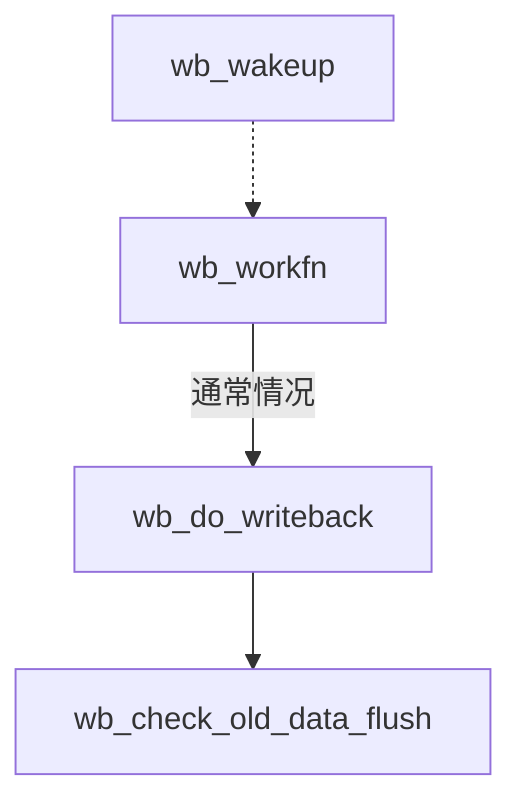

首先要保证当前时间在上次定期回写的 5s （和定期唤醒的时间间隔一致）后，并且当前存在脏页，才会生成一次定期回写的任务，也就是说每 5s 内最多触发一次定期回写

生成的回写任务交给 `fs/fs-writeback.c` 的 `wb_writeback` 函数处理

并且定期回写属于一种后台回写，优先级较低，只有在 `wb->work_list` 为空时才会执行

`wb_writeback` 执行定期回写时只会选择在至脏时间在当前时间 30s 之前的 `inode` 的所有脏页进行回写

### 阈值回写

针对脏页率内核中有两个阈值，10% 和 20%

```c
// mm/page-writeback.c

/*
 * Start background writeback (via writeback threads) at this percentage
 */
int dirty_background_ratio = 10;

/*
 * The generator of dirty data starts writeback at this percentage
 */
int vm_dirty_ratio = 20;
```

1. bg_thresh 后台阈值

    当脏页率达到 10% 时会以后台的方式进行回写

    ```mermaid
	graph TD
	generic_perform_write --> balance_dirty_pages_ratelimited --> balance_dirty_pages --> wb_start_background_writeback --> wb_wakeup
	wb_wakeup -.-> wb_workfn -->|通常情况| wb_do_writeback -->|wb_over_bg_thresh| wb_check_background_flush
    ```

    当用户 `write` 调用使用 `generic_perform_write` 来写 page cache 时，会调用 `balance_dirty_pages_ratelimited` 来检查脏页率，当脏页率超过 10% 就会调用 `balance_dirty_pages` 来唤醒 `wb_workfn` 来进行下刷脏页，此时并不会阻塞当前的 `write` 过程

2. thresh 前台阈值

    而当脏页率达到 20% 之后则会触发前台回写，此时的函数调用和逻辑和上面基本一致，不同点在于当脏页率超过 20% 后会在 `balance_dirty_pages` 的循环中无法跳出，因此线程会阻塞，直到脏页率降低至 20% 以下，跳出循环，启用后台回写

## 手动触发回写

### `sync`

`sync` 系统调用会同步所有的 page cache

在 `bash` 上直接输入 `sync` 命令就会触发 `sync` 系统调用

```c
// fs/sync.c
/*
 * Sync everything. We start by waking flusher threads so that most of
 * writeback runs on all devices in parallel. Then we sync all inodes reliably
 * which effectively also waits for all flusher threads to finish doing
 * writeback. At this point all data is on disk so metadata should be stable
 * and we tell filesystems to sync their metadata via ->sync_fs() calls.
 * Finally, we writeout all block devices because some filesystems (e.g. ext2)
 * just write metadata (such as inodes or bitmaps) to block device page cache
 * and do not sync it on their own in ->sync_fs().
 */
void ksys_sync(void)
{
	int nowait = 0, wait = 1;

	// 唤醒所有 bdi 的回写线程
	wakeup_flusher_threads(WB_REASON_SYNC);
	// 下发所有 inode 的回写任务
	iterate_supers(sync_inodes_one_sb, NULL);
	// 调用 sync_fs() 同步文件系统的元数据
	iterate_supers(sync_fs_one_sb, &nowait);
	iterate_supers(sync_fs_one_sb, &wait);
	// 回写块设备的 page cache
	iterate_bdevs(fdatawrite_one_bdev, NULL);
	iterate_bdevs(fdatawait_one_bdev, NULL);
	if (unlikely(laptop_mode))
		laptop_sync_completion();
}

SYSCALL_DEFINE0(sync)
{
	ksys_sync();
	return 0;
}
```

- 首先，唤醒所有设备的回写线程线程，这样大部分的回写在所有设备上并行运行
- 并立刻生成一个下刷设备上所有 inode 的回写任务，并等待完成
- 然后文件系统通过注册的 `sync_fs()` 调用来同步他们的元数据
- 最后，回写所有的块设备的 page cache
  - 因为有些文件系统（例如 `ext2`）会将元数据（如 `inodes` 或 `bitmaps`）写入块设备 page cache，而不是在 `sync_fs()` 中自行同步

### `fsync` 和 `fdatasync`

`fsync` 和 `fdatasync` 系统调用则可以更加细粒度的下刷脏页，他们的下刷对象是一个文件

```c
// fs/sync.c
/**
 * vfs_fsync_range - helper to sync a range of data & metadata to disk
 * @file:		file to sync
 * @start:		offset in bytes of the beginning of data range to sync
 * @end:		offset in bytes of the end of data range (inclusive)
 * @datasync:		perform only datasync
 *
 * Write back data in range @start..@end and metadata for @file to disk.  If
 * @datasync is set only metadata needed to access modified file data is
 * written.
 */
int vfs_fsync_range(struct file *file, loff_t start, loff_t end, int datasync)
{
	struct inode *inode = file->f_mapping->host;

	if (!file->f_op->fsync)
		return -EINVAL;
	if (!datasync && (inode->i_state & I_DIRTY_TIME))
		mark_inode_dirty_sync(inode);
	return file->f_op->fsync(file, start, end, datasync);
}
EXPORT_SYMBOL(vfs_fsync_range);

/**
 * vfs_fsync - perform a fsync or fdatasync on a file
 * @file:		file to sync
 * @datasync:		only perform a fdatasync operation
 *
 * Write back data and metadata for @file to disk.  If @datasync is
 * set only metadata needed to access modified file data is written.
 */
int vfs_fsync(struct file *file, int datasync)
{
	return vfs_fsync_range(file, 0, LLONG_MAX, datasync);
}
EXPORT_SYMBOL(vfs_fsync);

static int do_fsync(unsigned int fd, int datasync)
{
	struct fd f = fdget(fd);
	int ret = -EBADF;

	if (f.file) {
		ret = vfs_fsync(f.file, datasync);
		fdput(f);
	}
	return ret;
}

SYSCALL_DEFINE1(fsync, unsigned int, fd)
{
	return do_fsync(fd, 0);
}

SYSCALL_DEFINE1(fdatasync, unsigned int, fd)
{
	return do_fsync(fd, 1);
}
```

`fsync` 和 `fdatasync` 会调用文件系统注册的 `f_op->fsync()` 函数进行脏页的下刷。很多文件系统会使用或者参考通用的 `generic_file_fsync` 来实现，这里针对 `__generic_file_fsync` 进行分析

```c
// fs/libfs.c
/**
 * __generic_file_fsync - generic fsync implementation for simple filesystems
 *
 * @file:	file to synchronize
 * @start:	start offset in bytes
 * @end:	end offset in bytes (inclusive)
 * @datasync:	only synchronize essential metadata if true
 *
 * This is a generic implementation of the fsync method for simple
 * filesystems which track all non-inode metadata in the buffers list
 * hanging off the address_space structure.
 */
int __generic_file_fsync(struct file *file, loff_t start, loff_t end,
				 int datasync)
{
	struct inode *inode = file->f_mapping->host;
	int err;
	int ret;

	err = file_write_and_wait_range(file, start, end);
	if (err)
		return err;

	inode_lock(inode);
	ret = sync_mapping_buffers(inode->i_mapping);
	if (!(inode->i_state & I_DIRTY_ALL))
		goto out;
	if (datasync && !(inode->i_state & I_DIRTY_DATASYNC))
		goto out;

	err = sync_inode_metadata(inode, 1);
	if (ret == 0)
		ret = err;

out:
	inode_unlock(inode);
	/* check and advance again to catch errors after syncing out buffers */
	err = file_check_and_advance_wb_err(file);
	if (ret == 0)
		ret = err;
	return ret;
}
EXPORT_SYMBOL(__generic_file_fsync);

/**
 * generic_file_fsync - generic fsync implementation for simple filesystems
 *			with flush
 * @file:	file to synchronize
 * @start:	start offset in bytes
 * @end:	end offset in bytes (inclusive)
 * @datasync:	only synchronize essential metadata if true
 *
 */

int generic_file_fsync(struct file *file, loff_t start, loff_t end,
		       int datasync)
{
	struct inode *inode = file->f_mapping->host;
	int err;

	err = __generic_file_fsync(file, start, end, datasync);
	if (err)
		return err;
	return blkdev_issue_flush(inode->i_sb->s_bdev, GFP_KERNEL, NULL);
}
EXPORT_SYMBOL(generic_file_fsync);
```

无论 `fsync` 还是 `fdatasync` 都会调用 `file_write_and_wait_range` 下刷 page cache 中的脏页。而在 indoe 本身元数据只是时间戳是脏时，`fdatasync` 就会跳过 `sync_inode_metadata`，不将元数据一起下刷到底层设备上；`fsync` 则不会跳过元数据的下刷。

因此 `fsync` 至少需要两次 IO 写操作，开销比 `fdatasync` 更大

### `open` 时带有 `O_SYNC`

如果在打开一个文件时带了 `O_SYNC` 标记，则会在写入 page cache 后，再次调用 `vfs_fsync_range` 将数据下刷到底层设备上


在 `ext4`、`f2fs` 等文件系统 `write` 系统调用会使用 `new_sync_write` 来调用实际文件系统注册的 `read_iter` 函数

而 `new_sync_write` 调用先调用 `iocb_flags` 将用户配置的 `O_SYNC` 进行解析，为 `struct kiocb` 的 `ki_flags` 字段生成标记

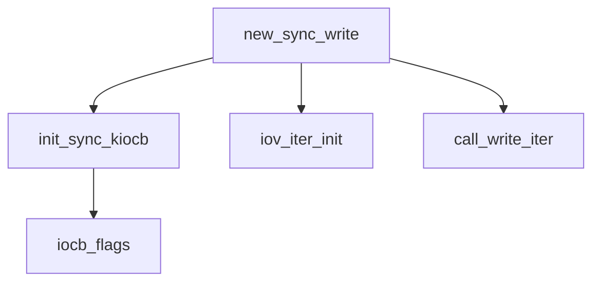

和之前一样，大多数文件系统会直接使用或者参考通用的 `generic_file_write_iter` 来实现 `read_iter` 函数，这里针对 `generic_file_write_iter` 进行分析

```c
// mm/filemap.c
/**
 * generic_file_write_iter - write data to a file
 * @iocb:	IO state structure
 * @from:	iov_iter with data to write
 *
 * This is a wrapper around __generic_file_write_iter() to be used by most
 * filesystems. It takes care of syncing the file in case of O_SYNC file
 * and acquires i_mutex as needed.
 * Return:
 * * negative error code if no data has been written at all of
 *   vfs_fsync_range() failed for a synchronous write
 * * number of bytes written, even for truncated writes
 */
ssize_t generic_file_write_iter(struct kiocb *iocb, struct iov_iter *from)
{
	struct file *file = iocb->ki_filp;
	struct inode *inode = file->f_mapping->host;
	ssize_t ret;

	inode_lock(inode);
	ret = generic_write_checks(iocb, from);
	if (ret > 0)
		ret = __generic_file_write_iter(iocb, from);
	inode_unlock(inode);

	if (ret > 0)
		ret = generic_write_sync(iocb, ret);
	return ret;
}
EXPORT_SYMBOL(generic_file_write_iter);
```

在 `__generic_file_write_iter` 完成之后，实际的数据已经被写入 page cache，之后会调用 `generic_write_sync` 会将刚刚写入 page cache 的数据通过 `vfs_fsync_range` 下刷到底层设备上

```c
// include/linux/fs.h
/*
 * Sync the bytes written if this was a synchronous write.  Expect ki_pos
 * to already be updated for the write, and will return either the amount
 * of bytes passed in, or an error if syncing the file failed.
 */
static inline ssize_t generic_write_sync(struct kiocb *iocb, ssize_t count)
{
	if (iocb->ki_flags & IOCB_DSYNC) {
		int ret = vfs_fsync_range(iocb->ki_filp,
				iocb->ki_pos - count, iocb->ki_pos - 1,
				(iocb->ki_flags & IOCB_SYNC) ? 0 : 1);
		if (ret)
			return ret;
	}

	return count;
}
```

## 参考资料

- [【CSDN】VFS 基础学习笔记 - 7. page cache 回写](https://blog.csdn.net/jasonactions/article/details/117292233)
- [【CSDN】VFS 源码分析 - Page Cache Writeback 脏页回写机制](https://blog.csdn.net/u011649400/article/details/96505600)
- 以及在评论区的某位不愿透露姓名的 dalao 的笔记


---

> 作者: [Zeus](https://github.com/ywang-wnlo)  
> URL: https://ywang-wnlo.github.io/posts/646202b9/  

