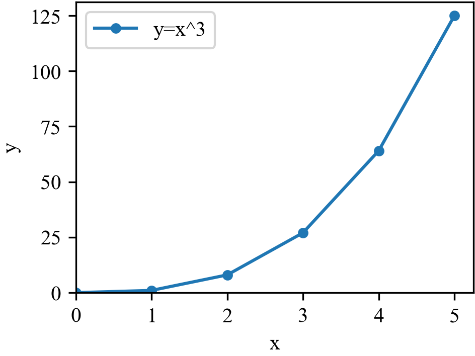
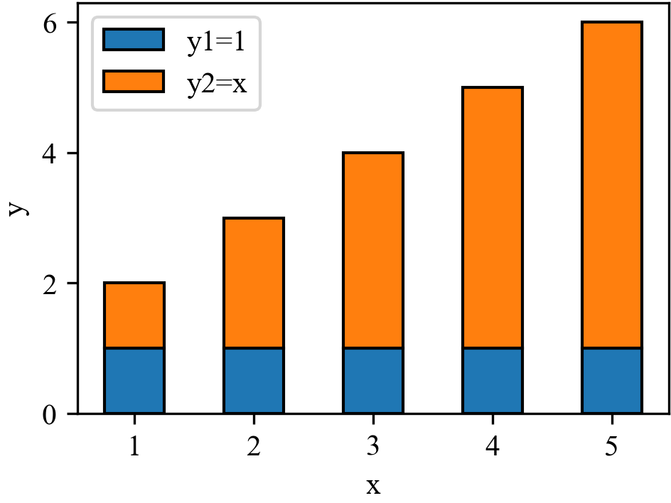
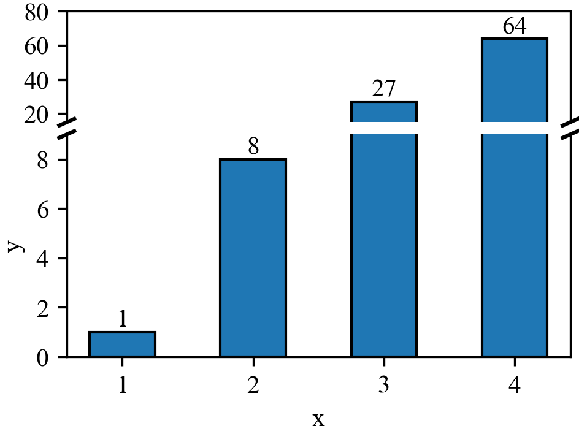

# Python 使用 Matplotlib 画图


本文将介绍如何使用 Python 的 `matplotlib` 库画图，记录一些常用的画图 demo 代码

## 安装

```bash
# 建议先切换到虚拟环境中
pip install matplotlib
```

## 中文显示

新版的 `matplotlib` 已经支持[字体回退功能](https://github.com/matplotlib/matplotlib/pull/20740)，因此可以直接设置字体为 `Times New Roman` 和 `SimSun`(宋体)。这样英文会以 `Times New Roman` 显示，中文会以 宋体 显示

```python
import matplotlib.pyplot as plt

plt.rcParams[&#39;font.family&#39;] = [&#39;Times New Roman&#39;,&#39;SimSun&#39;]
```

## 折线图、点线图

`plot` 即可以绘制折线图，也可以绘制点线图，通过 `marker` 参数设置点的样式，`markersize` 设置点的大小

```python
import matplotlib.pyplot as plt

# 设置中文字体为 Times New Roman 和 宋体
plt.rcParams[&#39;font.family&#39;] = [&#39;Times New Roman&#39;,&#39;SimSun&#39;]

# 生成数据
x = range(0, 6)
y = [i**3 for i in x]

# 绘制点线图
plt.plot(x, y, marker=&#39;o&#39;, markersize=6, label=&#39;y=x^3&#39;)

# 添加坐标轴标签
plt.xlabel(&#39;x&#39;)
plt.ylabel(&#39;y&#39;)

# 配置坐标轴范围
plt.xlim(0)
plt.ylim(0)

# 添加图例
plt.legend()

# 配置紧凑布局
plt.tight_layout(pad=0.1)

# 保存图片
plt.savefig(&#39;plot.png&#39;)
```



## 柱状图、堆积柱状图

`bar` 绘制柱状图，通过 `bottom` 参数可以绘制堆积柱状图

```python
# 生成数据
x = range(1, 6)
y1 = [1 for i in x]
y2 = [i for i in x]

# 绘制堆积柱状图
plt.bar(x, y1, color=&#39;tab:blue&#39;, edgecolor=&#39;black&#39;, label=&#39;y1=1&#39;, width=0.5)
plt.bar(x, y2, bottom=y1, color=&#39;tab:orange&#39;, edgecolor=&#39;black&#39;, label=&#39;y2=x&#39;, width=0.5)
```



## 坐标轴断点

有时需要在柱状图中添加 y 轴的断点，可以通过画两个相同的图，并配置不同的 y 轴范围，然后在两个图之间添加截断线的方式来实现

```python
# 生成数据
x = range(1, 5)
y = [i**3 for i in x]

# 分别绘制上下两个图
b1 = ax1.bar(x, y, color=&#39;tab:blue&#39;, edgecolor=&#39;black&#39;, label=&#39;y1=1&#39;, width=0.5)
b2 = ax2.bar(x, y, color=&#39;tab:blue&#39;, edgecolor=&#39;black&#39;, label=&#39;y1=1&#39;, width=0.5)

# 显示数据
ax1.bar_label(b1, fmt=&#39;%d&#39;, label_type=&#39;edge&#39;)
ax2.bar_label(b2, fmt=&#39;%d&#39;, label_type=&#39;edge&#39;)

# 配置上图的坐标轴范围
ax1.set_ylim(15)
ax1.set_yticks([20, 40, 60])
# 删掉上图的下边框
ax1.spines[&#39;bottom&#39;].set_visible(False)
# 隐藏上图的x轴
ax1.xaxis.set_visible(False)

# 配置下图的坐标轴范围
ax2.set_ylim(0, 9)
ax2.set_yticks([0, 2, 4, 6, 8])
# 删掉下图的上边框
ax2.spines[&#39;top&#39;].set_visible(False)

# 添加截断线，由于图高度比例为1:2，所以截断线的y坐标也需要按比例设置
d = .015
kwargs = dict(transform=ax1.transAxes, color=&#39;k&#39;, clip_on=False)
ax1.plot((-d, &#43;d), (-2*d, &#43;2*d), **kwargs) 
ax1.plot((1 - d, 1 &#43; d), (-2*d, &#43;2*d), **kwargs)

kwargs.update(transform=ax2.transAxes)
ax2.plot((-d, &#43;d), (1 - d, 1 &#43; d), **kwargs)
ax2.plot((1 - d, 1 &#43; d), (1 - d, 1 &#43; d), **kwargs)
```



## 参考资料

- [【GitHub】Implement Font-Fallback in Matplotlib](https://github.com/matplotlib/matplotlib/pull/20740)
- [【matplotlib】axes.Axes.bar_label](https://matplotlib.org/stable/api/_as_gen/matplotlib.axes.Axes.bar_label.html)
- [【matplotlib】Broken Axis](https://matplotlib.org/stable/gallery/subplots_axes_and_figures/broken_axis.html)

---

> 作者: [Zeus](https://github.com/ywang-wnlo)  
> URL: https://ywang-wnlo.github.io/posts/731b80f7/  

