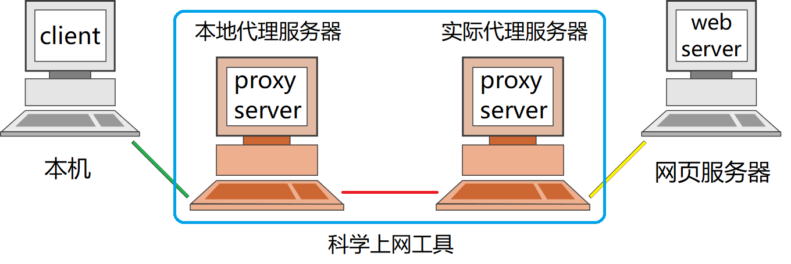
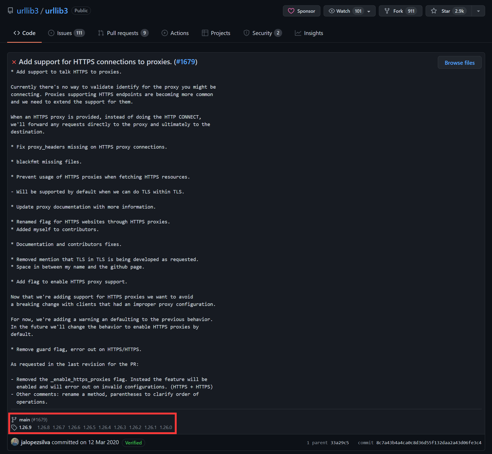
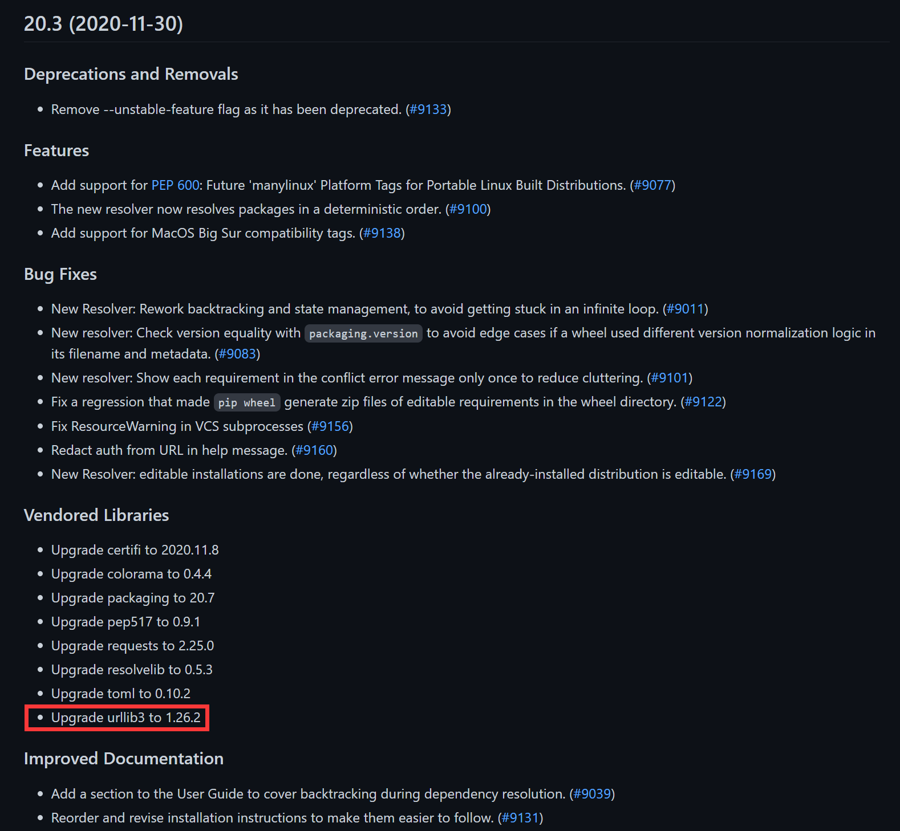
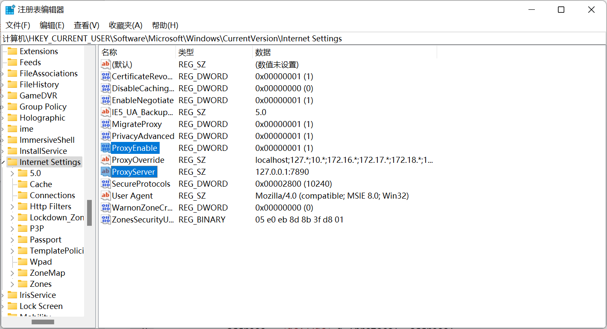

# 从 SSLEOFError 到正确配置 Proxy


本文主要参考 [Python 遭遇 ProxyError 问题记录](https://www.cnblogs.com/davyyy/p/14388623.html) 重新梳理改写

## 踩坑

在前几天搞定 `pip` 的 SSL 认证之后，结果在利用 `requests` 库请求 HTTPS 网站又出现了 `SSLError(SSLEOFError(8, 'EOF occurred in violation of protocol (_ssl.c:1129)'))` 的 SSL 相关错误

经过一系列的查询资料和测试发现，原因竟然在于 `python` 自身的 `urllib` 库没有正确配置 HTTPS 代理
<!-- more -->

## 代理服务器

### 普通的代理服务器


上面提及的 HTTP(S) 代理，其实是通过代理服务器进行 HTTP(S) 流量的转发的意思，也是在上图中的 *黄线* 所代表的协议，文中后续用 <u>出口协议</u> 来指代

而和代理服务器之间其实也需要一种协议进行通信，就是在上图中的 *绿线* 部分，文中后续用 <u>入口协议</u> 来指代

而 <u>入口协议</u> **通常使用较多的都是 HTTP 和 Socks4/Socks5，很少有采用 HTTPS 作为与代理服务器间的连接协议**，这点也是**导致之前报错的主要原因**

### 科学上网工具

其实代理服务器和 SS、SSR、V2Ray、Clash 等科学上网代理工具都是同一种性质，主要的不同点在于与实际代理服务器之间的 <u>入口协议</u> 部分（例如 Shadowsocks、VMess、Trojan 等）。为了不被 GFW 发现，需要实现对流量的混淆加密等。而且通常为了兼容性等因素，大多数科学上网工具在与实际代理服务器之间还有一级本地的代理服务器



科学上网工具的特殊协议只是在上图中的只有红线部分使用，而整个蓝色框的部分就是科学上网工具，用户并不需要关心这些特殊协议，只需要通过与通常代理服务器一样的 *绿线* 的 <u>入口协议</u> 来进行连接即可

### 代理配置

因此 <u>入口协议</u> 和 <u>出口协议</u> 之间其实没有任何因果联系，以 [Clash for Windows, CFW](https://github.com/Fndroid/clash_for_windows_pkg) 为例


它的 <u>入口协议</u> 支持 http 以及 socks，而且都在同一个端口，因此正确的代理配置应该是这样的：

```ini
# 正确的配置方式
HTTP_PROXY=http://127.0.0.1:7890
HTTPS_PROXY=http://127.0.0.1:7890
```

或者

```ini
# 正确的配置方式
HTTP_PROXY=socks5://127.0.0.1:7890
HTTPS_PROXY=socks5://127.0.0.1:7890
```

**重点：**

`HTTPS_PROXY` 也应该填写 `http://127.0.0.1:7890`，因为 `HTTPS_PROXY` 中 `HTTPS` 代表的是 <u>出口协议</u>，而 `http://127.0.0.1:7890` 代表和 `127.0.0.1:7890` 服务器之间的 <u>入口协议</u> 是 `HTTP`

## 追根溯源

```ini
# 错误的配置方式
HTTP_PROXY=http://127.0.0.1:7890
HTTPS_PROXY=https://127.0.0.1:7890
```

而之前一直采用的上述错误配置，则会因为旧版本的 `python` 的 `pip` 内含的 `urllib3` 不支持 HTTPS 的 <u>入口协议</u> ，自动转换成了 HTTP 的 <u>入口协议</u> 进行连接了

### urllib3

但是在 `urllib3` 库升级到 v1.26.0 版本之后，增加了对 HTTPS 的 <u>入口协议</u> 的支持，参见 [Add support for HTTPS connections to proxies.](https://github.com/urllib3/urllib3/commit/8c7a43b4a4ca0c8d36d55f132daa2a43d06fe3c4)



### pip

`pip` 内置了的 `requests` 和 `urllib3` 包，而不依赖全局的 `requests` 和 `urllib3` 包

当 `pip` 版本高于 [20.3](https://pypi.org/project/pip/20.3/#history) 时，内置的 `requests` 包升级到了 v2.25.0，`urllib3` 包也升级到了 v1.26.2，也就是说开始支持 HTTPS 的 <u>入口协议</u> 了，参见 [pypa/pip 20.3 (2020-11-30) NEWS.rst](https://github.com/pypa/pip/blob/c31c148a5b1d87591862c715adc7a7e5f3242fba/NEWS.rst#vendored-libraries)



### 万恶之源 urllib

但是其实他们都不是罪魁祸首，真正的原因其实在 python 的内置包 `urllib` 上

一般 `CFW` 等科学上网软件都会通过修改 Windows 注册表的 `计算机\HKEY_CURRENT_USER\Software\Microsoft\Windows\CurrentVersion\Internet Settings` 目录下的 `ProxyServer` 来配置代理服务器地址端口以及 `ProxyEnable` 是否启用代理



`CFW` 在配置代理服务器时，仅仅给出了地址和端口，并没有给出 <u>入口协议</u>

```py
# urllib 配置代理的源码摘录：
if '=' in proxyServer:
    # Per-protocol settings
    for p in proxyServer.split(';'):
        protocol, address = p.split('=', 1)
        # See if address has a type:// prefix
        if not re.match('(?:[^/:]+)://', address):
            address = '%s://%s' % (protocol, address)
        proxies[protocol] = address
else:
    # Use one setting for all protocols
    if proxyServer[:5] == 'http:':
        proxies['http'] = proxyServer
    else:
        proxies['http'] = 'http://%s' % proxyServer
        proxies['https'] = 'https://%s' % proxyServer
        proxies['ftp'] = 'ftp://%s' % proxyServer
```

按照上面给出的 `urllib` 库源码逻辑，会将代理配置为

```py
proxies = {
    'http': 'http://127.0.0.1:7890',
    'https': 'https://127.0.0.1:7890',
    'ftp': 'ftp://127.0.0.1:7890'
}
```

因此导致了 `pip`、`requests` 等上层包，访问 HTTPS 网站时会错误的使用 `https://127.0.0.1:7890` 代理，而 `CFW` 根本不支持 HTTPS 的 <u>入口协议</u>，所以才会产生这么一系列的错误

个人推荐可以根据自己常用的科学上网工具所支持的 <u>入口协议</u> 来修改 `urllib` 库源码逻辑（文件位置一般在 `***/python3.*/urllib/request.py` 或者 `***/anaconda3/Lib/urllib/request.py`）

```py
if '=' in proxyServer:
    # Per-protocol settings
    for p in proxyServer.split(';'):
        protocol, address = p.split('=', 1)
        # See if address has a type:// prefix
        if not re.match('(?:[^/:]+)://', address):
            address = '%s://%s' % (protocol, address)
        proxies[protocol] = address
else:
    # Use one setting for all protocols
    proxies['http'] = 'http://%s' % proxyServer
    proxies['https'] = 'http://%s' % proxyServer
    proxies['ftp'] = 'http://%s' % proxyServer
```

或者简单的按照下面的方式进行修改（并不一定适用所有情况）

```py
if '=' in proxyServer:
    # Per-protocol settings
    for p in proxyServer.split(';'):
        protocol, address = p.split('=', 1)
        # See if address has a type:// prefix
        if not re.match('(?:[^/:]+)://', address):
            address = '%s://%s' % (protocol, address)
        proxies[protocol] = address
else:
    # Use one setting for all protocols
    proxies['http'] = proxyServer
    proxies['https'] = proxyServer
    proxies['ftp'] = proxyServer
```

## 参考资料

- [【博客园】Python 遭遇 ProxyError 问题记录](https://www.cnblogs.com/davyyy/p/14388623.html)
- [【维基百科】代理服务器](https://zh.wikipedia.org/wiki/%E4%BB%A3%E7%90%86%E6%9C%8D%E5%8A%A1%E5%99%A8)
- [【GitHub】Fndroid/clash_for_windows_pkg 系统代理自动关闭或打开](https://github.com/Fndroid/clash_for_windows_pkg/issues/312)
- [【GitHub】pypa/pip Pip 20.3+ break proxy connection](https://github.com/pypa/pip/issues/9216#issuecomment-741836058)
- [【GitHub】urllib3/urllib3 Add support for HTTPS connections to proxies.](https://github.com/urllib3/urllib3/commit/8c7a43b4a4ca0c8d36d55f132daa2a43d06fe3c4)
- [【GitHub】pypa/pip 20.3 (2020-11-30) NEWS.rst](https://github.com/pypa/pip/blob/c31c148a5b1d87591862c715adc7a7e5f3242fba/NEWS.rst#vendored-libraries)

