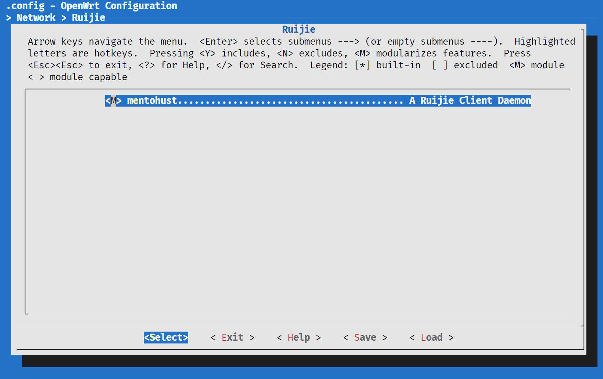

# OpenWrt 手动编译 ipk


## `.ipk` 文件

`.ipk` 文件是可以通过 OpenWrt 的包管理软件 `opkg` 直接安装，好比 `.deb` 文件与 `apt` 的关系。虽然官方的软件仓库已经很丰富了，但是有时仍然需要从源码编译一些第三方的软件使用，例如锐捷认证等

但是由于路由器平台通常与常用的服务器或者个人 PC 的处理器架构不同，并且路由器的处理器本身性能较弱，几乎不可能直接在路由器上进行编译生成 `.ipk` 文件，因此需要交叉编译来实现

而官方的 [OpenWrt](https://github.com/openwrt/openwrt) 仓库就提供了一个方便使用的交叉编译环境

## 编译准备

以 Debian / Ubuntu 为例，参考 [官网给出的要求](https://openwrt.org/docs/guide-developer/toolchain/install-buildsystem)，可以通过下面命令来进行安装依赖包

```bash
sudo apt update
sudo apt install build-essential ccache ecj fastjar file g++ gawk \
gettext git java-propose-classpath libelf-dev libncurses5-dev \
libncursesw5-dev libssl-dev python python2.7-dev python3 unzip wget \
python3-distutils python3-setuptools python3-dev rsync subversion \
swig time xsltproc zlib1g-dev
```

安装/更新好这些依赖之后，就可以通过 `git` 拉取 OpenWrt 仓库了

```bash
git clone https://git.openwrt.org/openwrt/openwrt.git
```

通常由于仓库较大以及网速问题，可能会需要很久，其实可以通过 `--depth` 来限制拉取的仓库深度，或者通过镜像站来加速拉取，当然也可以两者同时采用

```bash
git clone https://git.openwrt.org/openwrt/openwrt.git --depth=1
# cnpmjs.org 已经不能使用，请自行寻找其他镜像站
# git clone https://git.openwrt.org.cnpmjs.org/openwrt/openwrt.git
# git clone https://git.openwrt.org.cnpmjs.org/openwrt/openwrt.git --depth=1
```

## 编译 `.ipk` 文件

### 更新 feeds

进入 openwrt 仓库后，首先需要更新软件包列表 `feeds`，它是在 OpenWrt 中共用位置的包的集合。运行以下命令即可更新内置软件包列表并链接到编译工具中：

```bash
cd openwrt/
./scripts/feeds update
./scripts/feeds install
```

### 配置平台

```bash
make menuconfig
```

通常使用图形化菜单界面来进行配置编译选项，依次配置处理器架构、具体的处理器型号以及设备

以小米 R3G 路由器为例，应该将他们配置成如下图所示


### 获取交叉编译链

这一步就是获取对应设备交叉编译所需的编译链

```bash
make tools/install V=s -j$(grep processor /proc/cpuinfo | wc -l)
make toolchain/install V=s -j$(grep processor /proc/cpuinfo | wc -l)
```

- `V=s` 可以显示 `make` 过程中的所有输出，方便定位当前是否卡在了某一步骤上
- `-j$(grep processor /proc/cpuinfo | wc -l)` 则是根据机器的 CPU 数量来进行多线程编译
- 直接 `-j` 也可以

### 添加需要编译的第三方软件包

可以先搜索有没有已经配置好的含有 `Makefile` 的仓库，有了适配过的 `Makefile` 文件就可以很方便的来编译源码生成 `.ipk` 文件了

以 `MentoHUST` 为例，[github](https://github.com/KyleRicardo/MentoHUST-OpenWrt-ipk) 上有已经完成的仓库，依次可以直接拉取来编译

```bash
git clone https://github.com/KyleRicardo/MentoHUST-OpenWrt-ipk.git package/minieap
```

在拉取完成仓库后，就可以再次配置编译选项，将需要编译成 `.ipk` 的功能配置成模块编译，也就是标记成 `M`

```bash
make menuconfig
```

对于 `MentoHUST` 来说，在 `Network` 中的 `Ruijie` 找到对应选项并配置成 `M` 即可，如下图



配置完成后就可以进行编译了，编译命令也很简单，以 `MentoHUST` 为例如下所示

```bash
make package/mentohust/compile V=s -j
```

编译完成后，`.ipk` 文件会生成在  `./bin/packages/<YourArchitecture>/base` 目录下，将其拷贝到路由器上就可以通过 `opkg` 进行安装使用了

## 参考资料

- [【OpenWrt】编译系统准备](https://openwrt.org/docs/guide-developer/toolchain/install-buildsystem)
- [【Gitbook】建立编译环境](https://openwrt-nctu.gitbook.io/project/openwrt-compile-env/openwrt-sdk-and-ipk-format)
- [【GitHub】OpenWrt](https://github.com/openwrt/openwrt)
- [【GitHub】MentoHUST-OpenWrt-ipk](https://github.com/KyleRicardo/MentoHUST-OpenWrt-ipk)


---

> 作者: [Zeus](https://github.com/ywang-wnlo)  
> URL: https://ywang-wnlo.github.io/posts/96a1807/  

