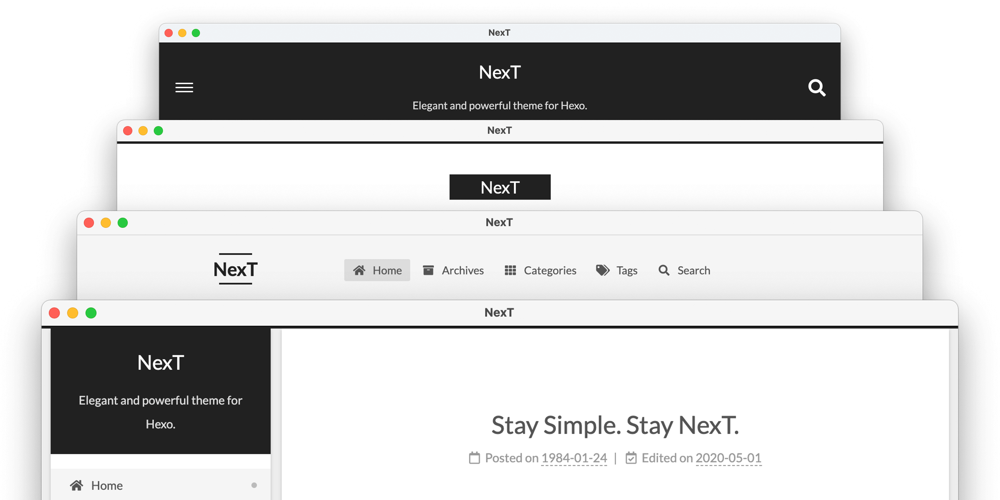
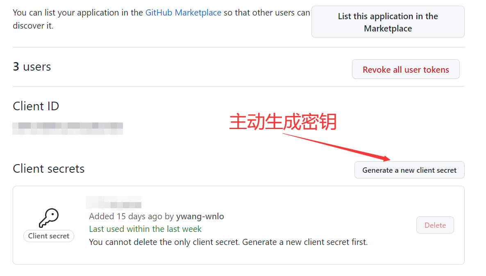

# NexT 主题的配置使用记录


## 简介

NexT 主题是 Hexo 上使用最广，同时在 GitHub 上也是 Star 最多的主题，bug 修复和功能更新也比较快。当前博客曾经就是使用 Hexo 配合 NexT 主题搭建的

### 版本

在 [【必读】更新说明及常见问题](https://github.com/next-theme/hexo-theme-next/issues/4) 中有相关说明，NexT 一共有三个不同的仓库：

版本 | 年份 | 仓库
-- | -- | --
v5.1.4 或更低 | 2014 ~ 2017 | [iissnan/hexo-theme-next](https://github.com/iissnan/hexo-theme-next)
v6.0.0 ~ v7.8.0 | 2018 ~ 2019 | [theme-next/hexo-theme-next](https://github.com/theme-next/hexo-theme-next)
v8.0.0 或更高 | 2020 | [next-theme/hexo-theme-next](https://github.com/next-theme/hexo-theme-next)

旧的仓库基本上已经不再更新，因此推荐选择最新的 [next-theme/hexo-theme-next](https://github.com/next-theme/hexo-theme-next) 仓库的 NexT 主题

## 安装

推荐使用 GitHub 进行安装，可以随时更新

因为笔者个人在 Windows 环境下写博客，后续命令均以 [PowerShell](https://docs.microsoft.com/zh-cn/powershell/scripting/install/installing-powershell?view=powershell-7.2) 为例

```ps
cd <hexo-dir>
# git clone https://github.com/next-theme/hexo-theme-next.git .\themes\next\
git clone git@github.com:next-theme/hexo-theme-next.git

cp .\themes\next\_config.yml .\_config.next.yml
```

## 配置记录

对 NexT 主题的配置可以直接在 `hexo` 仓库下的配置文件 `_config.next.yml` 中进行修改即可，该文件的修改会在生成页面时覆盖主题目录下的配置文件 `.\themes\next\_config.yml`

衍生拓展：[【Hexo】配置文件优先级](https://hexo.io/zh-cn/docs/configuration#%E4%BD%BF%E7%94%A8%E4%BB%A3%E6%9B%BF%E4%B8%BB%E9%A2%98%E9%85%8D%E7%BD%AE%E6%96%87%E4%BB%B6)

### 风格/主题

NexT 主题包含了 4 个风格，个人喜欢 Gemini，类似卡片的风格，边界比较明显



修改 `_config.next.yml` 之后，用 `hexo clean; hexo g; hexo s` 重新生成一下，就可以在 [本地](http://localhost:4000) 预览了（后续流程如果没有特殊说明则基本一致）

```yml
# Schemes
# scheme: Muse
# scheme: Mist
# scheme: Pisces
scheme: Gemini
```

### 网页图标

在各类网站上下载合适图标，按照配置文件中的文件名命名，并放在 `images` 下即可

衍生阅读：[【Apple】Configuring Web Applications](https://developer.apple.com/library/archive/documentation/AppleApplications/Reference/SafariWebContent/ConfiguringWebApplications/ConfiguringWebApplications.html)

```yml
favicon:
  small: /images/favicon-16x16-next.png
  medium: /images/favicon-32x32-next.png
  apple_touch_icon: /images/apple-touch-icon-next.png
  safari_pinned_tab: /images/logo.svg
  #android_manifest: /manifest.json
```

### 菜单栏

菜单栏配置默认没有开启，个人开启了 `首页`、`标签`、`分类`、`归档` 四个子项目，并开启了图标和数量的气泡显示

```yml
# Usage: `Key: /link/ || icon`
# Key is the name of menu item. If the translation for this item is available, the translated text will be loaded, otherwise the Key name will be used. Key is case-sensitive.
# Value before `||` delimiter is the target link, value after `||` delimiter is the name of Font Awesome icon.
# External url should start with http:// or https://
menu:
  home: / || fa fa-home
  #about: /about/ || fa fa-user
  tags: /tags/ || fa fa-tags
  categories: /categories/ || fa fa-th
  archives: /archives/ || fa fa-archive
  #schedule: /schedule/ || fa fa-calendar
  #sitemap: /sitemap.xml || fa fa-sitemap
  #commonweal: /404/ || fa fa-heartbeat

# Enable / Disable menu icons / item badges.
menu_settings:
  icons: true
  badges: true
```

### 侧边栏

默认头像会开启旋转功能，花里胡哨的而且旋转有点快，个人选择了关闭

```yml
# Sidebar Avatar
avatar:
  # Replace the default image and set the url here.
  url: /images/avatar.gif
  # If true, the avatar will be displayed in circle.
  rounded: true
  # If true, the avatar will be rotated with the cursor.
  rotated: false
```

在单独的文章页面时侧边栏会默认显示为目录，并且 `标签`、`分类`、`归档` 已经在菜单栏开启了，所以个人选择了关闭

```yml
# Posts / Categories / Tags in sidebar.
site_state: false
```

其他社交网站的主页的配置起来也很简单，简单替换一下链接，并且取消注释即可

```yml
# Social Links
# Usage: `Key: permalink || icon`
# Key is the link label showing to end users.
# Value before `||` delimiter is the target permalink, value after `||` delimiter is the name of Font Awesome icon.
social:
  GitHub: https://github.com/ywang-wnlo || fab fa-github
  E-Mail: mailto:ywang_wnlo@qq.com || fa fa-envelope
  #Weibo: https://weibo.com/yourname || fab fa-weibo
  #Google: https://plus.google.com/yourname || fab fa-google
  #Twitter: https://twitter.com/yourname || fab fa-twitter
  #FB Page: https://www.facebook.com/yourname || fab fa-facebook
  #StackOverflow: https://stackoverflow.com/yourname || fab fa-stack-overflow
  #YouTube: https://youtube.com/yourname || fab fa-youtube
  #Instagram: https://instagram.com/yourname || fab fa-instagram
  #Skype: skype:yourname?call|chat || fab fa-skype
```

### 本地搜索

本地搜索可以快速的检索所有的文章，有时候还是很有用的

配置本地搜索之前，首先要在 `hexo` 下安装插件

```ps
npm install hexo-generator-searchdb --save
```

然后在配置中开启即可

```yml
# Local Search
# Dependencies: https://github.com/next-theme/hexo-generator-searchdb
local_search:
  enable: true
  # If auto, trigger search by changing input.
  # If manual, trigger search by pressing enter key or search button.
  trigger: auto
  # Show top n results per article, show all results by setting to -1
  top_n_per_article: -1
  # Unescape html strings to the readable one.
  unescape: true
  # Preload the search data when the page loads.
  preload: false
```

### 代码块

代码块的高亮有很多种配色可以选，并且可以开启一键复制功能

```yml
codeblock:
  # Code Highlight theme
  # All available themes: https://theme-next.js.org/highlight/
  theme:
    light: vs
    dark: vs2015
  prism:
    light: prism
    dark: prism-dark
  # Add copy button on codeblock
  copy_button:
    enable: true
    # Available values: default | flat | mac
    style: default
```

### 动画效果

NexT 默认开启了动画效果，但是感觉比较慢，感觉有些影响阅读，推荐开启 `async`，并且适当的修改动画效果

P.S. 菜单栏的动画不可以关闭和调整，应该是个 [bug](https://github.com/next-theme/hexo-theme-next/issues/412)

```yml
# Use Animate.css to animate everything.
# For more information: https://animate.style
motion:
  enable: true
  async: true
  transition:
    # All available transition variants: https://theme-next.js.org/animate/
    post_block: fadeIn
    post_header:
    post_body:
    coll_header:
    # Only for Pisces | Gemini.
    sidebar: fadeInDown
```

### 阅读进度

阅读进度有两种展示方式，一个在回到首页的按钮上直接显示百分比，另一个可以配置在首位部增加进度条，个人两个都开启了

```yml
back2top:
  enable: true
  # Back to top in sidebar.
  sidebar: false
  # Scroll percent label in b2t button.
  scrollpercent: true

# Reading progress bar
reading_progress:
  enable: true
  # Available values: left | right
  start_at: left
  # Available values: top | bottom
  position: bottom
  reversed: false
  color: "#37c6c0"
  height: 5px
```

### 书签

NexT 的书签功能可以保存当前的阅读进度，下次打开是会在续接该进度

```yml
# Bookmark Support
bookmark:
  enable: true
  # Customize the color of the bookmark.
  color: "#222"
  # If auto, save the reading progress when closing the page or clicking the bookmark-icon.
  # If manual, only save it by clicking the bookmark-icon.
  save: auto
```

### Mermaid

[Mermaid](https://mermaid-js.github.io/mermaid/#/) 可以快速的用代码生成简单的流程图、时序图、甘特图等

NexT 中开启 Mermaid 支持很方便，同时还有不同的风格可以选

```yml
# Mermaid tag
mermaid:
  enable: true
  # Available themes: default | dark | forest | neutral
  theme:
    light: neutral
    dark: dark
```

### lazyload

lazyload 是网站常用的技术，通过按需加载，避免一次性加载过多内容导致的打开缓慢

```yml
# Vanilla JavaScript plugin for lazyloading images.
# For more information: https://apoorv.pro/lozad.js/demo/
lazyload: true
```

### fancybox

fancybox 可以在点击图片时放大该图片，并且可以快速浏览当前文章的所有图片

```yml
# FancyBox is a tool that offers a nice and elegant way to add zooming functionality for images.
# For more information: https://fancyapps.com/fancybox/
fancybox: true
```

### pangu

对于强迫症来说，中英文混排时加上空格能很大程度改善阅读体验，但是有时候会不小心打漏部分空格，而 [pangu](https://github.com/vinta/pangu.js) 这个项目就可以帮你在展示时自动加上空格

```yml
# Pangu Support
# For more information: https://github.com/vinta/pangu.js
# Server-side plugin: https://github.com/next-theme/hexo-pangu
pangu: true
```

### 捐赠

文章末尾还可以求打赏，需要配置好相应的二维码图片，并且可以修改提示语句

```yml
# Donate (Sponsor) settings
# Front-matter variable (nonsupport animation).
reward_settings:
  # If true, a donate button will be displayed in every article by default.
  enable: true
  animation: false
  comment: 赏个鸡腿🍗

reward:
  wechatpay: /images/wechatpay.png
  alipay: /images/alipay.jpg
  #paypal: /images/paypal.png
  #bitcoin: /images/bitcoin.png
```

### 版权声明

NexT 内置了文章末尾增加版权声明，只需手动开启即可

```yml
# Creative Commons 4.0 International License.
# See: https://creativecommons.org/about/cclicenses/
creative_commons:
  # Available values: by | by-nc | by-nc-nd | by-nc-sa | by-nd | by-sa | cc-zero
  license: by-nc-sa
  # Available values: big | small
  size: small
  sidebar: false
  post: true
  # You can set a language value if you prefer a translated version of CC license, e.g. deed.zh
  # CC licenses are available in 39 languages, you can find the specific and correct abbreviation you need on https://creativecommons.org
  language:
```

### 不蒜子

[不蒜子](https://busuanzi.ibruce.info/) 是一个极简的网页计数器，NexT 已经内置，只需打开即可

```yml
# Show Views / Visitors of the website / page with busuanzi.
# For more information: http://ibruce.info/2015/04/04/busuanzi/
busuanzi_count:
  enable: true
  total_visitors: true
  total_visitors_icon: fa fa-user
  total_views: true
  total_views_icon: fa fa-eye
  post_views: true
  post_views_icon: far fa-eye
```

### gitalk

评论系统也是一个博客必不可少的，由于本博客搭在 GitHub Pages 上，所以评论系统就采用利用 GitHub Issues 实现的 [gitalk](https://github.com/gitalk/gitalk)

NexT 已经内置的 gitalk 的 `js` 和 `css`，在配置文件中开启并进行配置即可

在修改配置文件之前需要先在 GitHub 上申请一个 OAuth Application，入口在 `【Settings】` -> `【Developer settings】` -> `【OAuth Apps】` -> `【New OAuth App】`，或者直接使用这个 [链接](https://github.com/settings/applications/new)


填写好之后，记录下应用 id 以及密钥，如果没有显示密钥需要手动生成一下



然后首先选用 gitalk 作为评论系统

```yml
# Multiple Comment System Support
comments:
  # Available values: tabs | buttons
  style: tabs
  # Choose a comment system to be displayed by default.
  # Available values: disqus | disqusjs | changyan | livere | gitalk | utterances
  active: gitalk
  # Setting `true` means remembering the comment system selected by the visitor.
  storage: true
  # Lazyload all comment systems.
  lazyload: true
  # Modify texts or order for any naves, here are some examples.
  nav:
    #disqus:
    #  text: Load Disqus
    #  order: -1
    #gitalk:
    #  order: -2
```

在 gitalk 配置中填上相应的内容

```yml
# Gitalk
# For more information: https://gitalk.github.io
gitalk:
  enable: true
  github_id: <GitHub id> # GitHub repo owner
  repo: <GitHub id>.github.io # Repository name to store issues
  client_id: <应用 id> # GitHub Application Client ID
  client_secret: <应用密钥> # GitHub Application Client Secret
  admin_user: <GitHub id> # GitHub repo owner and collaborators, only these guys can initialize gitHub issues
  distraction_free_mode: true # Facebook-like distraction free mode
  # When the official proxy is not available, you can change it to your own proxy address
  proxy: https://cors-anywhere.azm.workers.dev/https://github.com/login/oauth/access_token # This is official proxy address
  # Gitalk's display language depends on user's browser or system environment
  # If you want everyone visiting your site to see a uniform language, you can set a force language value
  # Available values: en | es-ES | fr | ru | zh-CN | zh-TW
  language:
```

## 参考资料

- [【NexT】v8.0.0+ 官网](https://theme-next.js.org)
- [【必读】更新说明及常见问题](https://github.com/next-theme/hexo-theme-next/issues/4)
- [【Hexo】配置文件优先级](https://hexo.io/zh-cn/docs/configuration#%E4%BD%BF%E7%94%A8%E4%BB%A3%E6%9B%BF%E4%B8%BB%E9%A2%98%E9%85%8D%E7%BD%AE%E6%96%87%E4%BB%B6)
- [【Apple】Configuring Web Applications](https://developer.apple.com/library/archive/documentation/AppleApplications/Reference/SafariWebContent/ConfiguringWebApplications/ConfiguringWebApplications.html)
- [【Mermaid】官网](https://mermaid-js.github.io/mermaid/#/)
- [【GitHub】pangu](https://github.com/vinta/pangu.js)
- [【不蒜子】官网](https://busuanzi.ibruce.info)
- [【GitHub】Gitalk](https://github.com/gitalk/gitalk)


---

> 作者: [Zeus](https://github.com/ywang-wnlo)  
> URL: https://ywang-wnlo.github.io/posts/9a0b7c3b/  

