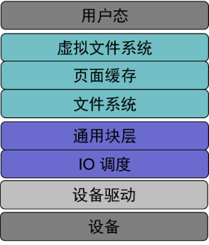

# page cache 简介


当前内容基于 Linux Kernel [v5.4.121](https://git.kernel.org/pub/scm/linux/kernel/git/stable/linux.git/tag/?h=v5.4.121)

## page cache

由于磁盘 HDD 甚至于现在广泛使用的固态硬盘 SSD 的读写速度都远小于内存 DRAM 的读写速度，为了避免每次读取数据都要直接访问这些低速的底层存储设备，Linux 在利用 DRAM 实现了一个缓存层，缓存的粒度是 page，因此也叫 page cache，中文一般称为页（面）缓存

经过这层 page cache 的作用，IO 的性能得到了显著的提升。不过由于 DRAM 具有易失性，在掉电后数据会丢失，因此内核中的 [回写机制](/posts/646202b9/) 定时将 page cache 中的数据下刷到设备上，保证数据的持久化。此外内核还在 page cache 中实现了巧妙的预读机制<!-- todo -->提升了顺序读性能

## 直接 IO 与 缓存 IO

在拥有 page cache 这一层缓存后，写数据就有了三种不同的策略：

1. 不经过缓存，直接写底层存储设备，但同时要使缓存中数据失效，也叫不缓存（nowrite）
2. 只写缓存，缓存中数据定期刷到底层存储设备上，也叫写回（write back）
3. 同时写缓存和底层存储设备，也叫写穿（write through）

前两种就是 Linux 在 IO 栈中支持的直接 IO（direct IO）和缓存 IO（buffer IO）

第三种策略虽然能非常简单保证缓存和底层设备的一致性，不过基于时间局部性原理，page cache 中的数据可能只是中间态，会被频繁修改，每次写穿会产生大量的开销

## Linux IO 栈

详细的 Linux IO 栈图如下（来源于 [Thomas-Krenn-Wiki](https://www.thomas-krenn.com/en/wiki/Linux_Storage_Stack_Diagram)）：


其实简化一下，可以分为文件系统、块层和设备驱动层这三层



## Linux 中的具体实现

这里介绍和 page cache 相关的主要结构体和一些常用的函数

### 相关结构体

#### 超级块 `super_block`

每个文件系统都有 `super_block` 结构体，用于存储该文件系统的特定信息

其定义在 `include/linux/fs.h` 中

```c
struct super_block {
	struct list_head	s_list;		/* Keep this first */
	dev_t			s_dev;		/* search index; _not_ kdev_t */
	unsigned char		s_blocksize_bits;
	unsigned long		s_blocksize;
	loff_t			s_maxbytes;	/* Max file size */
	struct file_system_type	*s_type;
	const struct super_operations	*s_op;
	const struct dquot_operations	*dq_op;
	const struct quotactl_ops	*s_qcop;
	const struct export_operations *s_export_op;
	unsigned long		s_flags;
	unsigned long		s_iflags;	/* internal SB_I_* flags */
	unsigned long		s_magic;
	struct dentry		*s_root;
	struct rw_semaphore	s_umount;
	int			s_count;
	atomic_t		s_active;
#ifdef CONFIG_SECURITY
	void                    *s_security;
#endif
	const struct xattr_handler **s_xattr;
#ifdef CONFIG_FS_ENCRYPTION
	const struct fscrypt_operations	*s_cop;
	struct key		*s_master_keys; /* master crypto keys in use */
#endif
#ifdef CONFIG_FS_VERITY
	const struct fsverity_operations *s_vop;
#endif
	struct hlist_bl_head	s_roots;	/* alternate root dentries for NFS */
	struct list_head	s_mounts;	/* list of mounts; _not_ for fs use */
	struct block_device	*s_bdev;
	struct backing_dev_info *s_bdi;
	struct mtd_info		*s_mtd;
	struct hlist_node	s_instances;
	unsigned int		s_quota_types;	/* Bitmask of supported quota types */
	struct quota_info	s_dquot;	/* Diskquota specific options */

	struct sb_writers	s_writers;

	/*
	 * Keep s_fs_info, s_time_gran, s_fsnotify_mask, and
	 * s_fsnotify_marks together for cache efficiency. They are frequently
	 * accessed and rarely modified.
	 */
	void			*s_fs_info;	/* Filesystem private info */

	/* Granularity of c/m/atime in ns (cannot be worse than a second) */
	u32			s_time_gran;
	/* Time limits for c/m/atime in seconds */
	time64_t		   s_time_min;
	time64_t		   s_time_max;
#ifdef CONFIG_FSNOTIFY
	__u32			s_fsnotify_mask;
	struct fsnotify_mark_connector __rcu	*s_fsnotify_marks;
#endif

	char			s_id[32];	/* Informational name */
	uuid_t			s_uuid;		/* UUID */

	unsigned int		s_max_links;
	fmode_t			s_mode;

	/*
	 * The next field is for VFS *only*. No filesystems have any business
	 * even looking at it. You had been warned.
	 */
	struct mutex s_vfs_rename_mutex;	/* Kludge */

	/*
	 * Filesystem subtype.  If non-empty the filesystem type field
	 * in /proc/mounts will be "type.subtype"
	 */
	const char *s_subtype;

	const struct dentry_operations *s_d_op; /* default d_op for dentries */

	/*
	 * Saved pool identifier for cleancache (-1 means none)
	 */
	int cleancache_poolid;

	struct shrinker s_shrink;	/* per-sb shrinker handle */

	/* Number of inodes with nlink == 0 but still referenced */
	atomic_long_t s_remove_count;

	/* Pending fsnotify inode refs */
	atomic_long_t s_fsnotify_inode_refs;

	/* Being remounted read-only */
	int s_readonly_remount;

	/* AIO completions deferred from interrupt context */
	struct workqueue_struct *s_dio_done_wq;
	struct hlist_head s_pins;

	/*
	 * Owning user namespace and default context in which to
	 * interpret filesystem uids, gids, quotas, device nodes,
	 * xattrs and security labels.
	 */
	struct user_namespace *s_user_ns;

	/*
	 * The list_lru structure is essentially just a pointer to a table
	 * of per-node lru lists, each of which has its own spinlock.
	 * There is no need to put them into separate cachelines.
	 */
	struct list_lru		s_dentry_lru;
	struct list_lru		s_inode_lru;
	struct rcu_head		rcu;
	struct work_struct	destroy_work;

	struct mutex		s_sync_lock;	/* sync serialisation lock */

	/*
	 * Indicates how deep in a filesystem stack this SB is
	 */
	int s_stack_depth;

	/* s_inode_list_lock protects s_inodes */
	spinlock_t		s_inode_list_lock ____cacheline_aligned_in_smp;
	struct list_head	s_inodes;	/* all inodes */

	spinlock_t		s_inode_wblist_lock;
	struct list_head	s_inodes_wb;	/* writeback inodes */
} __randomize_layout;
```

`super_block` 通常在挂载文件系统时会从底层存储设备上读取并构建，并且需要同步回底层存储设备

#### 索引节点 `inode`

而 `inode` 则是文件系统中最重要的一个结构体，用于保存一个文件的元数据以及其在底层设备上的位置信息等（在 Linux 下一切皆是文件，目录也是一种文件）

其定义也在 `include/linux/fs.h` 中

```c
/*
 * Keep mostly read-only and often accessed (especially for
 * the RCU path lookup and 'stat' data) fields at the beginning
 * of the 'struct inode'
 */
struct inode {
	// inode 类型
	umode_t			i_mode;
	unsigned short		i_opflags;
	kuid_t			i_uid;
	kgid_t			i_gid;
	unsigned int		i_flags;

#ifdef CONFIG_FS_POSIX_ACL
	struct posix_acl	*i_acl;
	struct posix_acl	*i_default_acl;
#endif

	const struct inode_operations	*i_op;
	struct super_block	*i_sb;
	// page cache 相关
	struct address_space	*i_mapping;

#ifdef CONFIG_SECURITY
	void			*i_security;
#endif

	/* Stat data, not accessed from path walking */
	unsigned long		i_ino;
	/*
	 * Filesystems may only read i_nlink directly.  They shall use the
	 * following functions for modification:
	 *
	 *    (set|clear|inc|drop)_nlink
	 *    inode_(inc|dec)_link_count
	 */
	union {
		const unsigned int i_nlink;
		unsigned int __i_nlink;
	};
	dev_t			i_rdev;
	loff_t			i_size;
	struct timespec64	i_atime;
	struct timespec64	i_mtime;
	struct timespec64	i_ctime;
	spinlock_t		i_lock;	/* i_blocks, i_bytes, maybe i_size */
	unsigned short          i_bytes;
	u8			i_blkbits;
	u8			i_write_hint;
	blkcnt_t		i_blocks;

#ifdef __NEED_I_SIZE_ORDERED
	seqcount_t		i_size_seqcount;
#endif

	/* Misc */
	unsigned long		i_state;
	struct rw_semaphore	i_rwsem;

	unsigned long		dirtied_when;	/* jiffies of first dirtying */
	unsigned long		dirtied_time_when;

	struct hlist_node	i_hash;
	struct list_head	i_io_list;	/* backing dev IO list */
#ifdef CONFIG_CGROUP_WRITEBACK
	struct bdi_writeback	*i_wb;		/* the associated cgroup wb */

	/* foreign inode detection, see wbc_detach_inode() */
	int			i_wb_frn_winner;
	u16			i_wb_frn_avg_time;
	u16			i_wb_frn_history;
#endif
	struct list_head	i_lru;		/* inode LRU list */
	struct list_head	i_sb_list;
	struct list_head	i_wb_list;	/* backing dev writeback list */
	union {
		struct hlist_head	i_dentry;
		struct rcu_head		i_rcu;
	};
	atomic64_t		i_version;
	atomic64_t		i_sequence; /* see futex */
	atomic_t		i_count;
	atomic_t		i_dio_count;
	atomic_t		i_writecount;
#if defined(CONFIG_IMA) || defined(CONFIG_FILE_LOCKING)
	atomic_t		i_readcount; /* struct files open RO */
#endif
	union {
		const struct file_operations	*i_fop;	/* former ->i_op->default_file_ops */
		void (*free_inode)(struct inode *);
	};
	struct file_lock_context	*i_flctx;
	struct address_space	i_data;
	struct list_head	i_devices;
	union {
		struct pipe_inode_info	*i_pipe;
		struct block_device	*i_bdev;
		struct cdev		*i_cdev;
		char			*i_link;
		unsigned		i_dir_seq;
	};

	__u32			i_generation;

#ifdef CONFIG_FSNOTIFY
	__u32			i_fsnotify_mask; /* all events this inode cares about */
	struct fsnotify_mark_connector __rcu	*i_fsnotify_marks;
#endif

#ifdef CONFIG_FS_ENCRYPTION
	struct fscrypt_info	*i_crypt_info;
#endif

#ifdef CONFIG_FS_VERITY
	struct fsverity_info	*i_verity_info;
#endif

	void			*i_private; /* fs or device private pointer */
} __randomize_layout;
```

与 `super_block` 一样，`inode` 也是从底层存储设备上读取并构建的，并且也需要同步回底层存储设备

#### 文件 `file`

`file` 其实是已经打开的底层存储设备上的文件在内存中的表示。与前面两个结构体有所不同，底层存储设备上并不会存储，该结构体只是内核抽象出来的，仅仅存在于内存中，方便管理

其定义也在 `include/linux/fs.h` 中

```c
struct file {
	union {
		struct llist_node	fu_llist;
		struct rcu_head 	fu_rcuhead;
	} f_u;
	struct path		f_path;
	struct inode		*f_inode;	/* cached value */
	const struct file_operations	*f_op;

	/*
	 * Protects f_ep_links, f_flags.
	 * Must not be taken from IRQ context.
	 */
	spinlock_t		f_lock;
	enum rw_hint		f_write_hint;
	atomic_long_t		f_count;
	unsigned int 		f_flags;
	fmode_t			f_mode;
	struct mutex		f_pos_lock;
	loff_t			f_pos;
	struct fown_struct	f_owner;
	const struct cred	*f_cred;
	struct file_ra_state	f_ra;

	u64			f_version;
#ifdef CONFIG_SECURITY
	void			*f_security;
#endif
	/* needed for tty driver, and maybe others */
	void			*private_data;

#ifdef CONFIG_EPOLL
	/* Used by fs/eventpoll.c to link all the hooks to this file */
	struct list_head	f_ep_links;
	struct list_head	f_tfile_llink;
#endif /* #ifdef CONFIG_EPOLL */
	struct address_space	*f_mapping;
	errseq_t		f_wb_err;
} __randomize_layout
  __attribute__((aligned(4)));	/* lest something weird decides that 2 is OK */
```

每个 file 都与一个 inode 对应

#### 目录项 `dentry`

`dentry` 与 `file` 类似，底层设备上并不会存储，该结构体也是内核抽象出来的，针对目录文件进行特殊的管理

目录项相对于文件具有更高的热度，同时为了加速打开文件时的路径解析，内核中还实现了目录项缓存 `dcache` 用于缓存 `dentry`

其定义在 `include/linux/dcache.h` 中

```c
struct dentry {
	/* RCU lookup touched fields */
	unsigned int d_flags;		/* protected by d_lock */
	seqcount_t d_seq;		/* per dentry seqlock */
	struct hlist_bl_node d_hash;	/* lookup hash list */
	struct dentry *d_parent;	/* parent directory */
	struct qstr d_name;
	struct inode *d_inode;		/* Where the name belongs to - NULL is
					 * negative */
	unsigned char d_iname[DNAME_INLINE_LEN];	/* small names */

	/* Ref lookup also touches following */
	struct lockref d_lockref;	/* per-dentry lock and refcount */
	const struct dentry_operations *d_op;
	struct super_block *d_sb;	/* The root of the dentry tree */
	unsigned long d_time;		/* used by d_revalidate */
	void *d_fsdata;			/* fs-specific data */

	union {
		struct list_head d_lru;		/* LRU list */
		wait_queue_head_t *d_wait;	/* in-lookup ones only */
	};
	struct list_head d_child;	/* child of parent list */
	struct list_head d_subdirs;	/* our children */
	/*
	 * d_alias and d_rcu can share memory
	 */
	union {
		struct hlist_node d_alias;	/* inode alias list */
		struct hlist_bl_node d_in_lookup_hash;	/* only for in-lookup ones */
	 	struct rcu_head d_rcu;
	} d_u;
} __randomize_layout;
```

因为目录也是文件，所以每个 `dentry` 也会与一个 `inode` 对应

#### 页缓存 `address_space`

在 `inode` 结构体中可以看见一个类型为 `address_space` 结构体指针的 `i_mapping` 字段，其实它就是 page cache 的核心结构体

其定义也在 `include/linux/fs.h` 中

```c
/**
 * struct address_space - Contents of a cacheable, mappable object.
 * @host: Owner, either the inode or the block_device.
 * @i_pages: Cached pages.
 * @gfp_mask: Memory allocation flags to use for allocating pages.
 * @i_mmap_writable: Number of VM_SHARED mappings.
 * @nr_thps: Number of THPs in the pagecache (non-shmem only).
 * @i_mmap: Tree of private and shared mappings.
 * @i_mmap_rwsem: Protects @i_mmap and @i_mmap_writable.
 * @nrpages: Number of page entries, protected by the i_pages lock.
 * @nrexceptional: Shadow or DAX entries, protected by the i_pages lock.
 * @writeback_index: Writeback starts here.
 * @a_ops: Methods.
 * @flags: Error bits and flags (AS_*).
 * @wb_err: The most recent error which has occurred.
 * @private_lock: For use by the owner of the address_space.
 * @private_list: For use by the owner of the address_space.
 * @private_data: For use by the owner of the address_space.
 */
struct address_space {
	// 指向文件 inode
	struct inode		*host;
	// 当前文件缓存的所有 page
	struct xarray		i_pages;
	gfp_t			gfp_mask;
	atomic_t		i_mmap_writable;
#ifdef CONFIG_READ_ONLY_THP_FOR_FS
	/* number of thp, only for non-shmem files */
	atomic_t		nr_thps;
#endif
	struct rb_root_cached	i_mmap;
	struct rw_semaphore	i_mmap_rwsem;
	unsigned long		nrpages;
	unsigned long		nrexceptional;
	pgoff_t			writeback_index;
	const struct address_space_operations *a_ops;
	unsigned long		flags;
	errseq_t		wb_err;
	spinlock_t		private_lock;
	struct list_head	private_list;
	void			*private_data;
} __attribute__((aligned(sizeof(long)))) __randomize_layout;
	/*
	 * On most architectures that alignment is already the case; but
	 * must be enforced here for CRIS, to let the least significant bit
	 * of struct page's "mapping" pointer be used for PAGE_MAPPING_ANON.
	 */
struct request_queue;

struct block_device {
	dev_t			bd_dev;  /* not a kdev_t - it's a search key */
	int			bd_openers;
	struct inode *		bd_inode;	/* will die */
	struct super_block *	bd_super;
	struct mutex		bd_mutex;	/* open/close mutex */
	void *			bd_claiming;
	void *			bd_holder;
	int			bd_holders;
	bool			bd_write_holder;
#ifdef CONFIG_SYSFS
	struct list_head	bd_holder_disks;
#endif
	struct block_device *	bd_contains;
	unsigned		bd_block_size;
	u8			bd_partno;
	struct hd_struct *	bd_part;
	/* number of times partitions within this device have been opened. */
	unsigned		bd_part_count;
	int			bd_invalidated;
	struct gendisk *	bd_disk;
	struct request_queue *  bd_queue;
	struct backing_dev_info *bd_bdi;
	struct list_head	bd_list;
	/*
	 * Private data.  You must have bd_claim'ed the block_device
	 * to use this.  NOTE:  bd_claim allows an owner to claim
	 * the same device multiple times, the owner must take special
	 * care to not mess up bd_private for that case.
	 */
	unsigned long		bd_private;

	/* The counter of freeze processes */
	int			bd_fsfreeze_count;
	/* Mutex for freeze */
	struct mutex		bd_fsfreeze_mutex;
} __randomize_layout;
```

每一个 `address_space` 与一个 `inode` 对应，同时 `file` 中的 `f_mapping` 字段通常由该文件的 `inode` 中 `i_mapping` 赋值，也就是说每个文件都会有独自的 `file`、`inode` 以及 `address_space` 结构体

`address_space` 结构体 `struct xarray i_pages` 就是该文件的 page cache 中缓存的所有物理页。它是通过基数树这一结构进行管理的，而 `xarray` 只是在基数树上进行了一层封装

### 常用函数

通常 `address_space` 上会挂载一个 `address_space_operations` 结构，用于自定义对 page cache 中的页面操作的函数

`address_space_operations` 结构定义也在 `include/linux/fs.h` 中

```c
struct address_space_operations {
	int (*writepage)(struct page *page, struct writeback_control *wbc);
	int (*readpage)(struct file *, struct page *);

	/* Write back some dirty pages from this mapping. */
	int (*writepages)(struct address_space *, struct writeback_control *);

	/* Set a page dirty.  Return true if this dirtied it */
	int (*set_page_dirty)(struct page *page);

	/*
	 * Reads in the requested pages. Unlike ->readpage(), this is
	 * PURELY used for read-ahead!.
	 */
	int (*readpages)(struct file *filp, struct address_space *mapping,
			struct list_head *pages, unsigned nr_pages);

	int (*write_begin)(struct file *, struct address_space *mapping,
				loff_t pos, unsigned len, unsigned flags,
				struct page **pagep, void **fsdata);
	int (*write_end)(struct file *, struct address_space *mapping,
				loff_t pos, unsigned len, unsigned copied,
				struct page *page, void *fsdata);

	/* Unfortunately this kludge is needed for FIBMAP. Don't use it */
	sector_t (*bmap)(struct address_space *, sector_t);
	void (*invalidatepage) (struct page *, unsigned int, unsigned int);
	int (*releasepage) (struct page *, gfp_t);
	void (*freepage)(struct page *);
	ssize_t (*direct_IO)(struct kiocb *, struct iov_iter *iter);
	/*
	 * migrate the contents of a page to the specified target. If
	 * migrate_mode is MIGRATE_ASYNC, it must not block.
	 */
	int (*migratepage) (struct address_space *,
			struct page *, struct page *, enum migrate_mode);
	bool (*isolate_page)(struct page *, isolate_mode_t);
	void (*putback_page)(struct page *);
	int (*launder_page) (struct page *);
	int (*is_partially_uptodate) (struct page *, unsigned long,
					unsigned long);
	void (*is_dirty_writeback) (struct page *, bool *, bool *);
	int (*error_remove_page)(struct address_space *, struct page *);

	/* swapfile support */
	int (*swap_activate)(struct swap_info_struct *sis, struct file *file,
				sector_t *span);
	void (*swap_deactivate)(struct file *file);
};
```

这里简要介绍一下其中通用的部分常用函数

#### 从底层填充

当打开一个文件后，page cache 不会立即缓存这个文件的所有数据页，而是随着对文件的读写来逐渐填充的

`readpage` 和 `readpages` 就是将底层存储设备上的一个或者多个页的数据读到 page cache 中

#### 写入修改

page cache 的写入较为复杂，主要分为三个阶段：

1. `write_begin` 主要负责查找、或者分配新的物理页，并将其锁定，有时还需要先从底层读取最新的数据页
2. `writepage` 或者 `writepages` 就是负责对这些物理页的实际写入过程
3. `write_end` 主要负责解锁这些物理页，并且更新 `inode` 中的元数据信息，例如 `i_size`

#### 其他

`direct_IO` 则是负责不经过 page cache 的直接 IO 的实现

需要注意的是，当需要读的数据在 page cache 中缓存的和底层存储数据不一致时，也就是 `page` 为 `dirty` 状态时，通常需要调用 `filemap_write_and_wait` 或者 `filemap_write_and_wait_range` 先将这部分脏数据写到底层设备之后，才能执行 direct read

## 参考资料

- [【Thomas-Krenn-Wiki】Linux Storage Stack Diagram](https://www.thomas-krenn.com/en/wiki/Linux_Storage_Stack_Diagram)
- [【CSDN】浅墨: 聊聊 Linux IO (中) —— Linux 内核中的 IO 栈](https://blog.csdn.net/juS3Ve/article/details/82322637)
- [【LKD】Linux Kernel Development (3rd Edition)](https://www.doc-developpement-durable.org/file/Projets-informatiques/cours-&-manuels-informatiques/Linux/Linux%20Kernel%20Development,%203rd%20Edition.pdf)
- [【阿里云技术博客】The Xarray Data Structure](https://kernel.taobao.org/2018/05/The-XArray-data-structure/)
- [【LWN】Some VFS address space operations changes](https://lwn.net/Articles/254856/)
- [【博客园】Page Cache 与 Page 回写](https://www.cnblogs.com/linhaostudy/p/10196915.html)


---

> 作者: [Zeus](https://github.com/ywang-wnlo)  
> URL: https://ywang-wnlo.github.io/posts/9ba60726/  

