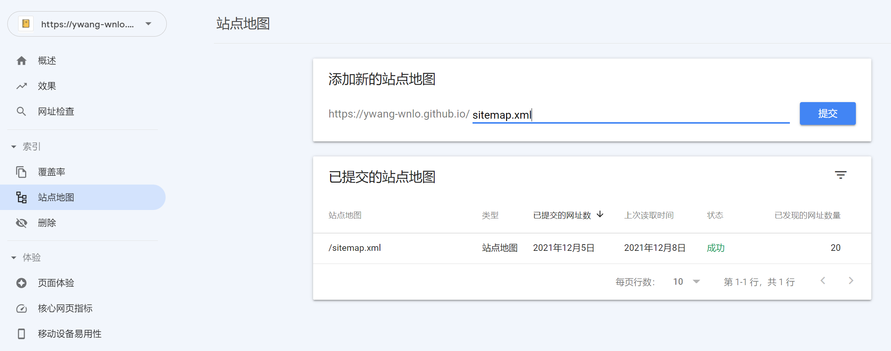

# Hexo 配置主流搜索引擎收录流程记录


想让网站能够被更多的人阅读，搜索引擎带来的流量必不可少。本文主要介绍如何配置 Hexo 并被主流的搜索引擎（Google、Bing）收录

搜索引擎能搜索到网站的前提是它抓取了网站的内容，并对其建立了索引，其实也就是爬虫爬取 + 插入数据库。虽然大部分搜索引擎都是自动抓取网络上的所有链接，并尝试爬取以及入库，但通常会比较缓慢（毕竟它并不一定知道我们网站的地址hhh）。所以更加推荐由我们站长主动出击，直接告诉它我们的网站地址

延伸阅读：[Google 搜索运作方式的基础知识](https://developers.google.com/search/docs/basics/how-search-works?hl=zh-CN)

## 是否已经被收录

为了查看网站是否已经被收录，可以在 Google 或者 Bing 以下查询格式搜索，根据自己网站的地址对后面的 `http(s)` 链接进行替换即可

```txt
site:https://ywang-wnlo.github.io/
```


如果能搜索到内容，那么恭喜网站已经被搜索引擎收录。不过为了更好的被收录网站中的内容，还是推荐生成站点地图并提交，来告诉搜索引擎网站中有哪些链接需要被爬取

## 生成站点地图

站点地图是一种文件，您以在其中提供与网站中的网页、视频或其他文件有关的信息，还可以说明这些内容之间的关系。搜索引擎会读取此文件，以便更高效地抓取您的网站。站点地图会告诉搜索引擎您认为网站中的哪些网页和文件比较重要，还会提供与这些文件有关的重要信息。例如，网页上次更新的时间和网页是否有任何备用的语言版本

Hexo 配置站点地图 `sitemap` 可以利用 `hexo-generator-sitemap` 插件，具体的配置过程参见 [这里](/posts/4143201a/#hexo-generator-sitemap)

仅仅生成站点地图还不够，为了更早被收录站点地图中的链接，还需要主动将站点地图提交给搜索引擎

## 提交站点地图

下面手把手教你如何给 Google 和 Bing 提交站点地图

（由于 GitHub 屏蔽了百度的爬虫，所以在这里不做百度搜索引擎的流程介绍，不过以下内容可以参考）

### Google

Google 官网给了详细的文档，可以看这篇 [新手入门指南](https://developers.google.com/search/docs/beginner/get-started?hl=zh-CN)

而对我们来说，主要分三个步骤：注册 Search Console，验证网站所有权，提交站点地图

#### 注册 Search Console

注册的过程非常简单，进入 [GSC 官网](https://search.google.com/search-console)，用谷歌账号登录即可

#### 验证网站所有权

登录之后，就需要添加我们的网站了


由于该博客是利用 GitHub Pages 搭建，并没有 DNS 配置的相关权限，因此我们使用第二种方式进行配置，点击 `继续` 后会有五种方式供我们选择


个人推荐使用第二种，也就是 HTML 标记的方式，因为 NexT 主题的配置中对其进行支持，配置起来比较简单


点击复制，记录下其中的标记信息，例如我们这里复制的原始内容是

```html
<meta name="google-site-verification" content="F3QOKaQRQaSAxN-JLDLGD21CCU5CkZRssZYwX-Mn-Zc" />
```

所以在 Next 的配置文件中 `_config.next.yml` 配置如下内容

```yml
# Google Webmaster tools verification.
# See: https://developers.google.com/search
google_site_verification: F3QOKaQRQaSAxN-JLDLGD21CCU5CkZRssZYwX-Mn-Zc
```

之后重新生成网站，并推送到 GitHub，等待 GitHub Pages 生成完毕后，点击 `验证` 即可

#### 提交站点地图

之前 `hexo-generator-sitemap` 插件生成的站点地图，会默认放在在根目录下，只需在 [GSC 的站点地图页面](https://search.google.com/search-console/sitemaps) 填好站点地图的位置，然后点击提交即可



不过和 Bing 不同，Google 的站点地图爬取需要一定的时间，并且由于 [GSC 的 bug](https://support.google.com/webmasters/thread/3105916/sitemap-could-not-be-read-in-new-gsc)，会将 `等待中` 错误的显示为 `无法获取`，一般需要几天的时间，此时只能耐心等待

### Bing

#### 从 GSC 导入


Bing 的流程和前面类似，不过由于已经配置好了 GSC，我们可以选择直接从 GSC 进行导入即可

#### 手动添加网站

如果需要手动添加的话，其实步骤和 Google 也很类似


这里一样推荐使用第二种，也就是 HTML Meta 标记的方式，因为 NexT 主题的配置中对其进行支持，配置起来比较简单

点击复制，记录下其中的标记信息，例如我们这里复制的原始内容是

```html
<meta name="msvalidate.01" content="65AB321A829DD5542989CC078C3ABD9E" />
```

所以在 Next 的配置文件中 `_config.next.yml` 配置如下内容

```yml
# Bing Webmaster tools verification.
# See: https://www.bing.com/webmasters
bing_site_verification: 65AB321A829DD5542989CC078C3ABD9E
```

之后重新生成网站，并推送到 GitHub，等待 GitHub Pages 生成完毕后，点击 `验证` 即可

提交站点地图也，只需在 [Bing Webmasters tools 的站点地图页面](https://www.bing.com/webmasters/sitemaps) 填好站点地图的位置，然后点击 `提交` 即可


Bing 的站点地图爬取一般几分钟就会完成，之后只需静静等待 Bing 给我们网站建立索引即可，一般来说一两天就可以完成整个网站的爬取，这点要比 Google 快不少

## 手动请求编入索引

根据个人观察，Google 及时获取到站点地图后似乎不会立刻根据站点地图爬取网站，因此推荐再自行进行一次手动请求编入索引

具体流程为：

1. 点击 GSC 的【网址检查】或者直接在顶部输入栏输入网站的根地址（也可以是其他子页面地址）

    

2. 等待结果返回后，点击【请求编入索引】即可

    

个人实测，大概需要一个月左右，Google 上就能搜索到网站上的大多数页面了

## 参考资料

- [【Google】Google 搜索运作方式的基础知识](https://developers.google.com/search/docs/basics/how-search-works?hl=zh-CN)
- [【Google】浏览 Google 搜索文档，改善网站的 SEO 过程](https://developers.google.com/search/docs?hl=zh-CN)
- [【Google】了解站点地图](https://developers.google.com/search/docs/advanced/sitemaps/overview?hl=zh-CN)
- [【Google】新手入门指南](https://developers.google.com/search/docs/beginner/get-started?hl=zh-CN)
- [【个人博客】Hexo 博客站点地图配置（Google）](https://mizeri.github.io/2021/04/18/hexo-sitemap-google/)
- [【个人博客】Hexo 博客主流搜索引擎收录详细指南](https://asurada.zone/post/Blog-Search-Engine-Index/)


---

> 作者: [Zeus](https://github.com/ywang-wnlo)  
> URL: https://ywang-wnlo.github.io/posts/abac0c46/  

