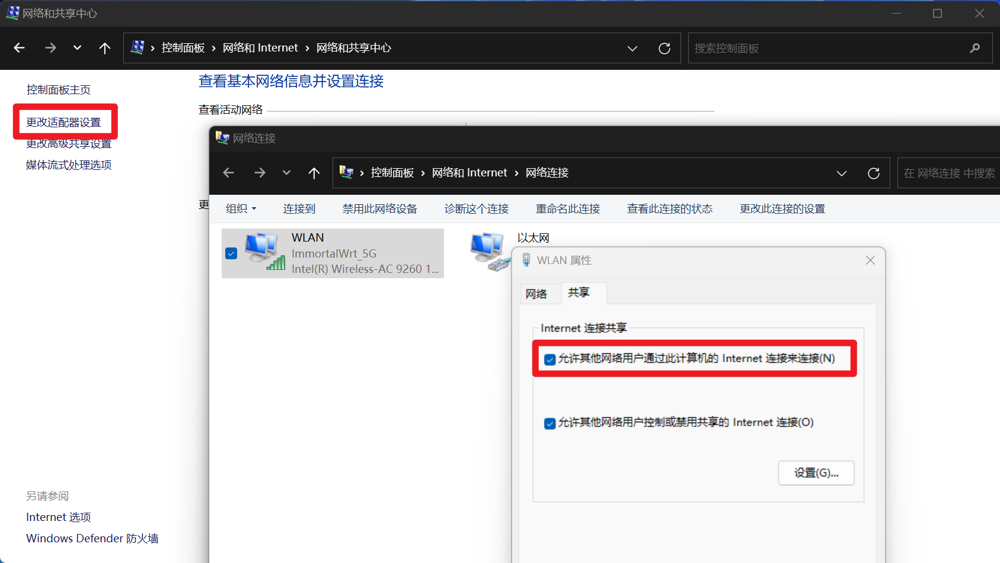

# 小米 WR30U 解锁并刷机


本文主要记录个人对小米 WR30U 路由器的解锁和刷机过程，整体步骤与 [一般安装流程](/posts/8507aaa1/#一般安装流程) 类似，但是由于 WR30U 的解锁 `ssh` 和刷机的过程中有一些细节需要注意，因此记录一下

## 解锁 ssh

### 环境准备

需要一台**同时具有 WiFi 和有线网络**的电脑，以及一根网线

然后需要配置 `python` 环境，并且安装 `pycryptodome` 依赖

```bash
conda create -n wr30u
conda activate wr30u
conda install pycryptodome
```

然后是解锁脚本，可以直接从 [PatriciaLee3](https://github.com/PatriciaLee3/wr30u_ssh/blob/main/server_emulator.py) 的仓库中下载

### 解锁过程

[PatriciaLee3](https://github.com/PatriciaLee3/wr30u_ssh/blob/main/README.md) 的仓库中已经给出了详细的解锁过程，这里只是简单记录一下

1. 电脑连接原厂固件的路由器，进入 192.168.31.1 的管理后台，在常用设置-上网设置里分别设置：

   - 上网设置 DHCP，自动配置 DNS
   - 启动与智能网关无线配置同步（会重启）
   - 固定 WAN 口为 1（会重启）

2. 电脑连接有正常网络的 WiFi，然后将网线连接到路由器的 WAN 口

3. 打开 `控制面板 - 网络和 Internet - 网络和共享中心 - 更改适配器设置 - 选择 WLAN - 右键属性 - 共享`，勾选第一个并确认，这个时候 WR30U 会通过有线连接共享电脑的网络，并且网络指示灯会变成蓝色

    

4. 打开 `控制面板 - 系统和安全 - Windows Defender 防火墙 - 启动或关闭 Windows Defender 防火墙`，关闭 Windows Defender 防火墙

    

5. 运行解锁脚本，并按照脚本提示操作

    ```bash
    conda activate wr30u
    python server_emulator.py
    ```

6. 解锁完成后，路由器的账号密码为 `root` 和 `admin`，之后记得重新开启防火墙，并且关闭共享网络

## 刷入 mt798x uboot

### 简介

这里首先推荐刷入 hanwckf 的 [mt798x uboot](https://cmi.hanwckf.top/p/mt798x-uboot-usage)，这个 uboot 有很多功能，其中以下两点非常实用：

- 【使用方便】自带 MTK 原厂开发的简易 WebUI 恢复界面，可以通过 WebUI 直接刷入固件或者更新 uboot
- 【兼容性好】支持多种 Flash 分区布局切换功能（仅支持 spi-nand），可以在 WebUI 中切换不同的分区布局，完美兼容小米原厂固件

### 刷入流程

1. 电脑接入正常网络，然后去 hanwckf 的仓库 release 页面下载对应的 uboot 文件：[mt7981_wr30u-fip-fixed-parts-multi-layout.bin](https://github.com/hanwckf/bl-mt798x/releases)
2. 电脑接入路由器网络，通过 `scp` 将 uboot 传到路由器上

    ```bash
    scp mt7981_wr30u-fip-fixed-parts-multi-layout.bin root@192.168.31.1:/tmp
    ```

3. 通过 `ssh` 登录路由器，查看布局

    ```bash
    # on PC
    ssh root@192.168.31.1

    # on Router
    # 查看当前分区布局
    cat /proc/mtd
    ```

    默认布局如下:

    ```txt
    dev:    size   erasesize  name
    mtd0: 08000000 00020000 "spi0.0"
    mtd1: 00100000 00020000 "BL2"
    mtd2: 00040000 00020000 "Nvram"
    mtd3: 00040000 00020000 "Bdata"
    mtd4: 00200000 00020000 "Factory"
    mtd5: 00200000 00020000 "FIP"
    mtd6: 00040000 00020000 "crash"
    mtd7: 00040000 00020000 "crash_log"
    mtd8: 02200000 00020000 "ubi"
    mtd9: 02200000 00020000 "ubi1"
    mtd10: 02000000 00020000 "overlay"
    mtd11: 00c00000 00020000 "data"
    mtd12: 00040000 00020000 "KF"
    ```

    如果需要备份，可以通过 `nanddump` 命令备份，之后通过 `scp` 将备份的文件传到电脑上

    ```bash
    # on Router
    nanddump -f /tmp/BL2.bin /dev/mtd1
    nanddump -f /tmp/Nvram.bin /dev/mtd2
    nanddump -f /tmp/Bdata.bin /dev/mtd3
    nanddump -f /tmp/Factory.bin /dev/mtd4
    nanddump -f /tmp/FIP.bin /dev/mtd5
    nanddump -f /tmp/ubi.bin /dev/mtd8
    nanddump -f /tmp/KF.bin /dev/mtd12

    # on PC
    scp root@192.168.31.1:/tmp/*.bin .
    ```

4. 然后将 uboot 刷入 FIP 分区，之后关机

    ```bash
    # on Router
    mtd write /tmp/mt7981_wr30u-fip-fixed-parts-multi-layout.bin FIP

    poweroff
    ```

## 刷入 ImmortalWrt

### 简介

ImmortalWrt 是 OpenWrt 的一个分支，相比于 OpenWrt 有更多的软件包以及设备支持，并且对中国大陆用户有特殊优化

### 刷入流程

1. 电脑连接正常网络，去官网下载 [Sysupgrade 固件](https://firmware-selector.immortalwrt.org/?version=23.05-SNAPSHOT&target=mediatek%2Ffilogic&id=xiaomi_mi-router-wr30u-112m-nmbm)

    这里选择了 custom U-Boot layout 的固件，也就是 112M UBI layout 的固件，这样可以有更多的空间用于安装软件包，固件名格式为 `immortalwrt-xxxxxx-mediatek-filogic-xiaomi_mi-router-wr30u-112m-nmbm-squashfs-sysupgrade.bin`

2. 针按住 reset 不放，再接上电源，等待 10s 左右松开，路由器的系统灯变蓝后就是成功进入 uboot 了

3. 因 uboot 不支持 DHCP 功能，需要把电脑的 IP 地址设置成固定 IP：

    电脑通过网线连接路由器，然后在网络设置里将以太网设置为静态，IP地址：192.168.31.100，子网掩码：255.255.255.0，网关：192.168.31.1，首选 DNS：192.168.31.1，最后保存

4. 直接访问 [WebUI](http://192.168.31.1) 进行刷固件，将 layout 选为 `immortalwrt-112m`，然后上传前面下载的固件，点击刷机即可

    

## 刷为原厂固件

刷回原厂固件的过程与刷入 ImmortalWrt 类似，只是需要下载[原厂固件](https://github.com/hanwckf/xiaomi-router-stock-ubi-bin)，然后在 WebUI 中将 layout 配置为 `default`，之后上传原厂固件刷机即可

## 参考资料

- [【个人博客】酱紫表 - 小米 WR30U 解锁 SSH 刷 openwrt，最有性价比的百元路由器](https://blog.qust.me/wr30u)
- [【GitHub】wr30u_ssh](https://github.com/PatriciaLee3/wr30u_ssh)
- [【个人博客】hanwckf - mt798x uboot 功能介绍](https://cmi.hanwckf.top/p/mt798x-uboot-usage)
- [【ImmortalWrt】固件下载](https://firmware-selector.immortalwrt.org/)

